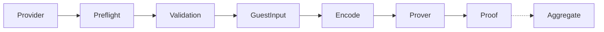
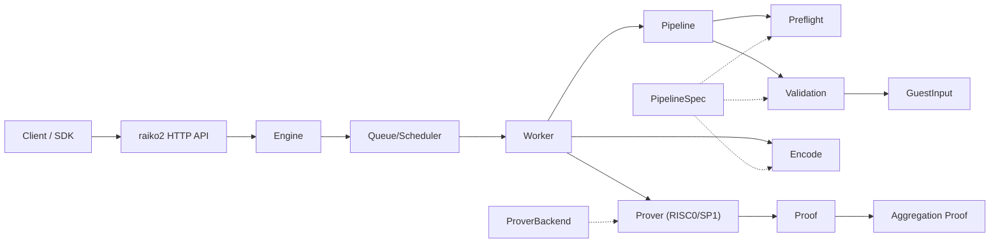
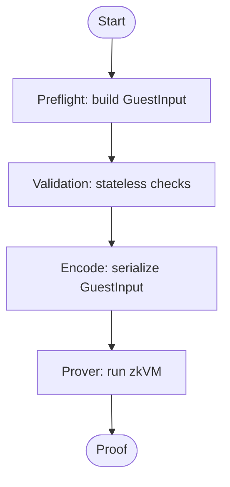
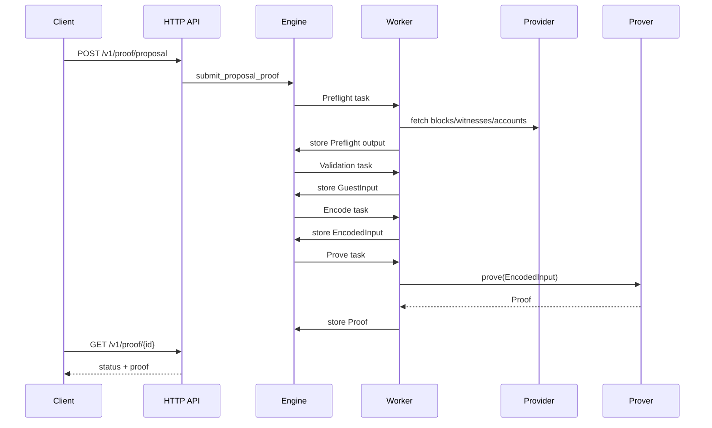

# Raiko V2

Raiko V2 is a zkVM prover for Taiko, built on top of [alethia-reth](https://github.com/taikoxyz/alethia-reth).

## Quickstart

```bash
cp config.example.toml config.toml
cargo run -r -p raiko2 -- --config config.toml
```

Configuration is loaded from a TOML file via `--config` (or `RAIKO2_CONFIG`). CLI flags and
environment variables override values from the file.

## Features

- Split into focused crates: `primitives`, `protocol`, `pipeline`, `provider`, `engine`, `queue`, `stateless`, `prover`
- Built on Taiko's `alethia-reth`
- Shasta protocol support (Based Contestable Rollup)
- Prover backends: RISC0, SP1, and `agent-risc0`
- Native mode: runs locally and outputs public inputs (no zk proof)

## Project structure

```
raiko2/
├── Cargo.toml                 # Workspace root
├── justfile                   # Task entrypoints (build-guest, etc.)
├── bin/                       # Standalone binaries
│   ├── raiko2/                # Prover server (HTTP API + CLI)
│   ├── rpc-proxy/             # RPC proxy service
│   ├── preflight/             # Preflight CLI (build GuestInput)
│   ├── guest-launcher/        # Local guest runner
│   └── witness-check/         # Witness/debug helpers
├── crates/                    # Reusable library crates
│   ├── primitives/            # Core types and traits
│   ├── primitives-shasta/     # Shasta-specific primitives
│   ├── protocol/              # Protocol core types
│   ├── protocol-shasta/       # Shasta types and codecs
│   ├── pipeline/              # Pipeline spec + manifest builder
│   ├── provider/              # Data provider interfaces
│   ├── engine/                # Execution engine
│   ├── queue/                 # Queue + scheduler backends
│   ├── stateless/             # Stateless validation
│   ├── prover/                # Prover backends (risc0, sp1, agent)
│   └── guests/                # Guest ELF assets (compiled outputs)
├── config/                    # Chain spec lists and config assets
├── docker/                    # Toolchain images
├── docs/                      # Documentation
├── xtask/                     # Automation (guest builds via xtask)
└── guests/                    # Guest program sources (not in workspace)
    ├── common/                # Shared guest abstractions
    ├── risc0/                 # RISC0 guest programs
    └── sp1/                   # SP1 guest programs
```

## How it works

Main flow:

1. `Preflight` builds `GuestInput` (includes `TaikoManifest`) from RPC/provider data.
2. `Validation` runs stateless checks for Shasta.
3. `Encode` serializes `GuestInput` for the prover backend.
4. `Prover` runs the zkVM using the hardfork-selected ELF.
5. `Aggregate` combines proposal proofs (aggregation stage).

Dataflow diagram:



Key traits and types:

- `PipelineSpec`: binds `Preflight` + `Validation` + `ManifestBuilder` for a fork.
- `ProverBackend`: selects guest ELFs per `ProofStage` (proposal/aggregation).
- `Pipeline`: hardfork-agnostic preflight + validation flow.
- `Engine`: schedules pipeline stages and prover work.
- `Prover`: encode/prove/aggregate execution (RISC0 / SP1 / agent-risc0).

High-level view:



Pipeline flow:



Request sequence:



## Build

```bash
cargo build --release -p raiko2
```

## Test

Before opening a PR, run:

```bash
cargo fmt --all
cargo clippy --workspace -- -D warnings
cargo nextest run --workspace
```

## Build guests

Guest programs live in `guests/` as standalone crates (they are not part of the workspace). Each guest
crate has its own `[patch.crates-io]` in its `Cargo.toml` so RISC0/SP1 dependency versions stay
isolated. `xtask` builds guests using the published Docker toolchain images and copies the resulting
ELFs into `crates/guests/elf` for the host to load. Use `just` unless you have a reason not to.

Prerequisites: `docker` and `just`.

By default, `xtask` uses prebuilt toolchain images, so you don't need local `rzup` / `sp1up` installs:

- RISC0: `RISC0_TOOLCHAIN_IMAGE=ghcr.io/taikoxyz/raiko2/risc0-toolchain:latest`
- SP1: `SP1_TOOLCHAIN_IMAGE=ghcr.io/taikoxyz/raiko2/sp1-toolchain:latest`

Docker builds reuse a persistent Cargo download cache by default:

- Disable: `DOCKER_CARGO_CACHE=none`
- Override the volume name: `DOCKER_CARGO_CACHE_VOLUME=...` (e.g. `raiko2-cargo-sp1`)

To use local toolchains instead, set `RISC0_TOOLCHAIN_IMAGE=none` and/or `SP1_TOOLCHAIN_IMAGE=none`.

```bash
just build-guest all
# or individually:
just build-guest risc0
just build-guest sp1
# Override docker tags/platform if needed (only applies when toolchain images are disabled):
RISC0_TOOLCHAIN_IMAGE=none SP1_TOOLCHAIN_IMAGE=none \
  RISC0_DOCKER_CONTAINER_TAG=<risc0-tag> SP1_DOCKER_TAG=<sp1-tag> \
  DOCKER_DEFAULT_PLATFORM=linux/amd64 \
  just build-guest all
```

To build the SP1 toolchain image locally:

```bash
docker build -f docker/sp1-toolchain/Dockerfile -t raiko2-sp1-toolchain:local docker/sp1-toolchain
SP1_TOOLCHAIN_IMAGE=raiko2-sp1-toolchain:local just build-guest sp1
```

Without `just`:

```bash
cargo run -r -p xtask -- build-guest all
```

## Release image

Use the `xtask` release entrypoint for runtime images. It is the canonical flow for image releases:

1. rebuild the guest ELF assets for the selected backend
2. build the runtime image
3. push the image
4. print the exact `kubectl set image` and `kubectl rollout status` commands

Release images should not be built via ad-hoc `docker build` because the Dockerfile packages the
existing `crates/guests/elf` artifacts and does not rebuild guest sources on its own.

```bash
just release-image risc0 tolba-20260310-1013

# Equivalent xtask command:
cargo run -r -p xtask -- release-image risc0 \
  --tag tolba-20260310-1013 \
  --repository us-docker.pkg.dev/evmchain/images/raiko2 \
  --namespace tolba-raiko2-host \
  --deployment raiko2 \
  --container raiko2
```

## Guest benchmarking

The `bench-guest` task measures guest execution costs (cycles + wall time):

1. (Optional) Run `preflight` to dump a `GuestInput` JSON.
2. Build SP1 guest ELFs with the `bench` feature enabled (docker).
3. Run `guest-launcher` and collect a JSON report (cycles + wall time).

Examples:

```bash
# Build ELFs (docker) + enable cycle tracking, then run
cargo run -r -p xtask -- bench-guest sp1 --input ./test.json --repeat 3

# Reuse prebuilt ELFs (skip docker build)
cargo run -r -p xtask -- bench-guest sp1 --skip-build-guest --input ./test.json --repeat 3

# Generate input via preflight and write an aggregated report
cargo run -r -p xtask -- bench-guest sp1 \
  --rpc-url http://localhost:9545 \
  --l2-chain-id 167000 \
  --proposal-id 3 \
  --repeat 3 \
  --json-out target/bench/guest-report.json
```

If `guest-launcher` panics while deserializing `GuestInput`, the checked-in ELFs are probably stale.
Rebuild them with:

```bash
cargo run -r -p xtask -- build-guest sp1 --bench
```

## Run

```bash
# Start the prover server
cp config.example.toml config.toml
./target/release/raiko2 --config config.toml

# Or with environment variables
RAIKO2_L1_RPC=http://localhost:8545 \
RAIKO2_L2_RPC=http://localhost:9545 \
./target/release/raiko2
```

## Docker

`raiko2` ships a Docker deployment path that matches the existing Docker-based operator flow, but
excludes all SGX-specific setup.

The Docker path uses:

- the root [`Dockerfile`](./Dockerfile) to build the `raiko2` binary
- [`docker/docker-compose.yml`](./docker/docker-compose.yml) for runtime orchestration
- [`docker/config.compose.toml`](./docker/config.compose.toml) for the base config file mounted into
  the container
- [`docker/.env.sample`](./docker/.env.sample) as the operator-facing environment template

Quickstart:

```bash
cp docker/.env.sample docker/.env
$EDITOR docker/.env

docker compose --env-file docker/.env -f docker/docker-compose.yml up --build
```

The default compose stack starts a single `raiko2` container on port `8080` and uses the in-process
memory queue.

Health checks:

- liveness/readiness: `GET /ready`
- basic status: `GET /health`

The default image is built without optional queue features. If you later want Redis-backed queueing,
rebuild with `BIN_FEATURES=--features redis-queue` and provide the corresponding runtime settings.

To switch prover backends, change `RAIKO2_PROVER` in `docker/.env`:

- `native`
- `risc0`
- `sp1`

## Agent prover

To use `raiko-agent`, set the prover type to `agent-risc0` and configure the agent endpoint:

```toml
[prover]
prover_type = "agent-risc0"

[prover.agent]
url = "http://localhost:9999"
api_key = "optional-api-key"
poll_interval_ms = 1000
timeout_ms = 300000
prover_type = "boundless"
```

The agent handles ELF uploads. raiko2 uploads new ELFs when they change and retries if the agent
returns an "image not uploaded" error.

## Documentation

- [API Documentation](docs/API.md)
- [Migration Guide](docs/MIGRATION.md)
- [Regression Guide](script/regression/README.md)

## License

Licensed under either of:

- Apache License, Version 2.0 ([LICENSE-APACHE](LICENSE-APACHE))
- MIT License ([LICENSE-MIT](LICENSE-MIT))

at your option.

Some files are derived from third-party projects and may include their own copyright and license
notices; those file-level terms apply.
