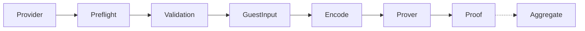
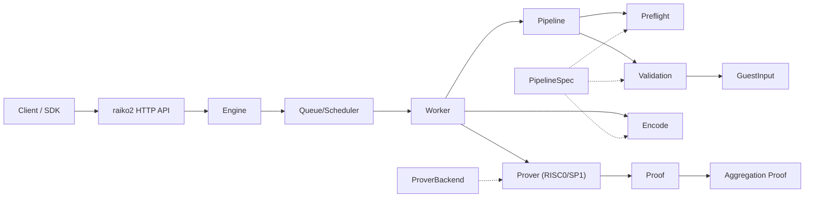
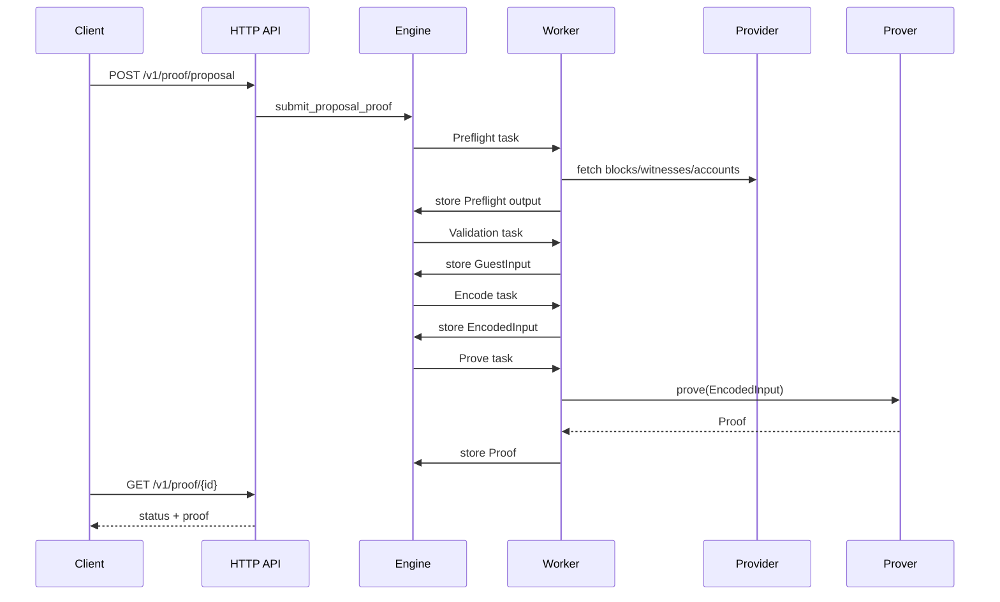

# Raiko V2

Raiko V2 is the next-generation zkVM prover for Taiko, built on top of [alethia-reth](https://github.com/taikoxyz/alethia-reth).

## Features

- **Modular Architecture**: Clean separation between primitives, protocol, pipeline, provider, engine, and prover
- **alethia-reth Integration**: Uses Taiko's new reth fork for improved performance
- **Shasta Protocol**: Native support for Taiko Shasta (Based Contestable Rollup)
- **zkVM Provers**: Support for RISC0 and SP1 provers
- **Native Prover**: Local execution with public-input output (no zk proof)

## Project Structure

```
raiko2/
├── Cargo.toml          # Workspace root
├── justfile            # Task entrypoints (build-guest, etc.)
├── crates/
│   ├── primitives/     # Core types and traits
│   ├── protocol/       # Shasta protocol implementation
│   ├── pipeline/       # Pipeline spec + manifest builder
│   ├── provider/       # Data provider interfaces
│   ├── engine/         # Execution engine
│   ├── stateless/      # Stateless validation
│   ├── prover/         # zkVM prover adapters (risc0, sp1)
│   └── guests/         # Guest ELF assets (compiled outputs)
├── bin/
│   ├── raiko2/         # Main binary (HTTP server + CLI)
│   └── rpc-proxy/      # RPC proxy service
├── docs/               # Documentation
├── xtask/              # Automation (guest builds via cargo risczero/prove)
├── guests/             # Guest program sources (out-of-workspace)
│   ├── common/         # Shared guest abstractions
│   ├── risc0/          # RISC0 guest programs
│   └── sp1/            # SP1 guest programs
└── script/             # Helper scripts (prove-block, update_imageid, etc.)
```

## Architecture

Core flow:

1. **Preflight** builds `GuestInput` (includes `TaikoManifest`) from RPC/provider data.
2. **Validation** checks `GuestInput` (stateless validation for Shasta).
3. **Encode** serializes `GuestInput` for the prover backend.
4. **Prover** runs the zkVM using hardfork-selected ELF.
5. **Aggregate** combines proposal proofs (aggregation stage).

Dataflow diagram:



Key abstractions:

- `PipelineSpec`: binds `Preflight` + `Validation` + `ManifestBuilder` for a fork.
- `ProverBackend`: selects guest ELFs per `ProofStage` (proposal/aggregation).
- `Pipeline`: hardfork-agnostic preflight + validation flow.
- `Engine`: schedules pipeline stages and prover work.
- `Prover`: encode/prove/aggregate execution (RISC0 / SP1).

Architecture diagram:



Pipeline flow:


Request sequence:



## Building

```bash
cd raiko2
cargo build --release
```

## Testing

Always run:

```bash
cargo clippy --workspace -- -D warnings
cargo nextest run --workspace
```

## Building Guests

Guest programs live in `guests/` as standalone crates (not part of the root workspace). Each guest
crate carries its own `[patch.crates-io]` in `Cargo.toml` to keep RISC0 and SP1 dependencies isolated.
`xtask` uses the official Docker images (no local toolchains required), and copies
ELF outputs into `crates/guests/elf` for use by the host. `just` is the preferred
wrapper.

Prerequisites: `docker`, `just`, `cargo risczero` (via `rzup install`), and `cargo prove` (via `sp1up`).

```bash
just build-guest all
# or individually:
just build-guest risc0
just build-guest sp1
# Override images/tags/platform if needed:
RISC0_DOCKER_TAG=r0.1.88.0 SP1_DOCKER_TAG=v5.2.4 DOCKER_DEFAULT_PLATFORM=linux/amd64 \\
  just build-guest all
```

If you don't use `just`:

```bash
cargo run -p xtask -- build-guest all
```

## Running

```bash
# Start the prover server
./target/release/raiko2 --config config.toml

# Or with environment variables
RAIKO2_L1_RPC=http://localhost:8545 \
RAIKO2_L2_RPC=http://localhost:9545 \
./target/release/raiko2
```

## Documentation

- [API Documentation](docs/API.md)
- [Migration Guide](docs/MIGRATION.md)

## License

MIT License - see [LICENSE](../LICENSE)
