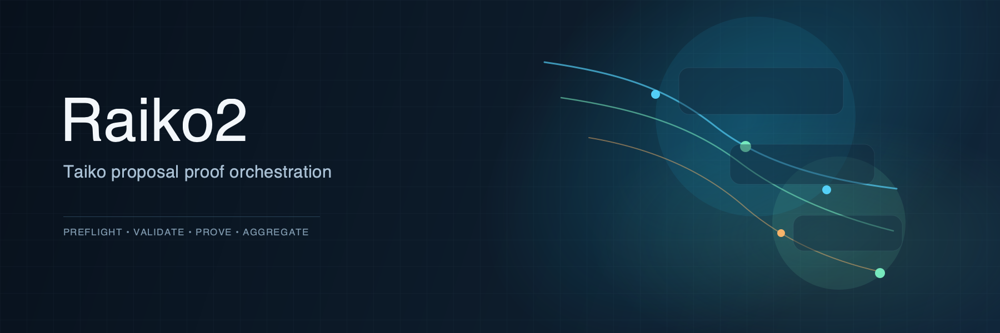
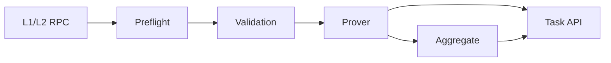

[](https://github.com/taikoxyz/raiko2/actions/workflows/ci.yml)

Home / [Docs](docs/README.md) / [API](docs/API.md) /
[Development](docs/development.md) / [Operations](docs/operations.md) /
[Regression](scripts/regression/README.md) / [Config](config.example.toml)

Raiko2 is a Shasta proof service for Taiko. It builds canonical guest inputs from RPC data,
validates them, runs local or remote proving routes, and exposes an asynchronous,
Hoodi-compatible v3 API.

## At a Glance

- Asynchronous, Hoodi-compatible v3 API for Shasta proofs and aggregation
- Canonical routes: `native/local`, `risc0/local`, `risc0/boundless`, `sp1/local`
- Shasta-first pipeline for preflight, validation, proving, and aggregation
- Config-driven RPC pair allowlist via `rpc.pairs`
- In-process runtime state under `./data/runtime` by default

## Quickstart

```bash
cp config.example.toml config.toml
cargo run -r -p raiko2 -- --config config.toml
```

Configuration is loaded from `--config` or `RAIKO2_CONFIG`. CLI flags and environment variables
override values from the file.

## Core Flow

1. `Preflight` resolves canonical Shasta inputs from L1 and L2 RPC.
2. `Validation` checks request invariants and witness-derived data.
3. `Prover` runs the selected backend and runner.
4. `Aggregate` combines proposal proofs when the request asks for it.



## Routes

- `native/local` executes the proving pipeline locally and returns public inputs
  instead of a zk proof.
- `risc0/local` generates RISC Zero proofs locally.
- `risc0/boundless` submits RISC Zero proving directly to Boundless from the `raiko2` process.
- `sp1/local` runs the SP1 flow; request-scoped SP1 settings also cover execute
  mode and network proving.

## Repository Map

- `bin/raiko2`: HTTP server and CLI
- `crates/pipeline`: preflight, manifest building, and validation wiring
- `crates/prover`: prover backends and aggregation adapters
- `xtask`: guest build, benchmarking, and release automation

## License

Licensed under either of:

- Apache License, Version 2.0 ([LICENSE-APACHE](LICENSE-APACHE))
- MIT License ([LICENSE-MIT](LICENSE-MIT))

at your option.

Some files are derived from third-party projects and may include their own copyright and license
notices; those file-level terms apply.
