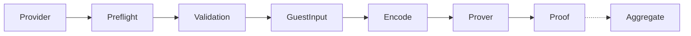
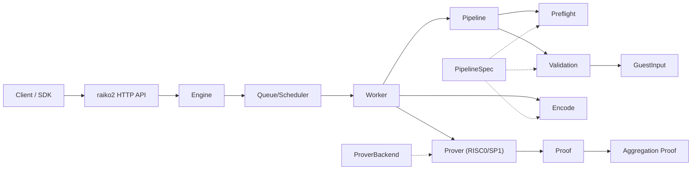
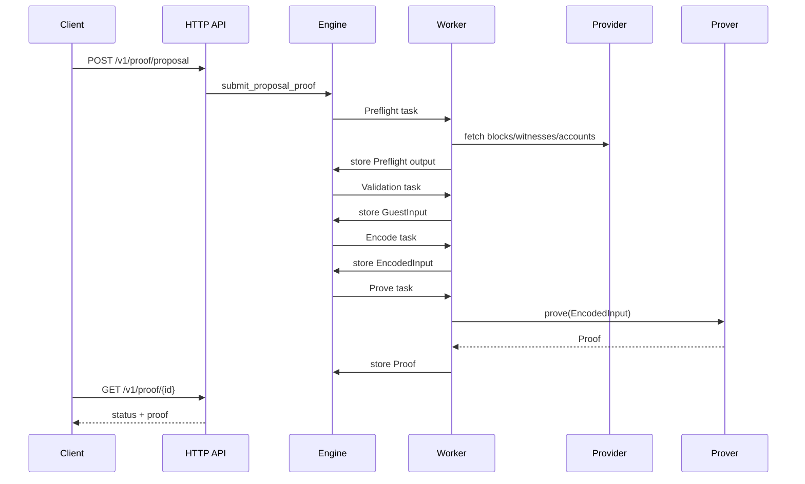

# Raiko V2

Raiko V2 is the next-generation zkVM prover for Taiko, built on top of [alethia-reth](https://github.com/taikoxyz/alethia-reth).

## Features

- **Modular Architecture**: Clean separation between primitives, protocol, pipeline, provider, engine, and prover
- **alethia-reth Integration**: Uses Taiko's new reth fork for improved performance
- **Shasta Protocol**: Native support for Taiko Shasta (Based Contestable Rollup)
- **zkVM Provers**: Support for RISC0, SP1, and agent-backed provers
- **Native Prover**: Local execution with public-input output (no zk proof)

## Project Structure

```
raiko2/
├── Cargo.toml          # Workspace root
├── justfile            # Task entrypoints (build-guest, etc.)
├── crates/
│   ├── primitives/     # Core types and traits
│   ├── protocol/       # Shasta protocol implementation
│   ├── pipeline/       # Pipeline spec + manifest builder
│   ├── provider/       # Data provider interfaces
│   ├── engine/         # Execution engine
│   ├── stateless/      # Stateless validation
│   ├── prover/         # zkVM prover adapters (risc0, sp1, agent)
│   └── guests/         # Guest ELF assets (compiled outputs)
├── bin/
│   ├── raiko2/         # Main binary (HTTP server + CLI)
│   └── rpc-proxy/      # RPC proxy service
├── docs/               # Documentation
├── xtask/              # Automation (guest builds via cargo risczero/prove)
├── guests/             # Guest program sources (out-of-workspace)
│   ├── common/         # Shared guest abstractions
│   ├── risc0/          # RISC0 guest programs
│   └── sp1/            # SP1 guest programs
└── script/             # Helper scripts (prove-block, update_imageid, etc.)
```

## Architecture

Core flow:

1. **Preflight** builds `GuestInput` (includes `TaikoManifest`) from RPC/provider data.
2. **Validation** checks `GuestInput` (stateless validation for Shasta).
3. **Encode** serializes `GuestInput` for the prover backend.
4. **Prover** runs the zkVM using hardfork-selected ELF.
5. **Aggregate** combines proposal proofs (aggregation stage).

Dataflow diagram:



Key abstractions:

- `PipelineSpec`: binds `Preflight` + `Validation` + `ManifestBuilder` for a fork.
- `ProverBackend`: selects guest ELFs per `ProofStage` (proposal/aggregation).
- `Pipeline`: hardfork-agnostic preflight + validation flow.
- `Engine`: schedules pipeline stages and prover work.
- `Prover`: encode/prove/aggregate execution (RISC0 / SP1 / agent).

Architecture diagram:



Pipeline flow:


Request sequence:



## Building

```bash
cd raiko2
cargo build --release
```

## Testing

Always run:

```bash
cargo clippy --workspace -- -D warnings
cargo nextest run --workspace
```

## Building Guests

Guest programs live in `guests/` as standalone crates (not part of the root workspace). Each guest
crate carries its own `[patch.crates-io]` in `Cargo.toml` to keep RISC0 and SP1 dependencies isolated.
`xtask` uses the official Docker images (no local toolchains required), and copies
ELF outputs into `crates/guests/elf` for use by the host. `just` is the preferred
wrapper.

Prerequisites: `docker` and `just`.

By default, `xtask` uses prebuilt toolchain images (no local `rzup` / `sp1up` installs required):

- RISC0: `RISC0_TOOLCHAIN_IMAGE=ghcr.io/taikoxyz/raiko2/risc0-toolchain:latest`
- SP1: `SP1_TOOLCHAIN_IMAGE=ghcr.io/taikoxyz/raiko2/sp1-toolchain:latest`

Docker-based guest builds reuse a persistent Cargo download cache by default:

- Disable: `DOCKER_CARGO_CACHE=none`
- Override the volume name: `DOCKER_CARGO_CACHE_VOLUME=...` (e.g. `raiko2-cargo-sp1`)

To use local toolchains instead, set `RISC0_TOOLCHAIN_IMAGE=none` and/or `SP1_TOOLCHAIN_IMAGE=none`.

```bash
just build-guest all
# or individually:
just build-guest risc0
just build-guest sp1
# Override tags/platform if needed (only applies to docker-based guest builds):
RISC0_DOCKER_TAG=r0.1.88.0 SP1_DOCKER_TAG=v5.2.4 DOCKER_DEFAULT_PLATFORM=linux/amd64 \\
  RISC0_TOOLCHAIN_IMAGE=none SP1_TOOLCHAIN_IMAGE=none \\
  just build-guest all
```

To build the SP1 toolchain image locally:

```bash
docker build -f docker/sp1-toolchain/Dockerfile -t raiko2-sp1-toolchain:local docker/sp1-toolchain
SP1_TOOLCHAIN_IMAGE=raiko2-sp1-toolchain:local just build-guest sp1
```

If you don't use `just`:

```bash
cargo run -r -p xtask -- build-guest all
```

## Guest Benchmarking

The `bench-guest` task reproduces the PR #9 workflow for measuring guest execution costs:

1. (Optional) Run `preflight` to dump a `GuestInput` JSON.
2. Build SP1 guest ELFs with the `bench` feature enabled (docker).
3. Run `guest-launcher` and collect a JSON report (cycles + wall time).

Examples:

```bash
# Build ELFs (docker) + enable cycle tracking, then run
cargo run -r -p xtask -- bench-guest sp1 --input ./test.json --repeat 3

# Reuse prebuilt ELFs (skip docker build)
cargo run -r -p xtask -- bench-guest sp1 --skip-build-guest --input ./test.json --repeat 3

# Generate input via preflight and write an aggregated report
cargo run -r -p xtask -- bench-guest sp1 \
  --rpc-url http://35.226.222.182:8545 \
  --l2-chain-id 167001 \
  --proposal-id 3 \
  --repeat 3 \
  --json-out target/bench/guest-report.json
```

If `guest-launcher` fails with a `GuestInput` deserialization panic, your checked-in ELFs may be out of
date. Rebuild them with:

```bash
cargo run -r -p xtask -- build-guest sp1 --bench
```

## Running

```bash
# Start the prover server
./target/release/raiko2 --config config.toml

# Or with environment variables
RAIKO2_L1_RPC=http://localhost:8545 \
RAIKO2_L2_RPC=http://localhost:9545 \
./target/release/raiko2
```

## Agent Prover

To delegate proof generation to `raiko-agent`, set the prover type to `agent` and configure the agent endpoint:

```toml
[prover]
prover_type = "agent"

[prover.agent]
url = "http://localhost:9999"
api_key = "optional-api-key"
poll_interval_ms = 1000
timeout_ms = 300000
prover_type = "boundless"
```

ELF uploads are handled by the agent; raiko2 will upload on change or retry after an "image not uploaded" error.

## Documentation

- [API Documentation](docs/API.md)
- [Migration Guide](docs/MIGRATION.md)

## License

MIT License - see [LICENSE](../LICENSE)
