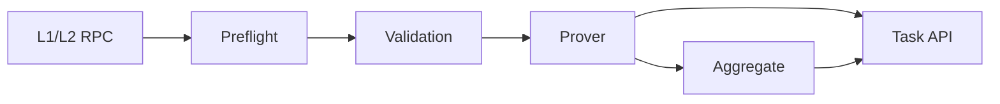

[](https://github.com/taikoxyz/raiko2/actions/workflows/ci.yml)

Home / [Docs](docs/README.md) / [API](docs/API.md) /
[Development](docs/development.md) / [Operations](docs/operations.md) /
[Regression](scripts/regression/README.md) / [Config](config.example.toml)

Raiko2 is a Shasta proof service for Taiko. It builds canonical guest inputs from RPC data,
validates them, runs local or remote proving routes, and exposes an asynchronous
Hoodi-compatible v3 API plus typed v4 proposal and aggregation endpoints.

## At a Glance

- Asynchronous Hoodi-compatible v3 API plus typed v4 proposal and aggregation endpoints
- Canonical routes: `native/local`, `risc0/local`, `risc0/network`, `sp1/local`, `sp1/network`
- Default binaries include RISC Zero local/network proving and SP1 proving
- Optional remote SGX routes for configured external prover providers
- Shasta-first pipeline for preflight, validation, proving, and aggregation
- Config-driven RPC pair allowlist and optional L1 beacon overrides via `rpc.pairs`
- Persisted runtime state, task workdirs, and reusable proof artifacts under `./data/runtime`
- In-process memory queue by default, with an optional Redis-backed queue

## Quickstart

Run the fixture-backed server for a dependency-free local API smoke test:

```bash
cargo run -p raiko2 --features fixture-server -- fixture-server --host 127.0.0.1 --port 8087
```

Use this only for local API-surface smoke testing, request/response contract checks, and simple
task/report workflow validation when you do not want real RPC or prover dependencies. It is not a
substitute for preflight correctness, remote-provider integration, or full proposal regression.

Run the real server with an explicit config file:

```bash
cp config.example.toml config.toml
cargo run -r -p raiko2 -- --config config.toml
```

Configuration is loaded from `--config` or `RAIKO2_CONFIG`. CLI flags and environment variables
override values from the file. The real server checks configured RPC endpoints and hosted prover
capabilities before it starts, so replace example RPC endpoints and set required prover secrets
such as `NETWORK_PRIVATE_KEY` for SP1 network proving or a Boundless signer key when the selected
route is `risc0/network`. The prover loads guest ELF files from `RAIKO2_GUEST_ELF_DIR` when set,
otherwise from `crates/guests/elf`. For unreleased testing, build ELFs locally with
`just build-guest all`. Packaged deployments can download released ELF assets with
`cargo run -r -p xtask -- download-guest-elves --tag <tag> --dir <guest-elf-dir>`.
When intentionally running v0.1.0 release guest ELFs with a newer host, set
`prover.guest_input_abi = "v0_1_0"`; the default is `current`.

## Core Flow

1. `Preflight` resolves canonical Shasta inputs from L1 and L2 RPC.
2. `Validation` checks request invariants and witness-derived data.
3. `Prover` runs the selected backend and runner.
4. `Aggregate` combines proposal proofs when the request asks for it.



## API Compatibility

- `POST /v3/proof/batch/shasta` registers proposal proof work and, when `aggregate=true`, also
  registers the aggregation work for that batch.
- `POST /v3/proof/aggregate` registers aggregation work from externally supplied proposal proofs.
- Single-proof aggregation is allowed for compatibility with existing `raiko` clients.
- Shasta manifests support `blob_proof_type = "proof_of_equivalence"` only; legacy
  `kzg_versioned_hash` manifests are rejected.
- Public batch request proof types are `native`, `risc0`, `sp1`, `sgx`, `sgxgeth`, and
  admission-time `zk_any` for proposal sampling. `native` is accepted only for internal native
  regression when the server route is `native/local`.
- Hosted SP1 proposal proving emits Compressed proofs and SP1 aggregation emits Plonk proofs.
- `proof_type=risc0` resolves to the server's configured RISC Zero prover type. The
  `prover_type=network` path submits to Boundless and exposes Boundless quote metadata; Boundless
  is not a separate proof type.
- `proof_type=boundless` is not accepted; use `proof_type=risc0` with the server configured for
  `risc0/network` when targeting Boundless.

## Routes

- `native/local` executes the proving pipeline locally and returns public inputs
  instead of a zk proof.
- `risc0/local` generates RISC Zero proofs locally.
- `risc0/network` submits RISC Zero proving directly to Boundless from the `raiko2` process.
- `sp1/local` and `sp1/network` select the SP1 pipeline. The task `prover_type` reports whether
  SP1 ran in `mock`, `local`, or `network` mode.
- `sgx/remote` submits Shasta proving to the dedicated remote SGX runtime. This repo now ships
  `raiko2-sgx-prover` for `proof_type=sgx`; that runtime can run in `tee` or `native` mode
  without changing the remote API. `proof_type=sgxgeth` is served by an external remote prover
  implementation such as `gaiko2` over the same remote protocol.
- `docker/docker-compose.sgx.regression.yml` starts both SGX remote services and can optionally
  add a dockerized `raiko2` for regression work.

## Remote Prover Conformance

`raiko2` owns the canonical remote prover request fixtures under:

- `tests/fixtures/remote_prover/shasta_aggregate_request_v1_single_fixture_proof.json`

The aggregate request fixture is the strict protocol golden for:

- `raiko2-shasta-aggregate-request-v1`

Run the ignored black-box conformance harness against a provider endpoint with:

```bash
RAIKO2_REMOTE_PROVER_BASE_URL=http://127.0.0.1:8080 \
cargo test -p raiko2-prover --no-default-features \
  --test remote_prover_conformance -- --ignored --nocapture
```

The harness builds the proposal request from the shared Shasta `GuestInput` fixture and posts it to:

- `POST /prove/shasta`

This harness targets providers whose `/prove/shasta` input is the v1
`raiko2-shasta-request-v1` packet with `payload.guest_input`. `raiko2-sgx-prover` consumes the
same request shape and runs the Shasta guest validation path before signing.

It then builds a live aggregate request from the returned proposal proof and posts that derived
request to:

- `POST /prove/shasta-aggregate`

This keeps aggregate conformance provider-agnostic while preserving provider identity continuity
for implementations that require aggregate subproofs to come from the current prover instance.

The harness verifies the provider returns a `raiko2-proof-v1` envelope with an `input` value that
is self-consistent with the submitted proof carry data.

For the first external provider migration, see
[`docs/gaiko2-remote-prover-integration.md`](docs/gaiko2-remote-prover-integration.md).

## Repository Map

- `bin/raiko2`: HTTP server and CLI
- `crates/pipeline`: preflight, manifest building, and validation wiring
- `crates/prover`: prover backends and aggregation adapters
- `xtask`: guest build, verifier registration, benchmarking, and release automation

## License

Licensed under either of:

- Apache License, Version 2.0 ([LICENSE-APACHE](LICENSE-APACHE))
- MIT License ([LICENSE-MIT](LICENSE-MIT))

at your option.

Some files are derived from third-party projects and may include their own copyright and license
notices; those file-level terms apply.
