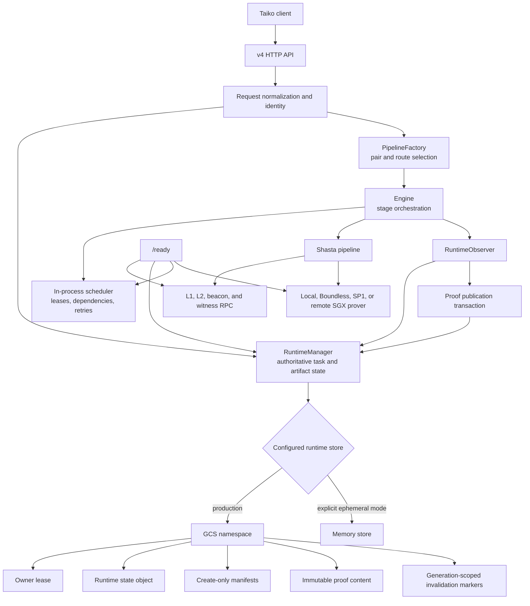
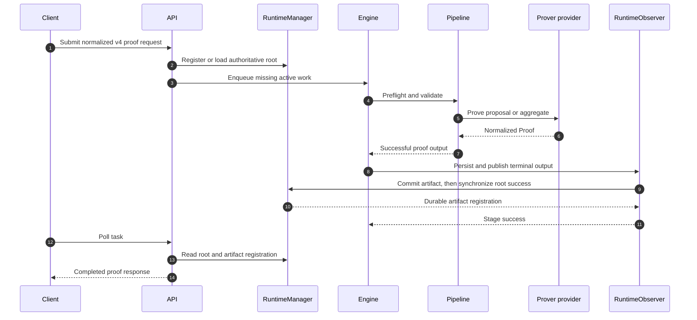
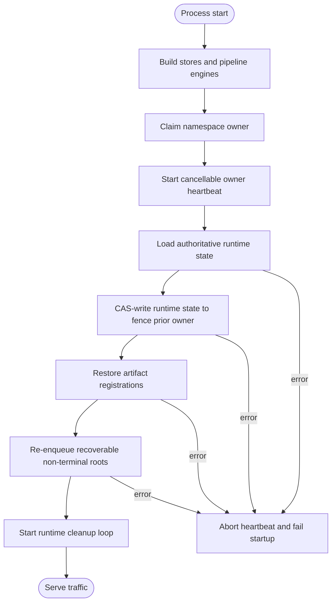
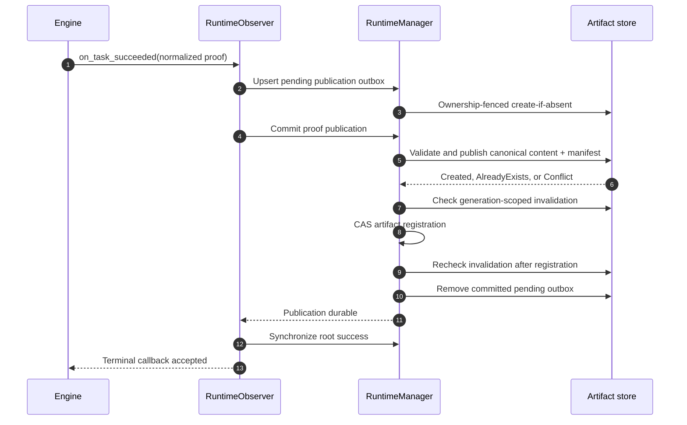
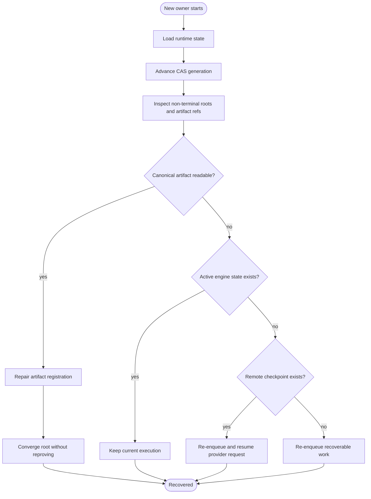
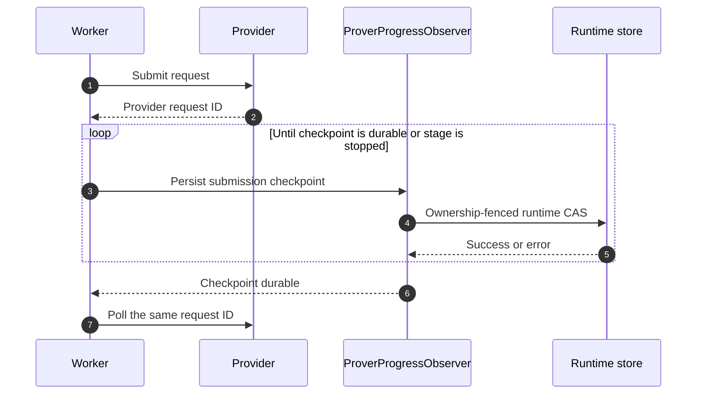
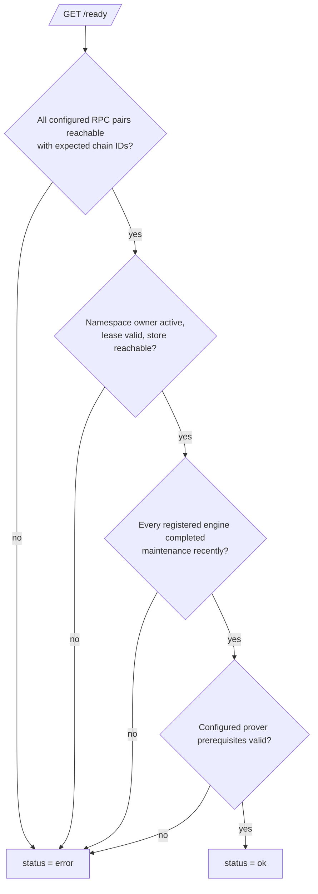

# Architecture

Raiko2 is a Shasta proof orchestration service. It turns a normalized v4 proof request into a
durable proposal or aggregation proof while keeping request identity, execution state, remote
provider checkpoints, and published proof artifacts recoverable across process restarts.

This document describes the current runtime architecture. Historical plans under `docs/plans/`
explain how individual changes were developed but are not the source of truth for current behavior.

## Design Invariants

The architecture is organized around these invariants:

1. The namespaced runtime store is authoritative for task state, artifact registration, and remote
   submission checkpoints. The in-process queue is an execution projection of that state.
2. A GCS-backed `(environment, namespace)` has one renewable writer owner. Ownership loss freezes
   admissions and shared mutations and makes the instance not ready.
3. Proof computation is not completion. A task becomes completed only after its normalized proof is
   durably published, registered, and synchronized to its runtime root.
4. Proof manifests are create-only and first-valid-wins. Content objects are immutable and addressed
   by SHA-256; a conflicting publication cannot replace the canonical proof.
5. Invalidation targets one manifest generation and content hash. A later proof lifecycle may publish
   identical bytes under a new manifest generation without reactivating the invalidated generation.
6. Remote request identifiers are resumable only after their submission checkpoint is durably stored.
   Request-level SP1 retry configuration may lower, but never raise, the operator limit.

## System Architecture



The server binary owns configuration, HTTP behavior, route selection, and lifecycle wiring. Shared
domain and persistence rules live in crates:

| Layer | Primary responsibility | Main locations |
| --- | --- | --- |
| HTTP and startup | v4 API, readiness, configuration, recovery wiring | `bin/raiko2/src/server`, `bin/raiko2/src/config` |
| Engine | Stage dependencies, leases, retry policy, durable publication retry payloads | `crates/engine` |
| Queue | In-process task scheduling and maintenance | `crates/queue` |
| Pipeline | Preflight, validation, encoding, proving, and aggregation wiring | `crates/pipeline` |
| Prover | Local and hosted prover adapters plus remote submission recovery | `crates/prover` |
| Runtime | Authoritative task state, ownership fencing, artifact storage, publication | `crates/runtime` |

## Identity And Isolation

Every durable key is scoped by an explicit proof environment and runtime namespace. These are
different boundaries:

- `environment` separates business deployments such as devnet and mainnet.
- `namespace` separates one authoritative runtime ownership domain inside an environment.
- The network pair, concrete pipeline, execution route, and normalized request identity further
  scope tasks and artifacts.

Proofs are never reused across environments, concrete proof types, or execution routes. A
`risc0/local` proof therefore cannot satisfy a `risc0/network` request, even if the public proof
type and proposal range match.

## Request And Execution Flow



Proposal execution is decomposed into preflight, validation, encoding, and proving stages.
Aggregation depends on proposal proof artifact references rather than in-memory proof values. A
successful prover result that cannot yet be published is converted into an `EngineTask::PublishProof`
payload, so publication retries reuse the computed proof and do not pay to prove again.

Terminal engine state is not authoritative by itself. If terminal synchronization fails, API and
startup recovery compare the runtime root with active engine state. Only active engine states
(`Pending`, `Ready`, `Retrying`, or `Running`) block re-enqueue; a terminal engine record cannot
permanently strand a non-terminal runtime root.

## Runtime Ownership And Fencing

The GCS backend stores an owner lease containing `owner_id`, monotonically advancing `epoch`, expiry,
and the GCS object generation. Claim and renewal writes use generation preconditions. Runtime state
writes use compare-and-swap against the last observed runtime-state generation.

Startup orders ownership before recovery:



Every external artifact mutation first verifies live ownership and advances the runtime-state CAS
fence. If renewal or verification fails, `RuntimeManager` becomes inactive. Later state mutations,
artifact writes, invalidations, and request admissions fail closed until ownership is valid again.

Memory mode deliberately has no distributed owner object. It is an explicit ephemeral, single-process
backend for local development and controlled emergency operation, not an automatic GCS fallback.

## Proof Artifact Storage

For a logical `ProofArtifactKey`, the GCS backend uses this layout:

```text
<prefix>/<environment>/<namespace>/
  owner.owner.json
  work/runtime-state.runtime.json
  proofs/<pipeline>/<route>/<network-pair>/<proof-ref>/
    manifest.manifest.json
    content/<sha256>.proof.json
    invalidated/<manifest-generation>-<sha256>.tombstone
```

Components are encoded before becoming object-name segments. The manifest contains only the selected
content hash; the manifest object's native GCS generation identifies that publication generation.

Publication has three storage outcomes:

- `Created`: content and manifest were created.
- `AlreadyExists`: the manifest already selected the same content hash; missing identical content is
  repaired before returning the idempotent result.
- `Conflict`: the manifest selected different canonical content. The existing valid proof remains
  first-write-wins and is never overwritten.

Normal reads materialize the manifest and referenced content and reject a missing or hash-mismatched
content object as corruption. Metadata-only manifest reads are used for repair and conditional delete,
so a dangling manifest remains inspectable even when normal proof reads fail.

## Publication Transaction

The pending publication object is the durable outbox between proof computation and artifact
registration. It is retained until the canonical proof is validated, published, and registered.
Runtime root synchronization follows that storage commit; if it fails, the engine retains the
normalized proof in its publication-retry payload and repeats the idempotent commit before retrying
root synchronization.



Any transient error before convergence leaves enough state to retry. Publication errors are retryable
and retain the proof in the queue payload. A proof publication invalidated by cancellation is a real
terminal outcome and is not retried as a successful artifact.

## Cancellation And Generation-Scoped Invalidation

Invalidation is not a content-wide ban. It records the tuple `(logical key, manifest generation,
content hash)`, then conditionally deletes only that manifest generation. Immutable content may remain
for retention or later deduplication.


If generation A is invalidated, a later identical proof may create generation B. Reads of A remain
invalidated, while B is active because its generation differs. Conditional delete prevents an old
owner or delayed cancellation from deleting a replacement manifest.

Cancellation is checked both before and after artifact registration. Cancellation after the pending
outbox was already drained still reconciles the canonical manifest by reading it directly, restoring
its registration if necessary, and invalidating that exact generation.

## Restart And Failure Recovery

Recovery always starts from runtime state and canonical artifact metadata, never from queue memory.



Important recovery cases are:

| Persisted condition | Recovery action |
| --- | --- |
| Canonical artifact exists, registration missing | Validate and restore registration before considering reproof |
| Proof is computed, publication incomplete | Retry `PublishProof` with the retained normalized proof |
| Runtime root non-terminal, engine state terminal or missing | Re-enqueue if no active engine state blocks it |
| Remote request checkpoint exists | Resume the recorded request and attempt budget |
| Cancellation raced a committed artifact | Invalidate and conditionally remove the committed generation |
| Manifest references missing content | Surface integrity failure; identical publication may repair content |

## Remote Prover Checkpoints And Cost Policy

Boundless and SP1 submission progress is written through the fallible `ProverProgressObserver`.
The checkpoint contains the backend, attempt, submission time, deadline, and backend-specific payload.



A newly returned provider request ID is never treated as resumable before checkpoint persistence.
Legacy SP1 checkpoints whose deadline is zero or absent reuse the full configured timeout while
retaining their request ID and attempt. The effective SP1 request attempt limit is:

```text
min(operator network_request_max_attempts, non-zero request override)
```

Without an override, the operator value is used. A request cannot raise the configured cost ceiling.

## Readiness

`GET /health` proves only that the process is alive. `GET /ready` is the traffic gate and succeeds
only when every required dependency is healthy:



Queue health is not queue emptiness. Each engine records the time of its last successful scheduler
maintenance tick. The stale threshold is:

```text
max(3 * queue.maintenance_interval_ms, 1000 ms)
```

The readiness response exposes independent `reth`, `runtime`, `queue`, and `prover` checks so an
operator can identify the failed boundary without inferring it from the aggregate status.

## Retention And Operational Boundaries

- Active manifests must not be removed by age-based lifecycle rules.
- Content must remain while any active manifest references it. Unreferenced content may be retained
  for at least the invalidation window before garbage collection.
- Generation-scoped invalidation markers must outlive the longest retry, recovery, and cleanup window;
  the current operational minimum is 30 days.
- Runtime state and owner objects are control-plane data and must not share artifact garbage-collection
  rules.
- GCS and memory are alternative authoritative backends. The server does not dual-write or fail over
  automatically between them.

See [Operations](operations.md) for configuration, lifecycle policy, metrics, and rollout checks, and
[ADR 0001](adr/0001-use-an-immutable-proof-artifact-store.md) for the artifact-store decision.
