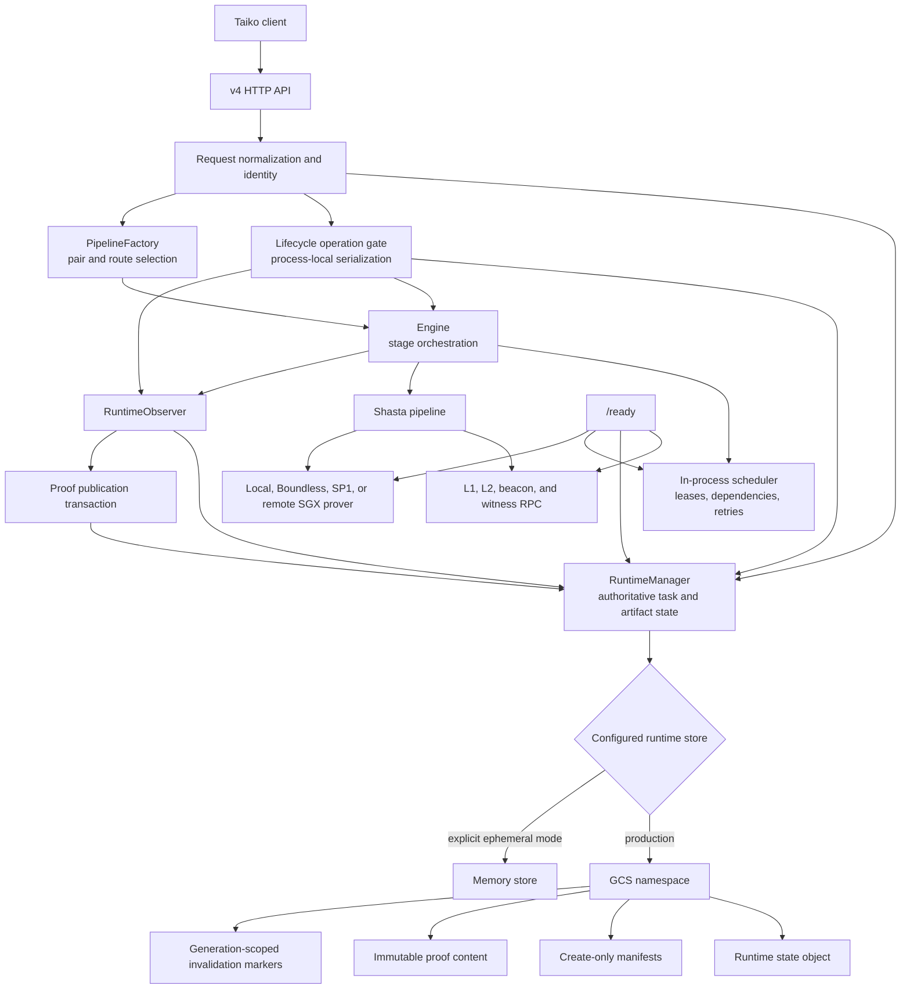
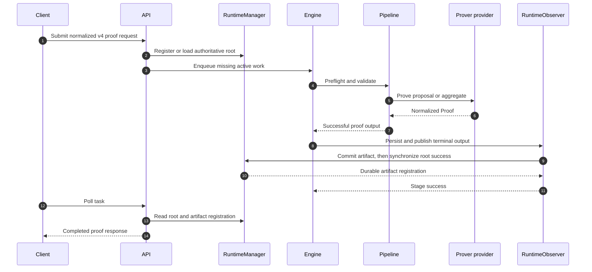
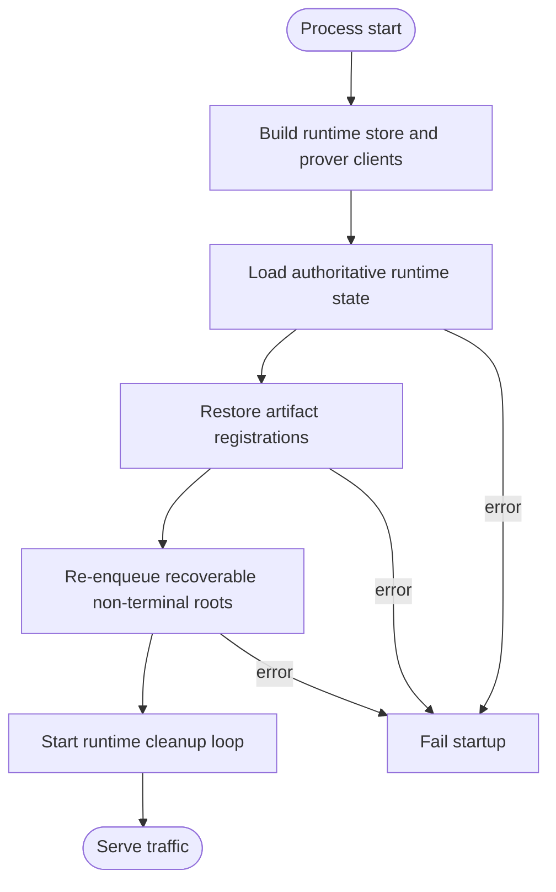
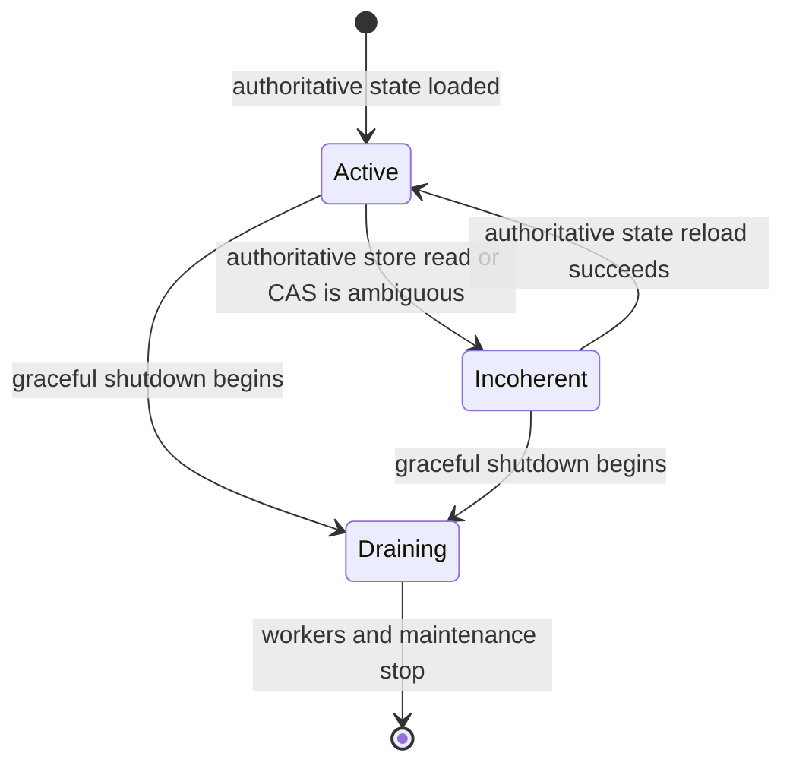
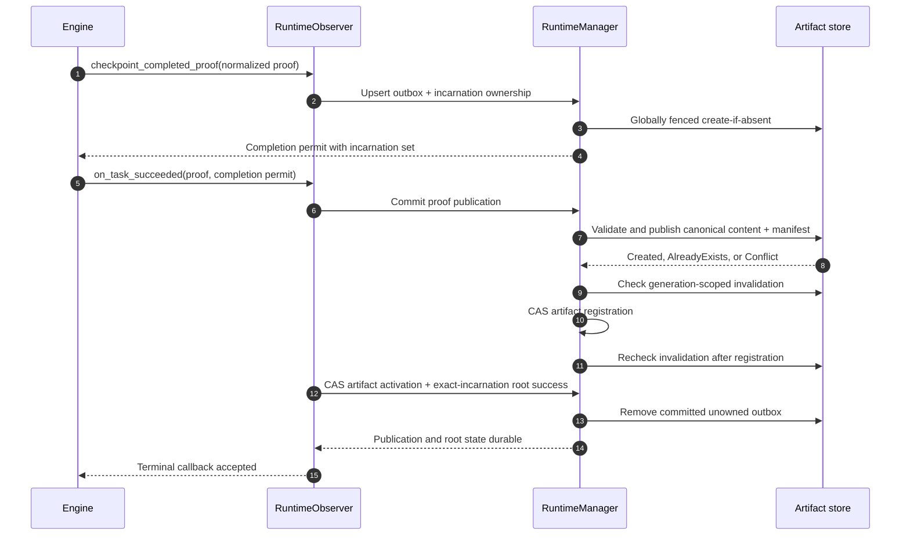
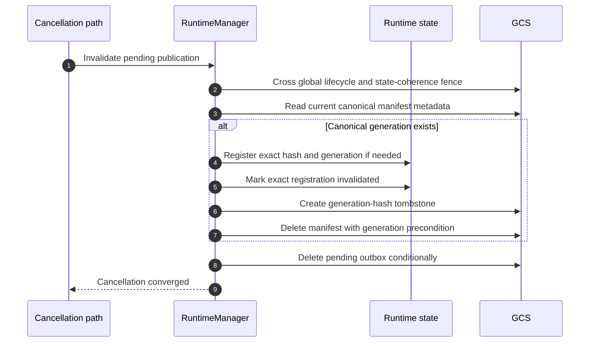
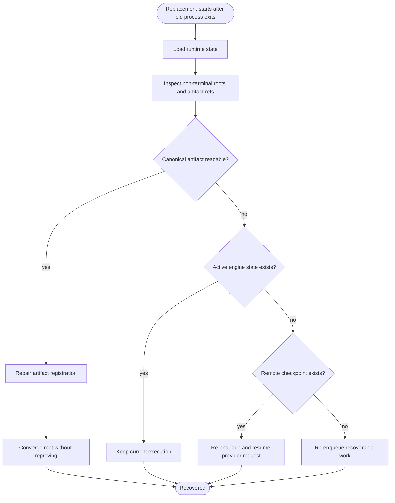
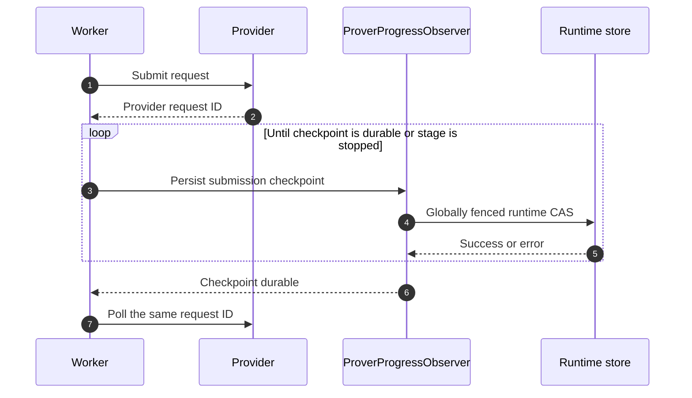

# Architecture

Raiko2 is a Shasta proof orchestration service. It turns a normalized v4 proof request into a
durable proposal or aggregation proof while keeping request identity, execution state, remote
provider checkpoints, and published proof artifacts recoverable across process restarts.

This document expands the normative architecture and operator contract in [README.md](../README.md)
with component boundaries, state transitions, and operational diagrams. If this document conflicts
with README.md, README.md governs. Historical plans under `docs/plans/` explain how individual
changes were developed but are not the source of truth for current behavior.

## Design Invariants

The architecture is organized around these invariants:

1. The namespaced runtime store is authoritative for task state, artifact registration, and remote
   submission checkpoints. The in-process queue is an execution projection of that state.
2. A GCS-backed `(environment, namespace)` has exactly one live process. This is an operational
   deployment invariant, not a distributed coordination feature. The runtime intentionally has no
   owner lease, owner epoch, or ownership heartbeat.
3. Proof computation is not completion. A task becomes completed only after its normalized proof is
   durably published, registered, and synchronized to its runtime root.
4. Proof manifests are create-only and first-valid-wins. Content objects are immutable and addressed
   by SHA-256; a conflicting publication cannot replace the canonical proof.
5. Invalidation targets one manifest generation and content hash. A later proof lifecycle may publish
   identical bytes under a new manifest generation without reactivating the invalidated generation.
6. Remote request identifiers are resumable only after their submission checkpoint is durably stored.
   Request-level SP1 retry configuration may lower, but never raise, the operator limit.
7. One running instance owns one namespace, and old and replacement instances never overlap.
   Namespaces are isolated persistence domains and never share tasks, artifacts, checkpoints, or
   invalidation markers. Multiple roots inside the same namespace may reference the same canonical
   proof artifact.
8. The runtime fence is global to the instance and namespace, never scoped to an individual task.
   When the lifecycle is inactive or draining, every worker, observer, cleanup loop, API mutation, and
   external-store write is fenced together. GCS object generations remain separate object-version
   CAS tokens; they are not instance epochs.
9. Every operation spanning runtime, queue, or artifact state enters one process-local lifecycle
   operation gate. Snapshot-derived removal uses the expected task incarnation, while cached-proof
   admission revalidates the exact artifact descriptor before creating the root.

## System Architecture



The server binary owns configuration, HTTP behavior, route selection, and lifecycle wiring. Shared
domain and persistence rules live in crates:

| Layer | Primary responsibility | Main locations |
| --- | --- | --- |
| HTTP and startup | v4 API, readiness, configuration, recovery wiring | `bin/raiko2/src/server`, `bin/raiko2/src/config` |
| Engine | Stage dependencies, leases, retry policy, durable publication retry payloads | `crates/engine` |
| Queue | In-process task scheduling and maintenance | `crates/queue` |
| Pipeline | Preflight, validation, encoding, proving, and aggregation wiring | `crates/pipeline` |
| Prover | Local and hosted prover adapters plus remote submission recovery | `crates/prover` |
| Runtime | Authoritative task state, global lifecycle fencing, artifact storage, publication | `crates/runtime` |

## Identity And Isolation

Every durable key is scoped by an explicit proof environment and runtime namespace. These are
different boundaries:

- `environment` separates business deployments such as devnet and mainnet.
- `namespace` separates one authoritative persistence domain inside an environment.
- The network pair, concrete pipeline, execution route, and normalized request identity further
  scope tasks and artifacts.

Proofs are never reused across environments, concrete proof types, or execution routes. A
`risc0/local` proof therefore cannot satisfy a `risc0/network` request, even if the public proof
type and proposal range match.

## Request And Execution Flow



Proposal execution is decomposed into preflight, validation, encoding, and proving stages.
Aggregation depends on proposal proof artifact references rather than in-memory proof values. A
successful prover result that cannot yet be published is converted into an `EngineTask::PublishProof`
payload, so publication retries reuse the computed proof and do not pay to prove again.

Terminal engine state is not authoritative by itself. If terminal synchronization fails, API and
startup recovery compare the runtime root with active engine state. Only active engine states
(`Pending`, `Ready`, `Retrying`, or `Running`) block re-enqueue; a terminal engine record cannot
permanently strand a non-terminal runtime root.

## Runtime Lifecycle And Fencing

The runtime uses one process-local shutdown fence for the entire namespace. It has no distributed
owner record, lease renewal, owner epoch, or task-scoped lifecycle fence. Immutable runtime-task
incarnations and scheduler lease tokens only reject stale callbacks; they never grant write authority
or bypass the namespace lifecycle state. `Active` permits mutations;
`Draining` rejects every new admission, ordinary runtime mutation, publication, invalidation,
reconciliation, and cleanup write. The sole exception is the request-ID checkpoint covered by a
provider-submission permit acquired while `Active`; shutdown waits for those permits up to its
deadline. Runtime-state and artifact-manifest GCS generations are retained
because they provide exact object-version compare-and-swap and conditional deletion; they do not
coordinate multiple instances.

Cross-component state changes additionally use one exclusive lifecycle operation gate. The lock
order is lifecycle operation gate, shutdown-fence read guard, publication mutation gate,
authoritative runtime mutation, then store I/O. API admission holds it from root registration through queue enqueue; cancellation holds it
from the authoritative-root snapshot through queue cancellation and runtime synchronization;
cleanup holds it while revalidating the captured incarnation and removing queue children and the
same runtime incarnation. Proof completion holds it from the durable outbox checkpoint through
publication, root synchronization, and queue completion. Invalidation uses the same gate.

```mermaid
sequenceDiagram
  participant A as Stale operation A
  participant Gate as Lifecycle operation gate
  participant Runtime
  participant Queue
  participant B as Replacement B

  A->>A: Capture task incarnation A
  B->>Gate: Replace A with incarnation B
  Gate->>Runtime: Install B
  Gate->>Queue: Enqueue B
  B-->>Gate: Release
  A->>Gate: Resume cleanup or cancellation
  Gate->>Runtime: Compare expected incarnation A
  Runtime-->>A: Mismatch; no queue or runtime mutation
```

The operation gate is deliberately process-local because deployments prohibit overlapping instances
for one namespace. Task incarnations remain necessary as snapshot preconditions across async pauses;
GCS generations remain necessary only as object CAS tokens. Neither is an instance epoch.

After leasing a queue task, the engine captures a runtime-issued execution capability mapping every
existing runtime task ID to its incarnation, then revalidates the unique queue lease token before
invoking any observer callback. Start, progress, intermediate success, failure, proof checkpoint, and
terminal success mutations all filter existing roots by that capability. At proof checkpoint, the
engine has also conditionally persisted the completed payload under the same queue lease token, so the
runtime may add a newly joined, distinct shared root to the completion owner set. It never substitutes
a new incarnation for a task ID already captured by the execution capability. A remove/recreate race
therefore fails either the queue-token check or the runtime-incarnation check, while a legitimate
late-joining shared root receives the already-computed proof.

An admitted provider checkpoint may write while the runtime is `Draining`, but completion is checked
again after every authoritative store await. Local installation and deadline deactivation share a
non-awaiting commit fence, giving them one linearization order. If the bounded drain deadline wins,
the call does not install or report the late state and marks local coherence recoverable for the next
authoritative reload.

Startup loads authoritative state before recovery:



Every external artifact mutation crosses the global lifecycle and authoritative-state coherence
fence. Draining closes the gate immediately, waits for any in-flight runtime or external store
mutation to leave it, and rejects every later ordinary mutation. A pre-admitted provider request may
use only the checkpoint persistence path until its permit is released. If authoritative state cannot be
reloaded, later mutations and request admissions fail closed. Memory mode is an explicit ephemeral backend
accepted only for `development`, `local`, and `test`, not an automatic GCS fallback.

Runtime lifecycle is an explicit state machine:



`Incoherent` and `Draining` reject mutations and make readiness fail. A later readiness check may
reload authoritative state after an ambiguous store result. Graceful shutdown stops admissions,
drains work, and stops engine workers and maintenance tasks before process exit.

## Proof Artifact Storage

For a logical `ProofArtifactKey`, the GCS backend uses this layout:

```text
<prefix>/<environment>/<namespace>/
  work/runtime-state.runtime.json
  proofs/<pipeline>/<route>/<network-pair>/<proof-ref>/
    manifest.manifest.json
    content/<sha256>.proof.json
    invalidated/<manifest-generation>-<sha256>.tombstone
```

Components are encoded before becoming object-name segments. The manifest contains only the selected
content hash; the manifest object's native GCS generation identifies that publication generation.

Publication has three storage outcomes:

- `Created`: content and manifest were created.
- `AlreadyExists`: the manifest already selected the same content hash; missing identical content is
  repaired before returning the idempotent result.
- `Conflict`: the manifest selected different canonical content. The existing valid proof remains
  first-write-wins and is never overwritten.

Normal reads materialize the manifest and referenced content and reject a missing or hash-mismatched
content object as corruption. Metadata-only manifest reads are used for repair and conditional delete,
so a dangling manifest remains inspectable even when normal proof reads fail.

## Publication Transaction

The pending publication object is the durable outbox between proof computation and artifact
registration. Its runtime record binds the proof hash to the exact eligible task incarnations. It is
retained until the canonical proof is validated, published, registered, and activated for that same
incarnation set.
Within the single process, raw outbox writes, ownership mutations, task removal, activation, and
conditional cleanup pass through one namespace-wide publication boundary. This closes the
put-before-owner and remove-before-put races without introducing a distributed lock or owner epoch.
No-owner invalidation uses the same boundary and an authoritative state CAS: it rechecks all live
roots for the complete artifact identity `(network_pair, pipeline_key, route, proof_ref)` before
marking an exact descriptor invalid, then performs generation/hash-conditional external tombstone and
delete work. A root for another network pair cannot block or receive this lifecycle transition. A
concurrently registered matching root therefore either prevents invalidation or starts after the
invalidated lifecycle state is durable.
Runtime root synchronization follows that storage commit; if it fails, the engine retains the
normalized proof in its publication-retry payload and repeats the idempotent commit before retrying
root synchronization.



Any transient error before convergence leaves enough state to retry. Publication errors are retryable
and retain the proof in the queue payload. A proof publication invalidated by cancellation is a real
terminal outcome and is not retried as a successful artifact.

## Cancellation And Generation-Scoped Invalidation

Invalidation is not a content-wide ban. It records the tuple `(logical key, manifest generation,
content hash)`, then conditionally deletes only that manifest generation. Immutable content is never
deleted while a manifest references it; once unreferenced, it remains for at least the minimum
30-day retention window for recovery or later deduplication.



If generation A is invalidated, a later identical proof may create generation B. Reads of A remain
invalidated, while B is active because its generation differs. Conditional delete prevents a
delayed cancellation from deleting a replacement manifest.

Cancellation is checked both before and after artifact registration. Cancellation after the pending
outbox was already drained still reconciles the canonical manifest by reading it directly, restoring
its registration if necessary, and invalidating that exact generation.

## Restart And Failure Recovery

Recovery always starts from runtime state and canonical artifact metadata, never from queue memory.



Important recovery cases are:

| Persisted condition | Recovery action |
| --- | --- |
| Canonical artifact exists, registration missing | Validate and restore registration before considering reproof |
| Proof is computed, publication incomplete | Retry `PublishProof` with the retained normalized proof |
| Runtime root non-terminal, engine state terminal or missing | Re-enqueue if no active engine state blocks it |
| Remote request checkpoint exists | Resume the recorded request and attempt budget |
| Cancellation raced a committed artifact | Invalidate and conditionally remove the committed generation |
| Manifest references missing content | Surface integrity failure; identical publication may repair content |

## Remote Prover Checkpoints And Cost Policy

Boundless and SP1 submission progress is written through the fallible `ProverProgressObserver`.
The checkpoint contains the backend, attempt, submission time, deadline, and backend-specific payload.



A newly returned provider request ID is never treated as resumable before checkpoint persistence.
Checkpoint fields are strict: zero deadlines, zero attempts, missing Boundless lock deadlines, and
missing exact bid data fail closed instead of entering a compatibility fallback. SP1 also persists
and verifies the network mode, fulfillment strategy, timeout, simulation policy, cycle limit, and
price target before polling a stored request ID. An expired SP1 checkpoint performs a status read against the
recorded request before any replacement can be submitted, allowing an already-paid fulfillment to be
recovered. Boundless never changes to a fresh request ID after an ambiguous reused-ID submission
failure. The effective SP1 request attempt limit is:

```text
min(operator network_request_max_attempts, non-zero request override)
```

Without an override, the operator value is used. A request cannot raise the configured cost ceiling.

## Deployment And Migration

Production deployments use `backend = "gcs"`. A namespace is assigned to exactly one live deployment
instance at a time; there is no supported active/active sharing and no data sharing across namespaces.
Rolling overlap is forbidden even when Kubernetes would normally start the replacement before
terminating the old pod. Deployments must use a `Recreate`-equivalent sequence: the old process exits
before the replacement starts.

```mermaid
sequenceDiagram
  autonumber
  participant Old as Old instance
  participant GCS as Namespace store
  participant New as New instance

  Old->>Old: Stop HTTP admissions and drain requests
  Old->>Old: Stop and join workers and maintenance
  Old-->>New: Process has exited; overlap is impossible
  New->>GCS: Load authoritative runtime state
  New->>New: Restore artifacts and recover non-terminal roots
  New->>New: Become ready
```

Backend or namespace changes are hard cuts. Drain the old instance, retain its namespace for rollback,
and start the new instance against the selected namespace. There is no SQLite importer, dual-write,
automatic merge, or compatibility migration. The execution queue is intentionally in-process and is
rebuilt from authoritative runtime state; Redis queue persistence is not part of this architecture.

## Readiness

`GET /health` proves only that the process is alive. `GET /ready` is the traffic gate and succeeds
only when every required dependency is healthy:


Queue health is not queue emptiness. Each engine records the time of its last successful scheduler
maintenance tick. The stale threshold is:

```text
max(3 * queue.maintenance_interval_ms, 1000 ms)
```

The readiness response exposes independent `reth`, `runtime`, `queue`, and `prover` checks so an
operator can identify the failed boundary without inferring it from the aggregate status.

## Retention And Operational Boundaries

- Active manifests must not be removed by age-based lifecycle rules.
- Immutable content must remain available until every manifest that references it is gone.
- Generation-scoped invalidation markers and unreferenced content must outlive the longest retry,
  recovery, and cleanup window; the current operational minimum is 30 days.
- Runtime state is control-plane data and must not share artifact garbage-collection rules.
- GCS and memory are alternative authoritative backends. The server does not dual-write or fail over
  automatically between them.

See [Operations](operations.md) for configuration, lifecycle policy, metrics, and rollout checks, and
[ADR 0001](adr/0001-use-an-immutable-proof-artifact-store.md) for the artifact-store decision.
