# Architecture

Raiko2 is a proposal proof orchestration service. It turns a normalized v4 proof request into a
durable proposal or aggregation proof while keeping request identity, execution state, remote
provider checkpoints, and published proof artifacts recoverable across process restarts.

This document expands the normative architecture and operator contract in [README.md](../README.md)
with component boundaries, state transitions, and operational diagrams. If this document conflicts
with README.md, README.md governs. Historical plans under `docs/plans/` explain how individual
changes were developed but are not the source of truth for current behavior.

## Design Invariants

The architecture is organized around these invariants:

1. The namespaced runtime-state repository is authoritative for task state, artifact registration,
   and remote submission checkpoints. The in-process queue is an execution projection of that state.
2. A GCS-backed `(environment, namespace)` has exactly one live process. This is an operational
   deployment invariant, not a distributed coordination feature. The runtime intentionally has no
   owner lease, owner epoch, or ownership heartbeat.
3. Proof computation is not completion. A task becomes completed only after its normalized proof is
   durably published, registered, validated against the proposal-or-aggregate payload contract, and
   synchronized to its runtime root.
4. Proof manifests are create-only and first-valid-wins. Content objects are immutable and addressed
   by SHA-256; a conflicting publication cannot replace the canonical proof.
5. Reclamation targets one manifest generation and content hash. Durable runtime state fences that
   exact descriptor until conditional deletion and state finalization complete; only then may a
   later lifecycle publish identical or different bytes under a new manifest generation.
6. Remote request identifiers are resumable only after their submission checkpoint is durably stored.
   Request-level SP1 retry configuration may lower, but never raise, the operator limit.
7. One running instance owns one namespace, and old and replacement instances never overlap.
   Namespaces are isolated persistence domains and never share tasks, artifacts, or checkpoints.
   Multiple roots inside the same namespace may reference the same canonical proof artifact.
8. The namespace fence is global to the instance and namespace, never scoped to an individual task.
   It controls admission to short authoritative commits and external writes. Draining closes that
   admission immediately and waits only for commits already in progress plus pre-authorized provider
   checkpoints; it does not wrap an entire task or cross-domain lifecycle saga.
9. Cross-domain lifecycle operations are state-first, idempotent sagas coordinated by
   `ProofLifecycle`. Runtime commands use exact `TaskLifetime` and `ArtifactExpectation`
   preconditions, queue effects are owner-aware projections, and reconciliation resumes any effect
   interrupted after the authoritative state transition.
10. Runtime-state revisions and GCS object generations belong to storage. A runtime-state generation
    is the CAS identity for one snapshot; serialized JSON byte order is not identity. Runtime-state
    generations are repository-internal, while an artifact manifest generation is exposed only
    inside an exact artifact descriptor for conditional deletion. Neither grants
    runtime authority.
11. Durable execution metadata is a hard-cut schema. Canonical proposal and aggregate requests are
    required; proposal fields, task references, aggregate flags, and artifact indexes are validated
    projections. Unknown or inconsistent fields fail startup instead of being inferred, repaired, or
    accepted through a legacy path.

## System Architecture

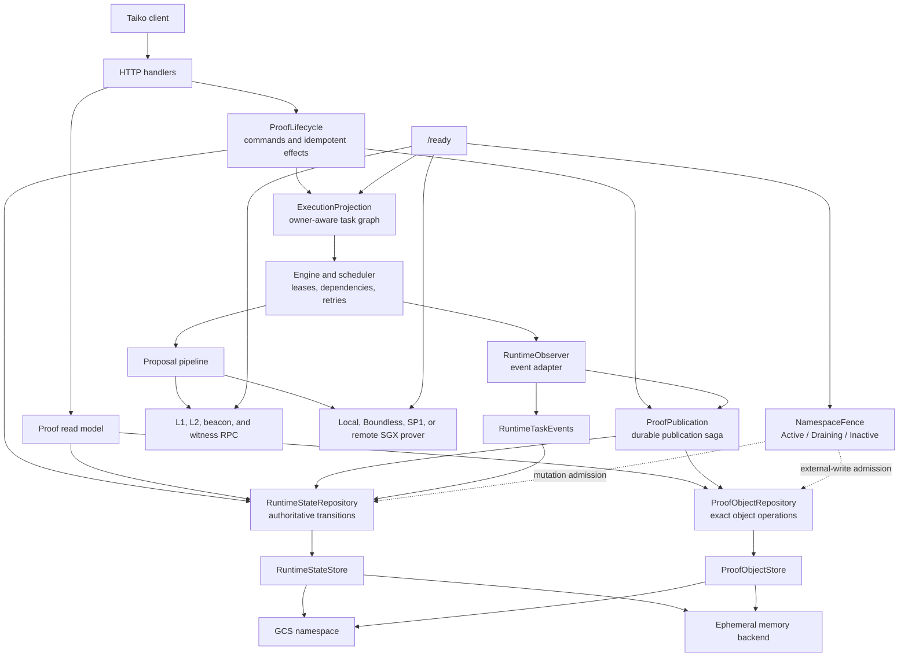

The server binary owns configuration, HTTP behavior, route selection, and lifecycle wiring. Shared
domain and persistence rules live in crates:

These boundaries are internal. They do not change the public HTTP contracts, normalized proof
format, `proof_uri` behavior, or canonical GCS object layout.

| Layer | Primary responsibility | Main locations |
| --- | --- | --- |
| HTTP and lifecycle | v4 API, readiness, concrete lifecycle commands, read model, recovery wiring | `bin/raiko2/src/server`, `bin/raiko2/src/config` |
| Engine | Stage dependencies, leases, retry policy, durable publication retry payloads | `crates/engine` |
| Queue | Owner-aware execution projection, atomic graph attachment and detachment, scheduling | `crates/queue` |
| Pipeline | Preflight, validation, encoding, proving, and aggregation wiring | `crates/pipeline` |
| Prover | Local and hosted prover adapters plus remote submission recovery | `crates/prover` |
| Runtime | Authoritative state repository, proof-object repository, namespace fence, publication primitives | `crates/runtime` |

## Identity And Isolation

Every durable key is scoped by an explicit proof environment and runtime namespace. These are
different boundaries:

- `environment` separates business deployments such as devnet and mainnet.
- `namespace` separates one authoritative persistence domain inside an environment.
- The network pair, concrete pipeline, execution route, and normalized request identity further
  scope tasks and artifacts.

Runtime task records store the network pair and artifact references as first-class fields. Runtime
commands do not parse opaque metadata JSON to reconstruct identity or ownership. Every root also
stores one non-empty, namespace-scoped request fingerprint. The fingerprint is mandatory and unique
inside the authoritative state; there is no anonymous task-registration path.

At startup, every runtime record is decoded and checked before reconciliation or worker creation.
The canonical engine request is the source for execution identity; duplicated display and query
fields must match it exactly. A runtime namespace written by an older or incompatible schema must be
cut over explicitly rather than migrated in place.

Proofs are never reused across environments, concrete proof types, or execution routes. A
`risc0/local` proof therefore cannot satisfy a `risc0/network` request, even if the public proof
type and proposal range match.

## Request And Execution Flow

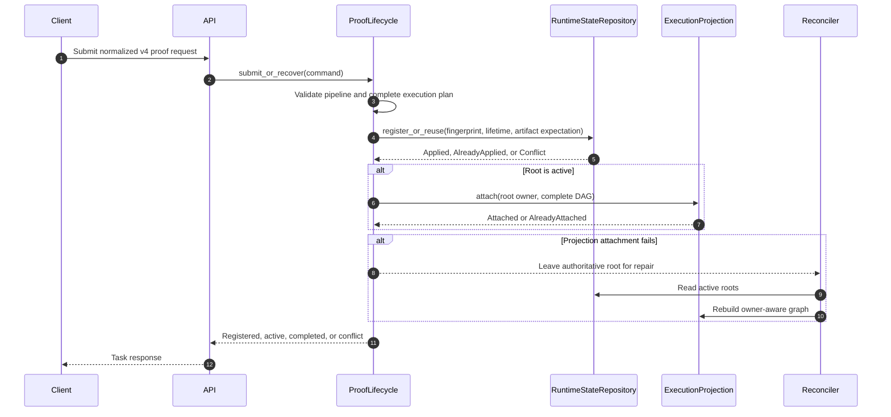

`ExecutionProjection::attach` installs the complete DAG and its `RootOwner` relationship under one
queue mutex. Reusing a stage adds an owner without duplicating execution. Detaching one root removes
only that owner; shared stages remain until the last live owner leaves. Queue lease tokens still
identify execution attempts, while `TaskLifetime { task_id, incarnation_id }` identifies the exact
authoritative record that a callback may affect. If an existing shared publication completes a newly
registered root before its projection attach runs, the lifecycle attach observes `Completed` under
the same local gate and becomes a successful no-op instead of reopening work or failing the request.

Every proposal node has a root-independent definition and no proposal-to-proposal dependency. Batch
position is request presentation, not execution identity; the same proposal can therefore be shared
by a standalone root and by any batch position without graph conflict. Proposal execution is
decomposed internally into preflight, validation, encoding, and proving stages. Aggregation alone
carries dependencies on the pending proposal proof artifact references it consumes. A successful
prover result that cannot yet be published is converted into a durable publication-retry payload, so
publication retries reuse the computed proof and do not pay to prove again.
Cached proposal artifacts short-circuit proposal execution through the observer; they never remove a
proposal node or change an aggregate input from dependent to independent. Initial admission and each
client-triggered recovery therefore reconstruct the same task set, payloads, and dependency edges.

Artifact payload policy follows the canonical engine task kind, not the current root-owner set. A
proposal task accepts a normal proof payload; `Sp1Local` proposal tasks additionally accept a
complete Compressed payload containing `quote`, `input`, `uuid`, and `extra_data`. Aggregate tasks
always require a non-null final `proof`. The same proposal artifact is therefore valid whether it is
owned by a standalone root, an aggregate root, or both, including when an owner joins after proving
has started. Ownership controls which exact root lifetimes may be synchronized; it never changes the
artifact's payload class.

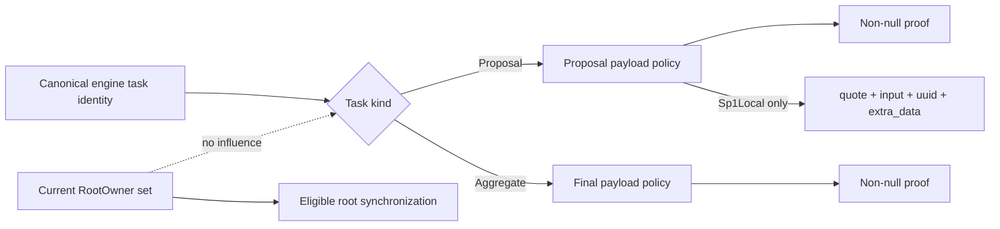

Execution ownership is derived from canonical proposal or aggregate task membership in
`TaskMetadata`, not from the broad artifact-reference index. That index also includes external
aggregate inputs so storage cleanup can protect live consumers; consuming a proposal artifact does
not authorize proposal-stage callbacks to mutate the aggregate root.

Terminal engine state is not authoritative by itself. If terminal synchronization fails, a matching
API request inspects the exact `RootOwner(task_id, incarnation_id)` projection. Only an active task
(`Pending`, `Ready`, `Retrying`, or `Running`) in that projection blocks re-enqueue; a shared task
owned by another root or a terminal engine record cannot strand a non-terminal runtime root. Startup
restores and validates persisted runtime state without attaching an execution projection, so process
restart alone cannot submit or rebid paid proof work.

Recovery, invalidation, cleanup, and replacement use snapshot-conditional runtime commands. A
recovery attempt can reopen only the exact record whose metadata it used to build the recovery plan;
terminal retention cleanup can admit only the exact record it selected to an independent retention
state without changing the task's runner status, proof URI, or error. Invalidation keeps its distinct
cancellation semantics. Root replacement atomically verifies the predecessor snapshot, removes its
pending-publication ownership, and installs one successor. Only the winning replacement swaps the old
and new `RootOwner` projections under the lifecycle transition gate. This closes same-incarnation
races in which status or remote-checkpoint metadata changed after a caller read the root. Removing the
predecessor owner leaves an unowned pending-publication record with its typed artifact identity until
the proof object is deleted; a successor that references the same artifact key does not inherit the
predecessor's publication authority. Startup reconciliation completes that cleanup after a crash.
Orphan cleanup uses the same gate to inspect the exact `(task_id, incarnation_id)` projection and
commit cancellation. A globally shared queue task owned by another root is never evidence that the
selected root is attached, and an attachment cannot slip between that inspection and cancellation.

Terminal failure uses the same state-first lifecycle transition as cancellation. The observer locks
the process-local lifecycle transition gate and re-resolves every active owner, including roots that
joined the shared stage after its execution permit was issued. The engine then revalidates the queue
lease, the observer marks those exact roots `Failed`, and the engine commits the terminal queue state
and removes the affected `RootOwner` set before releasing the gate. A runtime-state persistence error
keeps the queue task in `Retrying`; the queue never becomes terminal first. This prevents a recovered
root from attaching to a failed shared stage through an owner relationship that was already made
terminal.

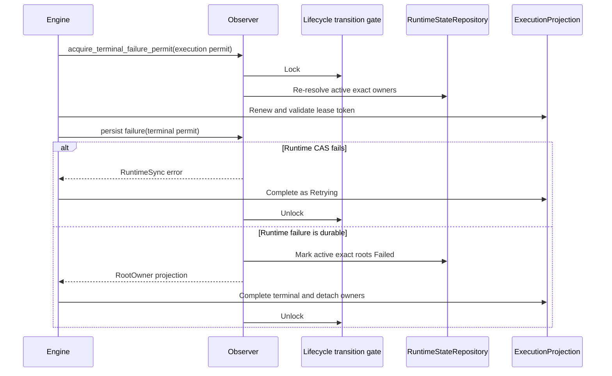

Completed-proof reads use a three-step validation rather than trusting a stale snapshot:

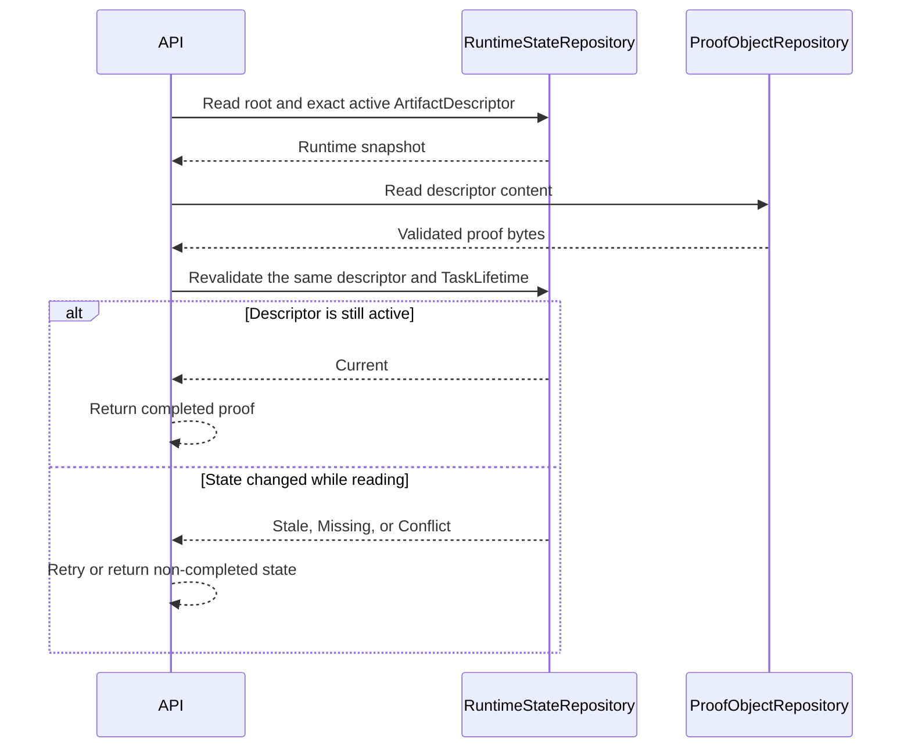

## Runtime Lifecycle And Fencing

The runtime uses one process-local `NamespaceFence` for the entire namespace. It has no distributed
owner record, lease renewal, owner epoch, or task-scoped lifecycle fence. Immutable task lifetimes,
scheduler lease tokens, and GCS generations reject different classes of stale operation; none grants
namespace authority or bypasses the fence.

The fence is an admission boundary for short commits. One read permit spans each admitted runtime
repository write or proof-object operation so draining can wait for it to settle, but no permit spans
an API request, provider call, complete task, or publication saga. `ProofLifecycle` also has a
process-local transition gate that serializes one active-root decision across its single
runtime-state CAS and in-memory queue attach or detach, so neither shutdown nor a competing lifecycle
transition can split those effects. While `Active`, repositories may begin ordinary mutations and
external writes.
Entering `Draining` makes readiness fail immediately and rejects every
new ordinary mutation, publication step, invalidation step, reconciliation write, cleanup write, and
provider submission. Shutdown waits only for repository commits already admitted and request-ID
checkpoints covered by provider permits acquired while `Active`. After their bounded deadline,
workers and maintenance tasks are stopped and joined; unfinished sagas resume from durable state on
the next start.

While coherent, readiness also compares the authoritative runtime object generation with the local
repository snapshot. An out-of-band generation change permanently fails that process closed; it is
never adopted as a second writer's state.

The authoritative state repository is the linearization point for lifecycle races. Commands carry
typed preconditions:

```text
TaskLifetime { task_id, incarnation_id }
ArtifactExpectation { key, descriptor, lifecycle }
```

They return explicit outcomes such as `Applied`, `AlreadyApplied`, `Stale`,
`BlockedByLiveOwner`, `Missing`, or `Conflict`. `ProofLifecycle` interprets those outcomes and
applies queue or proof-object effects idempotently. It never rolls an authoritative transition back
merely because a later projection effect failed.

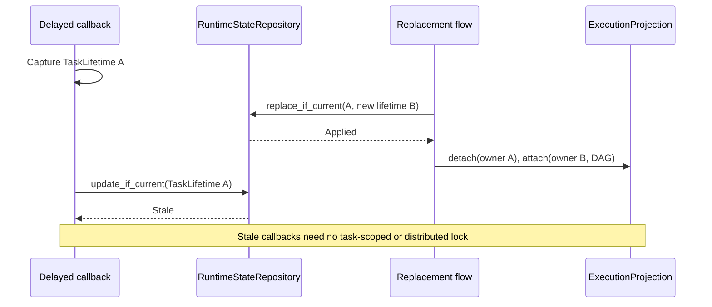

After leasing a queue task, the engine captures the exact task lifetimes eligible for that execution
and revalidates the unique lease token before emitting observer events. Start, progress, failure,
proof checkpoint, and terminal mutations all compare those identities. A proof checkpoint freezes
the observed task-ID-to-incarnation map as its replacement fence. Immediately before the single
activation CAS, the observer briefly holds the lifecycle transition gate and refreshes current
owners. A distinct active task ID registered for the shared stage after checkpointing is admitted; a different
incarnation for a task ID already in the checkpoint cohort is rejected. Terminal failure performs the
same gated owner refresh before the engine revalidates its lease. A remove/recreate race therefore
fails either the queue-token check or the runtime-lifetime check, while a legitimate shared root can
receive an already-computed proof.

An admitted provider checkpoint may write while the runtime is `Draining`, but completion is checked
against the permit and namespace state at commit. If the bounded drain deadline wins, the process
does not install or report late state; the next process reloads the authoritative snapshot and
reconciles any ambiguous provider result.

The drain sequence is deliberately bounded:

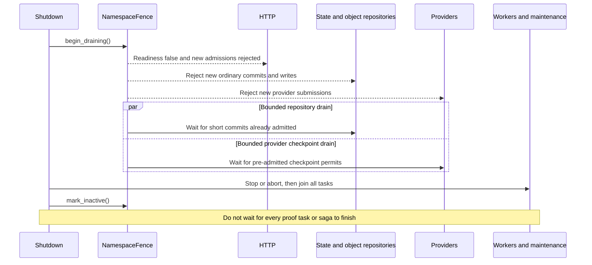

Every repository commit and external artifact mutation checks the global lifecycle and authoritative
state coherence boundary. A pre-admitted provider request may use only its checkpoint path until its
permit is released. If authoritative state cannot be reloaded, later mutations and request admissions
fail closed. Memory mode is an explicit ephemeral backend accepted only for `development`, `local`,
and `test`, not an automatic GCS fallback.

Runtime lifecycle is an explicit state machine:

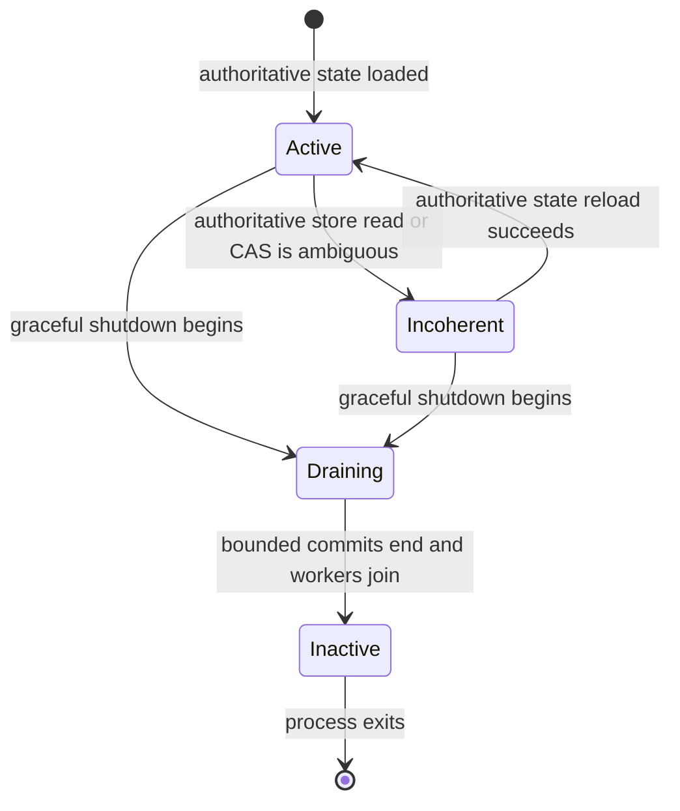

`Incoherent` and `Draining` reject mutations and make readiness fail. A later readiness check may
reload authoritative state after an ambiguous store result. `Inactive` rejects every write,
including provider checkpoints.

## Proof Artifact Storage

Persistence is split by semantics. `RuntimeStateRepository` owns task records, publication intents,
artifact registrations, transition validation, runtime-state CAS, ambiguous-write readback, and
coherence. `ProofObjectRepository` owns immutable content, create-only manifests, exact reads, and
generation/hash-conditional invalidation. Their crate-private `RuntimeStateStore` and
`ProofObjectStore` seams have GCS and memory adapters; callers never assemble raw store operations or
interpret a runtime-state revision as lifecycle authority.

`RuntimeTaskRecord` is the durable identity boundary. Its network pair, pipeline key, route, and
`artifact_refs` are canonical; `artifact_refs` is the only proof-reference index. Serialized task
metadata carries request and progress details, but every read validates its derived network, proof
type, and artifact references against the record before using it. Divergence is corruption and fails
closed rather than selecting a second path or reconstructing missing identity.

The GCS backend uses this runtime object layout:

```text
<prefix>/<environment>/<namespace>/
  work/runtime-state.runtime.json
  proofs/<pipeline>/<route>/<network-pair>/<proof-ref>/
    manifest.manifest.json
    content/<sha256>.proof.json
  preflights/v<compatibility-version>/<key-hash>.preflight.bincode
```

Components are encoded before becoming object-name segments. A proof manifest contains only the
selected content hash; the manifest object's native GCS generation identifies that proof publication
generation. A canonical preflight is a single create-only bincode object whose name is derived from
the complete typed key digest. Its GCS generation fences exact deletion, and its compatibility-version
prefix isolates host-semantics changes.

Proof publication has three storage outcomes:

- `Created`: content and manifest were created.
- `AlreadyExists`: the manifest already selected the same content hash; missing identical content is
  repaired before returning the idempotent result.
- `Conflict`: the manifest selected different canonical content. The existing valid proof remains
  first-write-wins and is never overwritten.

Normal reads materialize the manifest and referenced content and reject a missing or hash-mismatched
content object as corruption. Metadata-only manifest reads are used for repair and conditional delete,
so a dangling manifest remains inspectable even when normal proof reads fail. Prefix selection also
validates the complete immutable content before returning a bounded prefix; it does not trust an
unchecked GCS range read.

Canonical preflight publication has the same `Created`, `AlreadyExists`, and `Conflict` outcomes but
does not use a manifest. The first object created for a complete key digest wins. Reads calculate its
content hash from the stored bytes, while decoding and guest-equivalent semantic validation happen
before the cache value is consumed. Invalid entries are generation-conditionally deleted and rebuilt.

## Publication Transaction

Proof publication is a resumable saga. The queue first checkpoints the completed payload under its
lease token. `ProofPublication` records a publication intent in runtime state that binds the typed
artifact identity, content hash, and eligible `TaskLifetime` owners, then materializes the immutable
pending bytes. The canonical object is published only after that intent is authoritative. Activation
then refreshes current owners under the short lifecycle transition gate and commits the exact
descriptor plus every eligible root in one runtime-state mutation. The checkpoint cohort fences
replacement incarnations; distinct active roots registered after the checkpoint may join the activation.
Pending cleanup and queue completion are idempotent tail effects.

No namespace authority or distributed lock spans the saga. A bounded process-local lock is scoped to
one typed artifact key, so it orders same-artifact object operations without blocking task-state
transitions or unrelated artifacts. The runtime-state publication intent is the unique ownership and
content-hash truth; every durable repository command remains conditional. The intent and queue retry
payload are the recovery record between commands. If intent persistence fails, no pending object is
written. If pending-object materialization fails, the durable intent remains and a publication retry
recreates the object. If a canonical manifest exists without activation, reconciliation activates it
for still-current exact intent owners or invalidates it when no eligible intent owner remains. A
replacement task at the same logical key is not an owner unless its exact `incarnation_id` has
checkpointed that publication.

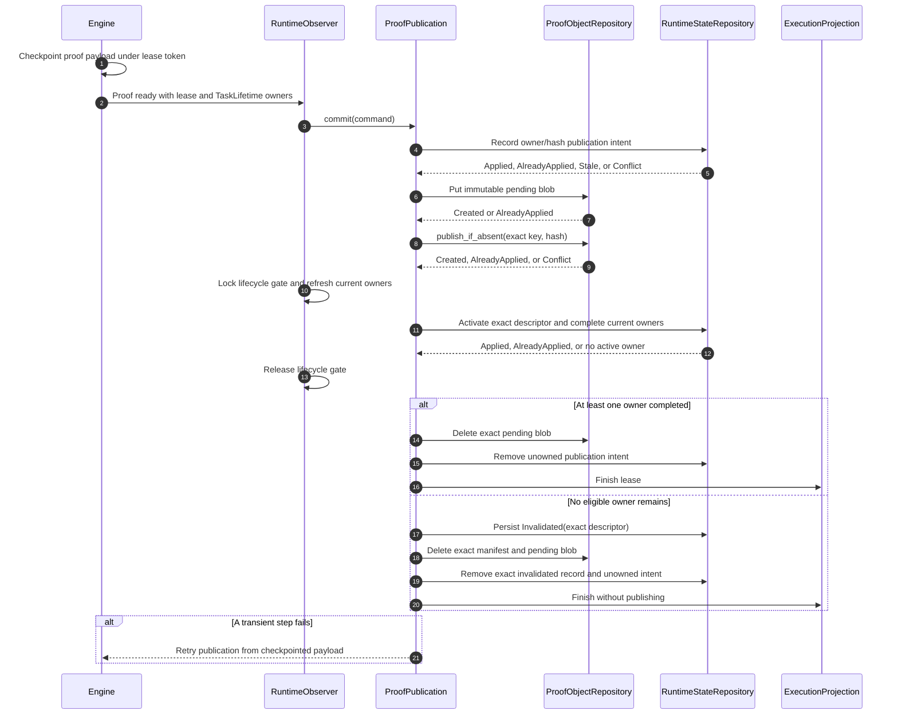

Any transient error before convergence leaves enough state to retry. Publication errors are retryable
and retain the proof in the queue payload. A proof publication invalidated by cancellation is a real
terminal outcome and is not retried as a successful artifact.

## Cancellation And Exact Reclamation

Cancellation is authoritative-state first. `ProofLifecycle` conditionally moves the exact root
`TaskLifetime` to `Cancelled`; a stale or terminal lifetime is left unchanged. Only after that commit
does it detach the `RootOwner` from the execution projection. Shared nodes retain their other owners,
while nodes whose last owner left are cancelled or removed. A detach or object-store failure is
recorded as an incomplete effect for reconciliation and never causes the cancelled root to be rolled
back. A retained terminal task continues to own its artifact until terminal-task retention removes
the exact task record; cancellation does not directly delete a shared proof manifest.

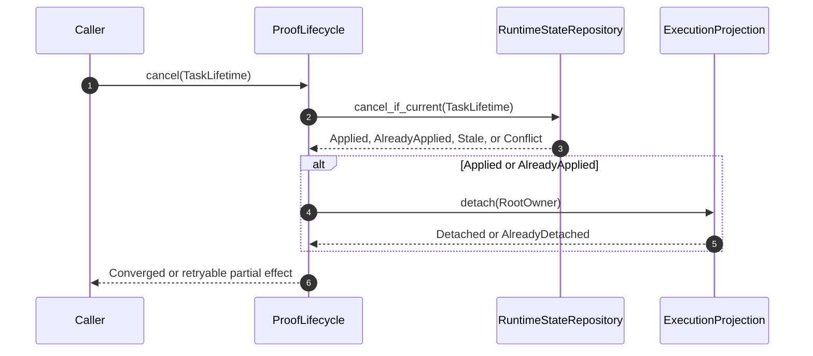

Proof artifact reclamation is an ownership-driven three-phase operation. There is no online
administrative endpoint for range- or prefix-selective artifact deletion.

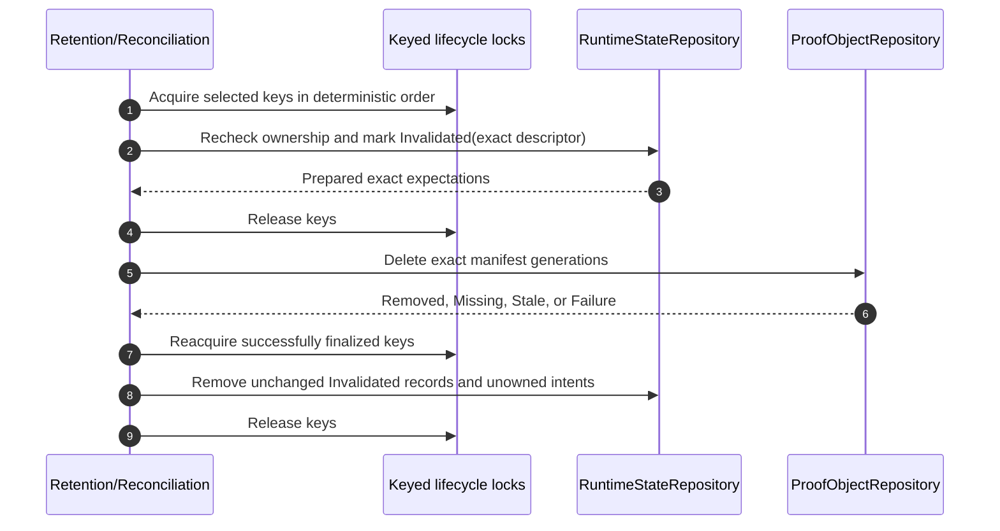

Keyed locks cover only the authoritative state transitions, never slow object-store I/O. While
generation A is `Invalidated`, same-key publication returns a retryable cleanup-pending outcome and
does not write content or a manifest. `Removed` and `Missing` permit Phase 3; `Stale` and transport
failure retain the exact runtime record for retry. Only after Phase 3 removes that record may a later
lifecycle publish generation B. Conditional deletion prevents an old cleanup candidate from deleting
a changed manifest.

## Restart And Failure Recovery

Recovery always starts from runtime state and canonical artifact metadata, never from queue memory.
The replacement process starts only after the old process has exited, so recovery resolves durable
saga cuts rather than competing with another instance.

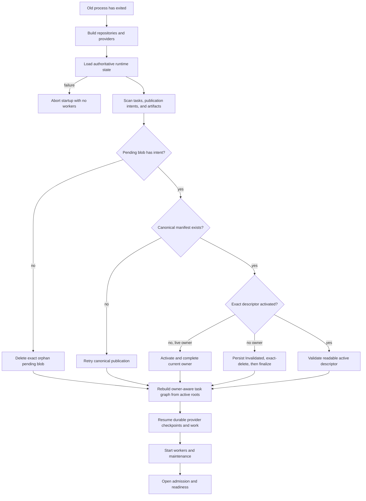

Important recovery cases are:

| Persisted condition | Recovery action |
| --- | --- |
| Root registered, projection missing | Atomically attach its owner and complete DAG |
| Root cancelled or failed, projection still attached | Detach its owner; remove only nodes with no remaining owner |
| Publication intent exists, pending blob missing | Re-materialize it from the retained queue payload, or re-run the proof after restart |
| Publication intent exists, canonical manifest missing | Retry create-only publication from the retained payload |
| Canonical manifest exists, activation missing | Activate for still-current exact intent owners, or persist `Invalidated` and reclaim it when none remain |
| Activation exists, queue completion missing | Finish or remove the queue projection idempotently |
| Canonical artifact exists, registration missing | Validate and restore registration before considering reproof |
| Proof is computed, publication incomplete | Retry `PublishProof` with the retained normalized proof |
| Runtime root non-terminal, engine state terminal or missing | Re-enqueue if no active engine state blocks it |
| Remote request checkpoint exists | Resume the recorded request and attempt budget |
| Cancellation raced a committed artifact | Preserve retained-root ownership, then reclaim the exact generation when ownership expires |
| Manifest references missing content | Surface integrity failure; identical publication may repair content |

## Remote Prover Checkpoints And Cost Policy

Boundless and SP1 submission progress is written through the fallible `ProverProgressObserver`.
The checkpoint contains the backend, attempt, submission time, deadline, and backend-specific payload.
For Boundless, request construction produces a non-zero market request ID before dispatch. Persisting
that ID is the dispatch admission point: if cancellation wins first, checkpoint persistence is
rejected and no provider call starts; if the checkpoint wins, every uncertain response and restart
continues with that exact ID for the current attempt. The offchain dispatch itself is attempted once
per attempt, so an accepted response that is lost in transit cannot trigger a second payable
request. A later attempt may rotate the ID only after provider state proves that the previous ID is
terminal and no longer payable.
The checkpoint also binds the request to its exact guest image, Boundless market deployment, and
submission transport. A replacement configured for a different image, market, or transport fails
closed instead of polling or resubmitting the identifier in another payable domain. Before such a
cutover, settle or explicitly abandon every outstanding remote request, then start the new
configuration in a new namespace.

Remote checkpoints are task-scoped even though runtime metadata is projected into each root. Under
the process-local lifecycle gate, a progress write refreshes and updates every current active owner
while excluding replacement incarnations. Recovery searches every retained owner and selects the
highest recorded attempt, so a root attached after the progress event reuses the already-paid
request even when the original owner is later cancelled. Progress merging is monotonic: an older
attempt cannot overwrite a newer checkpoint, and every retained projection of the same attempt must
agree on the provider identity, original submission time, and submission context. SP1 restart
re-notification projects the original submission timestamp and deadline into late owners instead of
starting a new timeout window. Boundless may only enrich that identity by adding the transaction
hash; removing or changing an observed hash is rejected permanently.

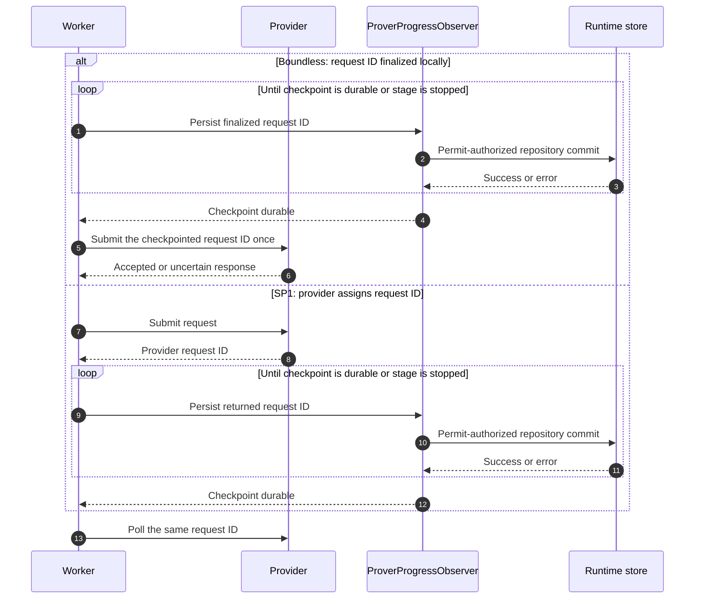

SP1 assigns its request ID during submission. A newly
returned SP1 request ID is never treated as resumable before checkpoint persistence, and transient
checkpoint failures are retried by the same worker without resubmission. Boundless checkpoints its
already-finalized ID before the provider call instead.
Checkpoint fields are strict: zero deadlines, zero attempts, missing Boundless lock deadlines, and
missing exact bid data fail closed instead of entering a compatibility fallback. SP1 also persists
and verifies the network mode, fulfillment strategy, timeout, simulation policy, cycle limit, and
price target before polling a stored request ID. An expired SP1 checkpoint performs a status read against the
recorded request before any replacement can be submitted, allowing an already-paid fulfillment to be
recovered. Boundless never changes to a fresh request ID after an ambiguous reused-ID submission
failure. The effective SP1 request attempt limit is:

```text
min(operator network_request_max_attempts, non-zero request override)
```

Without an override, the operator value is used. A request cannot raise the configured cost ceiling.

## Deployment And Migration

Production deployments use `backend = "gcs"`. A namespace is assigned to exactly one live deployment
instance at a time; there is no supported active/active sharing and no data sharing across namespaces.
Rolling overlap is forbidden even when Kubernetes would normally start the replacement before
terminating the old pod. Deployments must use a `Recreate`-equivalent sequence: the old process exits
before the replacement starts.

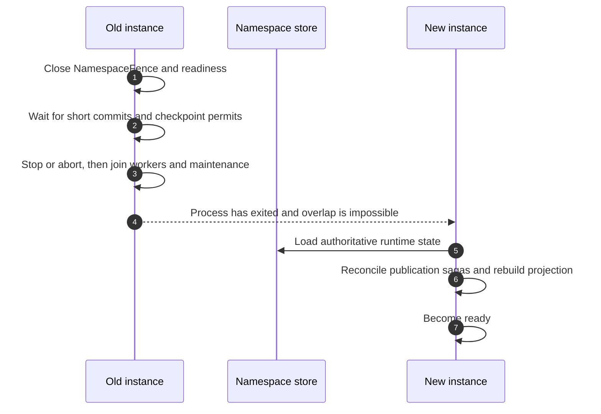

The old process does not wait for every proof task to finish. The bounded fence drain preserves only
commits already admitted and provider request-ID checkpoints with permits; durable task state,
publication intents, pending blobs, and provider checkpoints let the replacement resume safely.

Backend or namespace changes are hard cuts. Drain the old instance, retain its namespace for rollback,
and start the new instance against the selected namespace. There is no SQLite importer, dual-write,
automatic merge, or compatibility migration. The execution queue is intentionally in-process and is
rebuilt from authoritative runtime state; Redis queue persistence is not part of this architecture.

## Readiness

`GET /health` proves only that the process is alive. `GET /ready` is the traffic gate and succeeds
only when every required dependency is healthy:


Queue health is not queue emptiness. Each engine records the time of its last successful scheduler
maintenance tick. The stale threshold is:

```text
max(3 * queue.maintenance_interval_ms, 1000 ms)
```

The readiness response exposes independent `reth`, `runtime`, `queue`, and `prover` checks so an
operator can identify the failed boundary without inferring it from the aggregate status.

## Retention And Operational Boundaries

- Active manifests must not be removed by age-based lifecycle rules.
- Immutable content must remain available until every manifest that references it is gone.
- Terminal root records use a configurable retention window with a six-hour default. Artifact
  manifests and pending publication intents, including external aggregation inputs, have independent
  ownership-driven reclamation and retry lifecycles.
- Unreferenced immutable content must outlive the longest retry, recovery, and cleanup window and is
  eventually reclaimed by bucket lifecycle after its manifest is gone.
- Runtime state is control-plane data and must not share artifact garbage-collection rules.
- GCS and memory are alternative authoritative backends. The server does not dual-write or fail over
  automatically between them.

See [Operations](operations.md) for configuration, lifecycle policy, metrics, and rollout checks, and
[ADR 0001](adr/0001-use-an-immutable-proof-artifact-store.md) for the artifact-store decision.
