# Architecture

Raiko2 is a Shasta proof orchestration service. It turns a normalized v4 proof request into a
durable proposal or aggregation proof while keeping request identity, execution state, remote
provider checkpoints, and published proof artifacts recoverable across process restarts.

This document expands the normative architecture and operator contract in [README.md](../README.md)
with component boundaries, state transitions, and operational diagrams. If this document conflicts
with README.md, README.md governs. Historical plans under `docs/plans/` explain how individual
changes were developed but are not the source of truth for current behavior.

## Design Invariants

The architecture is organized around these invariants:

1. The namespaced runtime-state repository is authoritative for task state, artifact registration,
   and remote submission checkpoints. The in-process queue is an execution projection of that state.
2. A GCS-backed `(environment, namespace)` has exactly one live process. This is an operational
   deployment invariant, not a distributed coordination feature. The runtime intentionally has no
   owner lease, owner epoch, or ownership heartbeat.
3. Proof computation is not completion. A task becomes completed only after its normalized proof is
   durably published, registered, and synchronized to its runtime root.
4. Proof manifests are create-only and first-valid-wins. Content objects are immutable and addressed
   by SHA-256; a conflicting publication cannot replace the canonical proof.
5. Invalidation targets one manifest generation and content hash. A later proof lifecycle may publish
   identical or different bytes under a new manifest generation without reactivating the invalidated
   generation.
6. Remote request identifiers are resumable only after their submission checkpoint is durably stored.
   Request-level SP1 retry configuration may lower, but never raise, the operator limit.
7. One running instance owns one namespace, and old and replacement instances never overlap.
   Namespaces are isolated persistence domains and never share tasks, artifacts, checkpoints, or
   invalidation markers. Multiple roots inside the same namespace may reference the same canonical
   proof artifact.
8. The namespace fence is global to the instance and namespace, never scoped to an individual task.
   It controls admission to short authoritative commits and external writes. Draining closes that
   admission immediately and waits only for commits already in progress plus pre-authorized provider
   checkpoints; it does not wrap an entire task or cross-domain lifecycle saga.
9. Cross-domain lifecycle operations are state-first, idempotent sagas coordinated by
   `ProofLifecycle`. Runtime commands use exact `TaskLifetime` and `ArtifactExpectation`
   preconditions, queue effects are owner-aware projections, and reconciliation resumes any effect
   interrupted after the authoritative state transition.
10. Runtime-state revisions and GCS object generations belong to storage. Runtime-state revisions are
    repository-internal; an artifact manifest generation is exposed only inside an exact artifact
    descriptor for conditional invalidation or deletion. Neither grants runtime authority.

## System Architecture

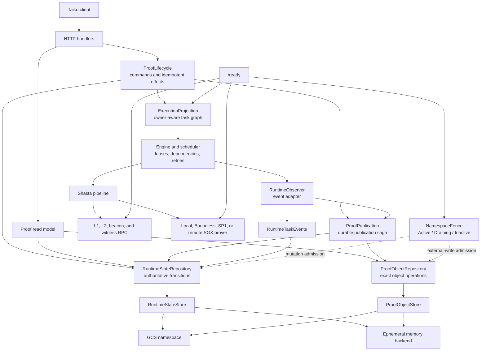

The server binary owns configuration, HTTP behavior, route selection, and lifecycle wiring. Shared
domain and persistence rules live in crates:

These boundaries are internal. They do not change the public HTTP contracts, normalized proof
format, `proof_uri` behavior, or canonical GCS object layout.

| Layer | Primary responsibility | Main locations |
| --- | --- | --- |
| HTTP and lifecycle | v4 API, readiness, concrete lifecycle commands, read model, recovery wiring | `bin/raiko2/src/server`, `bin/raiko2/src/config` |
| Engine | Stage dependencies, leases, retry policy, durable publication retry payloads | `crates/engine` |
| Queue | Owner-aware execution projection, atomic graph attachment and detachment, scheduling | `crates/queue` |
| Pipeline | Preflight, validation, encoding, proving, and aggregation wiring | `crates/pipeline` |
| Prover | Local and hosted prover adapters plus remote submission recovery | `crates/prover` |
| Runtime | Authoritative state repository, proof-object repository, namespace fence, publication primitives | `crates/runtime` |

## Identity And Isolation

Every durable key is scoped by an explicit proof environment and runtime namespace. These are
different boundaries:

- `environment` separates business deployments such as devnet and mainnet.
- `namespace` separates one authoritative persistence domain inside an environment.
- The network pair, concrete pipeline, execution route, and normalized request identity further
  scope tasks and artifacts.

Runtime task records store the network pair and artifact references as first-class fields. Runtime
commands do not parse opaque metadata JSON to reconstruct identity or ownership.

Proofs are never reused across environments, concrete proof types, or execution routes. A
`risc0/local` proof therefore cannot satisfy a `risc0/network` request, even if the public proof
type and proposal range match.

## Request And Execution Flow

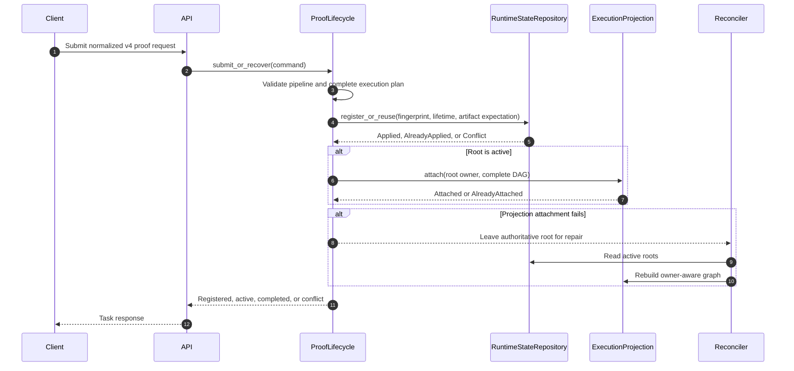

`ExecutionProjection::attach` installs the complete DAG and its `RootOwner` relationship under one
queue mutex. Reusing a stage adds an owner without duplicating execution. Detaching one root removes
only that owner; shared stages remain until the last live owner leaves. Queue lease tokens still
identify execution attempts, while `TaskLifetime { task_id, incarnation_id }` identifies the exact
authoritative record that a callback may affect.

Proposal execution is decomposed into preflight, validation, encoding, and proving stages.
Aggregation depends on proposal proof artifact references rather than in-memory proof values. A
successful prover result that cannot yet be published is converted into a durable publication-retry
payload, so publication retries reuse the computed proof and do not pay to prove again.

Terminal engine state is not authoritative by itself. If terminal synchronization fails, API and
startup recovery compare the runtime root with active engine state. Only active engine states
(`Pending`, `Ready`, `Retrying`, or `Running`) block re-enqueue; a terminal engine record cannot
permanently strand a non-terminal runtime root.

Terminal failure uses the same state-first lifecycle transition as cancellation. The observer first
marks each non-terminal exact runtime root `Failed` while holding the process-local lifecycle
transition gate, then returns the affected `RootOwner` set to the engine. The engine removes those owners with
`DetachMode::Remove` before releasing the gate. This prevents a recovered root from attaching to a
failed shared stage through an owner relationship that was already made terminal.

Completed-proof reads use a three-step validation rather than trusting a stale snapshot:

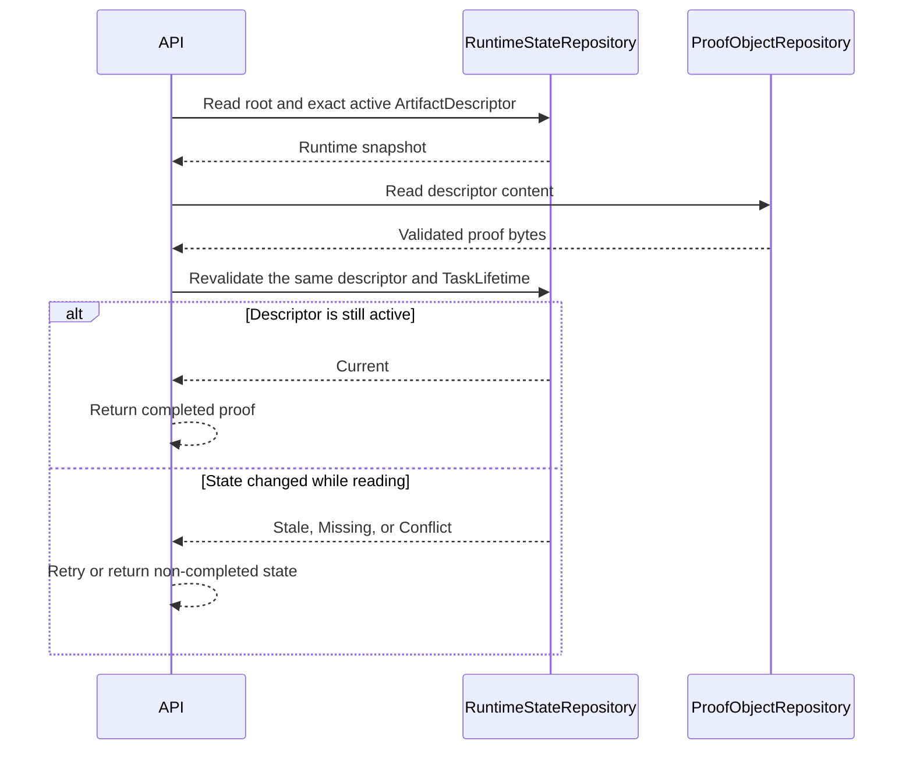

## Runtime Lifecycle And Fencing

The runtime uses one process-local `NamespaceFence` for the entire namespace. It has no distributed
owner record, lease renewal, owner epoch, or task-scoped lifecycle fence. Immutable task lifetimes,
scheduler lease tokens, and GCS generations reject different classes of stale operation; none grants
namespace authority or bypasses the fence.

The fence is an admission boundary for short commits, not a lock held across an API request, provider
call, external storage operation, or publication saga. `ProofLifecycle` also has a process-local
transition gate that serializes only the active-root decision with one in-memory queue attach or
detach, so shutdown cannot start between those two steps. While `Active`, repositories may begin
ordinary mutations and external writes. Entering `Draining` makes readiness fail immediately and rejects every
new ordinary mutation, publication step, invalidation step, reconciliation write, cleanup write, and
provider submission. Shutdown waits only for repository commits already admitted and request-ID
checkpoints covered by provider permits acquired while `Active`. After their bounded deadline,
workers and maintenance tasks are stopped and joined; unfinished sagas resume from durable state on
the next start.

The authoritative state repository is the linearization point for lifecycle races. Commands carry
typed preconditions:

```text
TaskLifetime { task_id, incarnation_id }
ArtifactExpectation { key, descriptor, lifecycle }
```

They return explicit outcomes such as `Applied`, `AlreadyApplied`, `Stale`,
`BlockedByLiveOwner`, `Missing`, or `Conflict`. `ProofLifecycle` interprets those outcomes and
applies queue or proof-object effects idempotently. It never rolls an authoritative transition back
merely because a later projection effect failed.

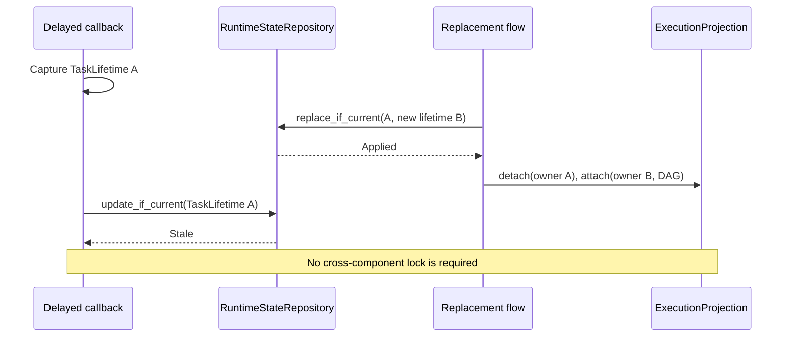

After leasing a queue task, the engine captures the exact task lifetimes eligible for that execution
and revalidates the unique lease token before emitting observer events. Start, progress, failure,
proof checkpoint, and terminal mutations all compare those identities. A distinct root that joins a
shared stage before publication may become an eligible owner; a replacement incarnation for an
already captured task ID may not. A remove/recreate race therefore fails either the queue-token check
or the runtime-lifetime check, while a legitimate shared root can receive an already-computed proof.

An admitted provider checkpoint may write while the runtime is `Draining`, but completion is checked
against the permit and namespace state at commit. If the bounded drain deadline wins, the process
does not install or report late state; the next process reloads the authoritative snapshot and
reconciles any ambiguous provider result.

The drain sequence is deliberately bounded:

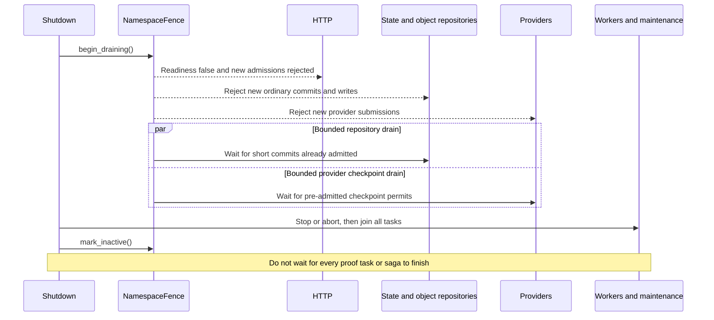

Every repository commit and external artifact mutation checks the global lifecycle and authoritative
state coherence boundary. A pre-admitted provider request may use only its checkpoint path until its
permit is released. If authoritative state cannot be reloaded, later mutations and request admissions
fail closed. Memory mode is an explicit ephemeral backend accepted only for `development`, `local`,
and `test`, not an automatic GCS fallback.

Runtime lifecycle is an explicit state machine:

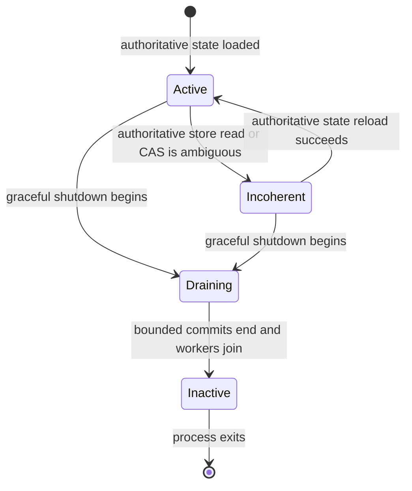

`Incoherent` and `Draining` reject mutations and make readiness fail. A later readiness check may
reload authoritative state after an ambiguous store result. `Inactive` rejects every write,
including provider checkpoints.

## Proof Artifact Storage

Persistence is split by semantics. `RuntimeStateRepository` owns task records, publication intents,
artifact registrations, transition validation, runtime-state CAS, ambiguous-write readback, and
coherence. `ProofObjectRepository` owns immutable content, create-only manifests, exact reads, and
generation/hash-conditional invalidation. Their crate-private `RuntimeStateStore` and
`ProofObjectStore` seams have GCS and memory adapters; callers never assemble raw store operations or
interpret a runtime-state revision as lifecycle authority.

For a logical `ProofArtifactKey`, the GCS backend uses this layout:

```text
<prefix>/<environment>/<namespace>/
  work/runtime-state.runtime.json
  proofs/<pipeline>/<route>/<network-pair>/<proof-ref>/
    manifest.manifest.json
    content/<sha256>.proof.json
    invalidated/<manifest-generation>-<sha256>.tombstone
```

Components are encoded before becoming object-name segments. The manifest contains only the selected
content hash; the manifest object's native GCS generation identifies that publication generation.

Publication has three storage outcomes:

- `Created`: content and manifest were created.
- `AlreadyExists`: the manifest already selected the same content hash; missing identical content is
  repaired before returning the idempotent result.
- `Conflict`: the manifest selected different canonical content. The existing valid proof remains
  first-write-wins and is never overwritten.

Normal reads materialize the manifest and referenced content and reject a missing or hash-mismatched
content object as corruption. Metadata-only manifest reads are used for repair and conditional delete,
so a dangling manifest remains inspectable even when normal proof reads fail.

## Publication Transaction

Proof publication is a resumable saga. The queue first checkpoints the completed payload under its
lease token. `ProofPublication` writes immutable pending bytes, then records a publication intent in
runtime state that binds the content hash, exact `ArtifactExpectation`, and eligible
`TaskLifetime` owners. The canonical object is published only after that intent is authoritative.
Activation then commits the exact descriptor and completes every still-current eligible root in one
runtime-state mutation. Pending cleanup and queue completion are idempotent tail effects.

No lock spans these steps. Each repository command is short and conditional; the intent and queue
retry payload are the recovery record between commands. If pending bytes exist without an intent,
reconciliation removes them as an orphan. If the intent exists without a canonical manifest,
publication retries. If a canonical manifest exists without activation, reconciliation activates it
for current owners or invalidates it when no eligible owner remains.

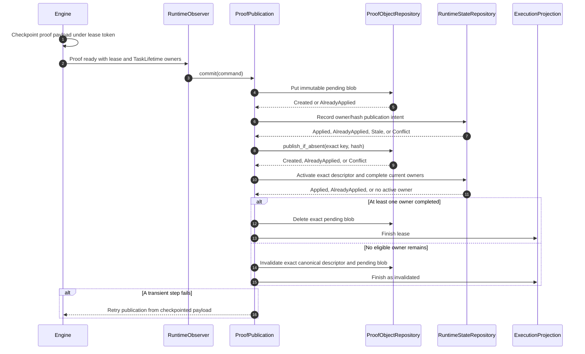

Any transient error before convergence leaves enough state to retry. Publication errors are retryable
and retain the proof in the queue payload. A proof publication invalidated by cancellation is a real
terminal outcome and is not retried as a successful artifact.

## Cancellation And Exact Invalidation

Cancellation is authoritative-state first. `ProofLifecycle` conditionally moves the exact root
`TaskLifetime` to `Cancelled`; a stale or terminal lifetime is left unchanged. Only after that commit
does it detach the `RootOwner` from the execution projection. Shared nodes retain their other owners,
while nodes whose last owner left are cancelled or removed. A detach or object-store failure is
recorded as an incomplete effect for reconciliation and never causes the cancelled root to be rolled
back.

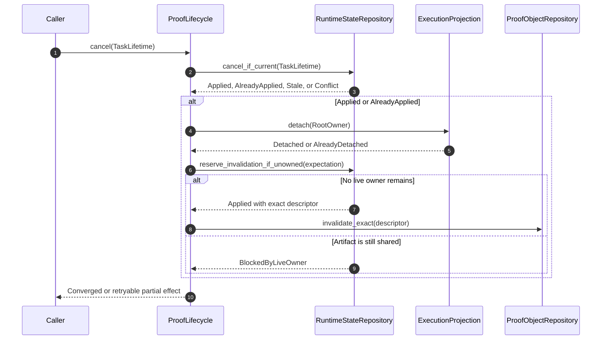

Administrative invalidation uses the same exact protocol but is a distinct command. Runtime state
first reserves invalidation for an `ArtifactExpectation` and proves that no live root owns it. Only
an `Applied` or `AlreadyApplied` reservation may create a tombstone and conditionally remove the
manifest and pending blob. Immutable content bytes are retained; invalidation is never a content-wide
delete or ban.

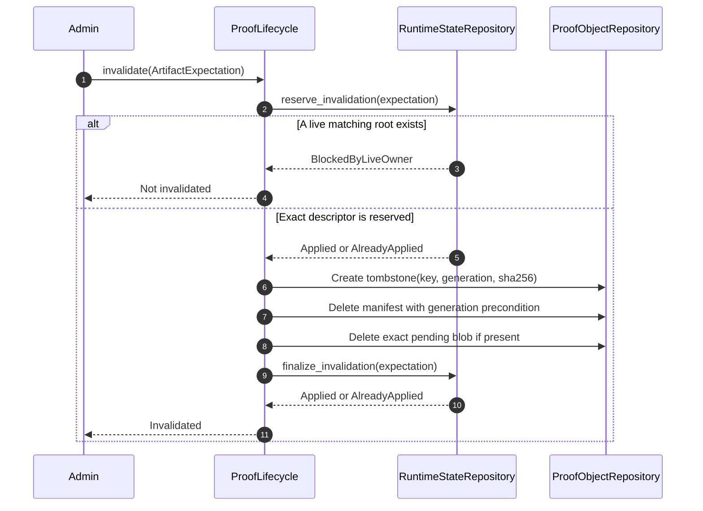

If generation A is invalidated, a later lifecycle may create generation B with identical or different
content. Reads of A remain invalidated because its exact `(logical key, manifest generation,
content hash)` descriptor differs from B. Conditional deletion prevents delayed cancellation or
cleanup from deleting a replacement manifest. Cancellation after pending cleanup still reconciles
the canonical manifest by its exact descriptor before invalidating it.

## Restart And Failure Recovery

Recovery always starts from runtime state and canonical artifact metadata, never from queue memory.
The replacement process starts only after the old process has exited, so recovery resolves durable
saga cuts rather than competing with another instance.

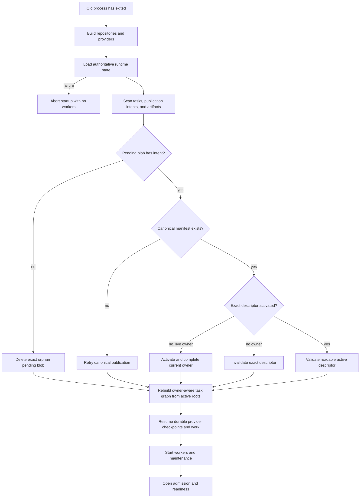

Important recovery cases are:

| Persisted condition | Recovery action |
| --- | --- |
| Root registered, projection missing | Atomically attach its owner and complete DAG |
| Root cancelled or failed, projection still attached | Detach its owner; remove only nodes with no remaining owner |
| Pending blob exists, publication intent missing | Treat as orphan and delete the exact pending descriptor |
| Publication intent exists, canonical manifest missing | Retry create-only publication from the retained payload |
| Canonical manifest exists, activation missing | Activate for exact current owners, or invalidate when none remain |
| Activation exists, queue completion missing | Finish or remove the queue projection idempotently |
| Canonical artifact exists, registration missing | Validate and restore registration before considering reproof |
| Proof is computed, publication incomplete | Retry `PublishProof` with the retained normalized proof |
| Runtime root non-terminal, engine state terminal or missing | Re-enqueue if no active engine state blocks it |
| Remote request checkpoint exists | Resume the recorded request and attempt budget |
| Cancellation raced a committed artifact | Invalidate and conditionally remove the committed generation |
| Manifest references missing content | Surface integrity failure; identical publication may repair content |

## Remote Prover Checkpoints And Cost Policy

Boundless and SP1 submission progress is written through the fallible `ProverProgressObserver`.
The checkpoint contains the backend, attempt, submission time, deadline, and backend-specific payload.

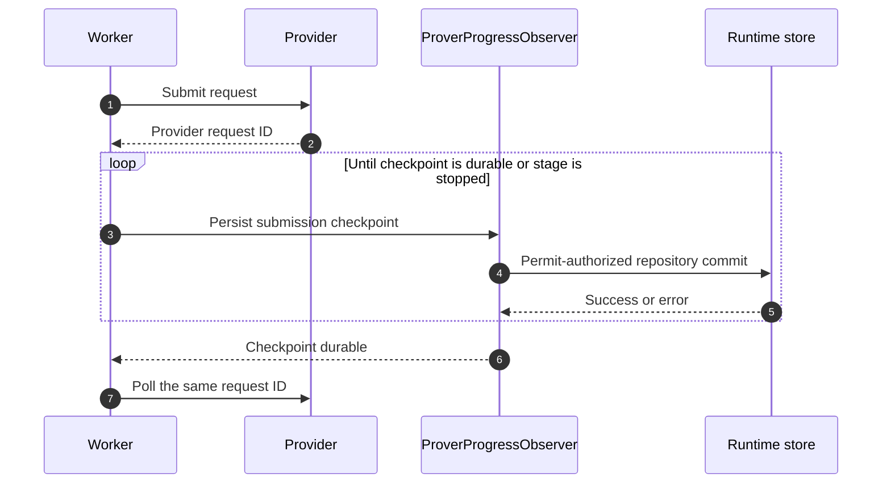

A newly returned provider request ID is never treated as resumable before checkpoint persistence.
Checkpoint fields are strict: zero deadlines, zero attempts, missing Boundless lock deadlines, and
missing exact bid data fail closed instead of entering a compatibility fallback. SP1 also persists
and verifies the network mode, fulfillment strategy, timeout, simulation policy, cycle limit, and
price target before polling a stored request ID. An expired SP1 checkpoint performs a status read against the
recorded request before any replacement can be submitted, allowing an already-paid fulfillment to be
recovered. Boundless never changes to a fresh request ID after an ambiguous reused-ID submission
failure. The effective SP1 request attempt limit is:

```text
min(operator network_request_max_attempts, non-zero request override)
```

Without an override, the operator value is used. A request cannot raise the configured cost ceiling.

## Deployment And Migration

Production deployments use `backend = "gcs"`. A namespace is assigned to exactly one live deployment
instance at a time; there is no supported active/active sharing and no data sharing across namespaces.
Rolling overlap is forbidden even when Kubernetes would normally start the replacement before
terminating the old pod. Deployments must use a `Recreate`-equivalent sequence: the old process exits
before the replacement starts.

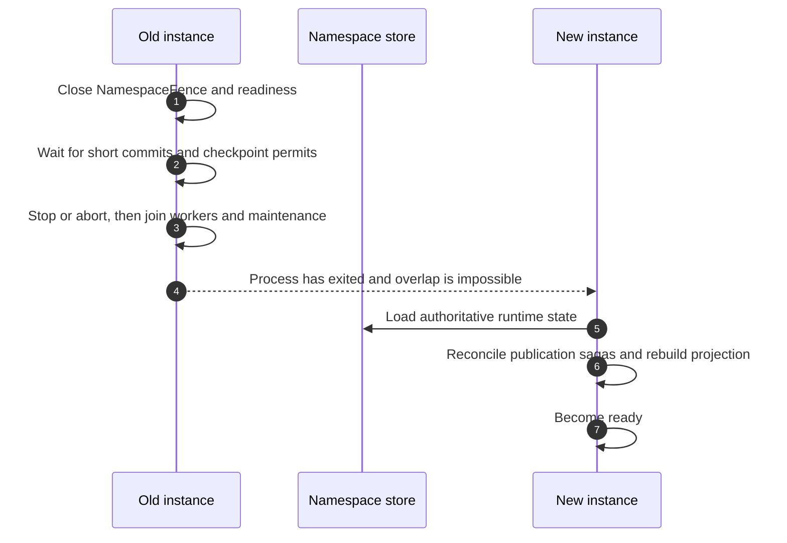

The old process does not wait for every proof task to finish. The bounded fence drain preserves only
commits already admitted and provider request-ID checkpoints with permits; durable task state,
publication intents, pending blobs, and provider checkpoints let the replacement resume safely.

Backend or namespace changes are hard cuts. Drain the old instance, retain its namespace for rollback,
and start the new instance against the selected namespace. There is no SQLite importer, dual-write,
automatic merge, or compatibility migration. The execution queue is intentionally in-process and is
rebuilt from authoritative runtime state; Redis queue persistence is not part of this architecture.

## Readiness

`GET /health` proves only that the process is alive. `GET /ready` is the traffic gate and succeeds
only when every required dependency is healthy:


Queue health is not queue emptiness. Each engine records the time of its last successful scheduler
maintenance tick. The stale threshold is:

```text
max(3 * queue.maintenance_interval_ms, 1000 ms)
```

The readiness response exposes independent `reth`, `runtime`, `queue`, and `prover` checks so an
operator can identify the failed boundary without inferring it from the aggregate status.

## Retention And Operational Boundaries

- Active manifests must not be removed by age-based lifecycle rules.
- Immutable content must remain available until every manifest that references it is gone.
- Generation-scoped invalidation markers and unreferenced content must outlive the longest retry,
  recovery, and cleanup window; the current operational minimum is 30 days.
- Runtime state is control-plane data and must not share artifact garbage-collection rules.
- GCS and memory are alternative authoritative backends. The server does not dual-write or fail over
  automatically between them.

See [Operations](operations.md) for configuration, lifecycle policy, metrics, and rollout checks, and
[ADR 0001](adr/0001-use-an-immutable-proof-artifact-store.md) for the artifact-store decision.
