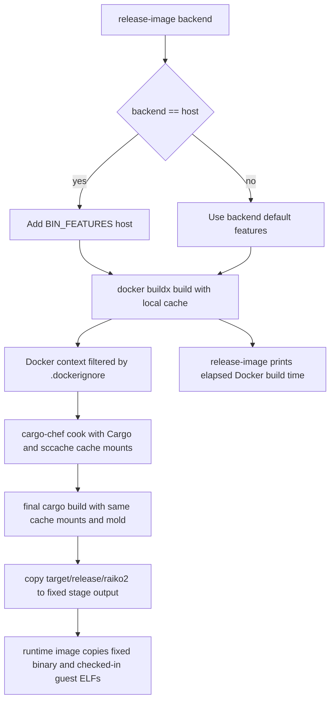

# Runtime Image Build Speed - Plan

## Goal Capsule

| Field | Value |
|---|---|
| Objective | Reduce runtime Docker image build time for repeated `release-image` and local image builds while preserving the current runtime image behavior. |
| Authority | The user request is primary: host images do not need full LTO, release builds should use Cargo defaults unless a specific command overrides them, build cache hits should improve, zkVM native/C++ dependencies should be cached, linker choice should be intentional, and the effect must be measurable. |
| Execution profile | Standard infra/performance change touching Docker build inputs, Cargo build configuration inside the image, and `xtask release-image` build flags/output. |
| Stop conditions | Stop if Docker cannot build the root runtime image, if the host build no longer selects `--no-default-features --features host`, or if `.dockerignore` hides files required by `Dockerfile` or `Dockerfile.sgx`. |

---

## Product Contract

### Summary

Speed up raiko2 runtime image builds by shrinking the Docker context, making the Rust/C/C++ compile cache survive BuildKit rebuilds, using a fast linker in the builder stage, and returning the workspace release profile to Cargo defaults.
The work keeps the release command and guest ELF refresh semantics intact, but makes `xtask release-image` print timing evidence so future runs can compare cold and warm cache behavior.

### Problem Frame

The root `Dockerfile` already uses `cargo-chef` and `xtask release-image` already exports a local buildx cache, but the current context includes large directories that the runtime image never copies, including `guests/` and local core dumps.
The current Docker build also inherits workspace `[profile.release]` overrides for both dependency cooking and final host builds, even when `release-image host` only needs the host feature set.
The builder installs `clang` and heavy zkVM-related dependencies can compile native code, but there is no compiler wrapper cache or explicit fast linker inside the Docker build.

### Requirements

**Build Context**

- R1. Runtime image builds must not send unused local artifacts, guest source trees, or developer caches in the Docker context.
- R2. `.dockerignore` must preserve all files copied by the root runtime `Dockerfile` and by `Dockerfile.sgx`.

**Cargo and Linker Behavior**

- R3. Runtime image builds must use Cargo's default release profile unless the caller explicitly overrides Cargo profile environment variables.
- R4. Host-only image builds must still select the host feature set through `xtask release-image host`.
- R5. The builder stage must use the repository-precedent fast linker choice without adding a slow source-built linker installation.

**Cache Behavior**

- R6. Docker builds must use BuildKit cache mounts for Cargo registry, Cargo git checkouts, Cargo target artifacts, and `sccache`.
- R7. Rust and native C/C++ compilation in the builder stage should route through `sccache` where supported.
- R8. Cache mounts must not become the only place the final binary exists; the runtime image must copy a binary persisted outside the mounted target cache.

**Measurability**

- R9. `release-image` must report elapsed Docker build time.
- R10. Verification must capture at least Docker context transfer size and one timed host-image build path so the speed impact is quantitative.

### Scope Boundaries

### Deferred to Follow-Up Work

- Remote registry cache export is deferred; this plan keeps the existing local buildx cache location under `target/buildx-cache/raiko2`.
- SGX image build optimization is deferred except for ensuring `.dockerignore` still preserves its copied `docker/` scripts.
- Guest toolchain image optimization is deferred; guest ELF refresh behavior remains owned by `xtask/build-guest`.

### Outside This Change

- Do not change checked-in guest ELF contents under `crates/guests/elf`.
- Do not change prover feature semantics for `host`, `risc0`, `sp1`, or `all`.
- Do not push images during verification unless the user explicitly asks for a release run.

---

## Planning Contract

### Key Technical Decisions

- KTD1. Trim Docker context before compiler tuning. The live checkout has `guests/` at tens of gigabytes plus local core dumps, while the root runtime image only copies `Cargo.toml`, `Cargo.lock`, `rust-toolchain.toml`, `crates/`, `bin/`, `xtask/`, `config/`, `config.example.toml`, and `test/guest_inputs/`.
- KTD2. Remove the workspace `[profile.release]` override instead of carrying per-command LTO exceptions. Cargo's default release profile already uses `opt-level = 3`, `debug = false`, and `lto = false`, which keeps output in `target/release` without Docker `COPY` path drift.
- KTD3. Use `mold` in the image builder, not `wild`. The repo CI already installs mold through `rui314/setup-mold`, Debian bookworm can install mold in the builder stage, and using `wild` would require an extra Rust-installed tool in the hot build image path.
- KTD4. Use BuildKit cache mounts plus `sccache`, then copy the final binary out of the mounted target directory during the final build step. Cache mounts are intentionally not committed to the image layer, so the binary must be persisted to a normal path before the stage ends.
- KTD5. Keep `release-image` as the release orchestrator. It already handles clean-tree checks, guest refresh policy, local buildx cache export/import, push, and digest reporting; this plan only adds build args and elapsed-time output.

### High-Level Technical Design

### Assumptions

- The default Docker builder supports BuildKit cache mounts because `release-image` already requires `docker buildx`.
- The builder-stage Debian package set can install `mold` and `sccache`; if a package is unavailable, implementation should choose a pinned binary package path or stop rather than compiling either tool from source in the Dockerfile.
- Host-image runtime performance is less important than build speed for this release path, matching the user's stated LTO constraint.

### Sources & Research

- `Dockerfile` currently uses `cargo-chef` but no cache mounts, `sccache`, or linker build arg.
- `xtask/src/release_image.rs` already centralizes buildx cache flags and host `BIN_FEATURES`.
- `Cargo.toml` previously set workspace `[profile.release] debug = 1` and `lto = true`; this change removes that override and returns release builds to Cargo defaults.
- `.dockerignore` currently ignores `target` and `.git`, but not `guests/`, core dumps, or local virtualenv/cache directories.
- Docker docs describe cache mounts as persistent build caches for steps that otherwise need to rebuild or redownload packages: <https://docs.docker.com/build/cache/optimize/>.
- Dockerfile reference documents `# syntax=` parser directives and `ARG`/`ENV` build-time variable behavior: <https://docs.docker.com/reference/dockerfile/>.
- Cargo docs state profile settings can be overridden from config or environment variables and that release defaults to `lto = false` unless overridden: <https://doc.rust-lang.org/cargo/reference/profiles.html>.
- Cargo environment docs state `RUSTC_WRAPPER` is intended for wrappers such as `sccache`: <https://doc.rust-lang.org/cargo/reference/environment-variables.html>.
- `sccache` documents itself as a compiler wrapper for caching local or remote compilation results: <https://github.com/mozilla/sccache>.

---

## Implementation Units

### U1. Trim Runtime Docker Context

- **Goal:** Exclude unused large local artifacts from image build context without hiding files used by runtime or SGX Dockerfiles.
- **Requirements:** R1, R2, R10.
- **Dependencies:** None.
- **Files:** `.dockerignore`, `Dockerfile`, `Dockerfile.sgx`.
- **Approach:** Add ignore rules for `guests/`, local core dumps, virtualenv/cache/worktree directories, logs, generated release output, and other non-copied development artifacts. Keep `docker/`, `crates/`, `bin/`, `xtask/`, `config/`, `config.example.toml`, `Cargo.toml`, `Cargo.lock`, `rust-toolchain.toml`, and `test/guest_inputs/` available because current Dockerfiles copy them.
- **Patterns to follow:** Use the existing `.dockerignore` as the single context filter; avoid Dockerfile-specific ignore files unless the root filter cannot preserve SGX safely.
- **Test scenarios:**
  - Run a root runtime build far enough to observe the `transferring context` line and confirm it is below 200 MB in this checkout.
  - Confirm a Dockerfile parser/build smoke does not fail because required copied files are excluded.
  - Confirm `Dockerfile.sgx` copied `docker/` scripts remain available by checking that `.dockerignore` does not exclude `docker/`.
- **Verification:** Docker build output shows the reduced context size, and no `COPY` step fails because of the new ignore set.

### U2. Add BuildKit Cargo, Target, and sccache Mounts

- **Goal:** Make dependency and native compilation cache hits survive layer invalidation during repeated image builds.
- **Requirements:** R5, R6, R7, R8.
- **Dependencies:** U1.
- **Files:** `Dockerfile`.
- **Approach:** Add a Dockerfile syntax directive for cache mounts, install `mold` and `sccache` in the builder base, set `RUSTC_WRAPPER=sccache`, set a persisted `SCCACHE_DIR`, route host C/C++ compilers through `sccache`, and wrap `cargo chef cook` plus final `cargo build` in cache mounts for Cargo registry, Cargo git, Cargo target, and sccache. Copy the final `raiko2` binary from the mounted target directory to a normal builder-stage output path before the `RUN` ends, then update runtime `COPY` to use that fixed output.
- **Execution note:** Start with a BuildKit smoke build of the builder target because cache mount misuse usually appears as a missing final binary or a failed `COPY`.
- **Patterns to follow:** Reuse the repo's CI precedent of mold for heavy Rust lanes and keep runtime image contents unchanged.
- **Test scenarios:**
  - Build the builder stage once and confirm `raiko2` is present at the fixed output path after the cache-mounted `RUN`.
  - Build the same host image a second time and confirm Docker reports cache reuse or a shorter elapsed build.
  - Confirm the runtime image still contains `/usr/local/bin/raiko2` and `/app/crates/guests/elf`.
- **Verification:** The Dockerfile completes a host runtime build with BuildKit cache mounts enabled and produces a runnable image.

### U3. Return Release Profile to Cargo Defaults

- **Goal:** Remove the workspace release profile override so runtime image builds use Cargo's default release profile.
- **Requirements:** R3, R4, R9.
- **Dependencies:** U2.
- **Files:** `Cargo.toml`, `xtask/src/release_image.rs`, `Dockerfile`.
- **Approach:** Delete `[profile.release]` from the workspace manifest, remove the now-redundant Docker and release-image Cargo profile override knobs, keep host `BIN_FEATURES` unchanged, and time only the `docker buildx build` phase with `Instant`. Print the elapsed duration before push so release logs capture build speed separately from registry push time.
- **Patterns to follow:** Mirror the existing unit-tested `BIN_FEATURES` flag construction and keep release summary digest output unchanged.
- **Test scenarios:**
  - Host backend flags include `BIN_FEATURES=--no-default-features --features host`.
  - Non-host backend flags include only metadata unless future backend-specific args are added.
  - Build duration formatting is stable enough for logs and does not alter `release_summary_lines`.
- **Verification:** `cargo test -p xtask release_image` passes.

### U4. Document Build Knobs and Quantitative Verification

- **Goal:** Make future operators able to reproduce the optimization evidence without pushing an image.
- **Requirements:** R9, R10.
- **Dependencies:** U1, U2, U3.
- **Files:** `docs/operations.md`, `docs/development.md`.
- **Approach:** Add a short note near release image documentation covering the host LTO override, default mold/sccache/cache-mount behavior, how to disable Docker Cargo cache if needed, and how to collect context size plus elapsed build time with a local `docker buildx build` or non-pushing smoke path.
- **Patterns to follow:** Keep docs command snippets aligned with existing `just release-image` and direct `xtask` entrypoints.
- **Test scenarios:**
  - Documentation names existing commands and build args only.
  - Documentation distinguishes local measurement from release publishing so it does not accidentally instruct operators to push benchmark images.
- **Verification:** Documentation facts match the implemented Dockerfile args and `xtask` flags.

---

## Verification Contract

| Gate | Applies To | Done Signal |
|---|---|---|
| Rust unit tests | U3 | `cargo test -p xtask release_image` passes. |
| Rust formatting | U3 | `cargo fmt --all -- --check` passes after Rust edits. |
| Dockerfile smoke | U1, U2 | A host runtime image build reaches completion with BuildKit enabled and the runtime image contains `/usr/local/bin/raiko2`. |
| Context size metric | U1, U4 | Docker build output reports context transfer below 200 MB for the root runtime image in this checkout. |
| Warm cache metric | U2, U3, U4 | A repeated host image build produces elapsed build output from `release-image` or shell timing, creating a before/after or cold/warm comparison. |
| Diff hygiene | All | `git diff --check` passes. |

---

## Risks & Dependencies

- Debian package availability for `mold` and `sccache` is a build blocker; do not hide this with a source install that slows every image build.
- `sccache` wrapping C/C++ compilers can expose build-script assumptions; keep the wrapper easy to override via Docker build args or environment if a native dependency rejects it.
- BuildKit cache mounts do not persist into image layers, so the implementation must copy the final binary out of the mounted target directory in the same `RUN`.
- Aggressive `.dockerignore` changes can silently affect SGX builds; keep the ignore set explicit and verify copied paths.

---

## Definition of Done

- Runtime image builds use Cargo's default release profile, and host image builds still pass `BIN_FEATURES=--no-default-features --features host` through `xtask release-image host`.
- The root runtime Dockerfile uses BuildKit cache mounts for Cargo registry, Cargo git, Cargo target, and `sccache`, and uses mold as the default fast linker.
- Rust and native C/C++ compilation inside the builder stage route through `sccache` where supported.
- The Docker context for the root runtime image no longer includes `guests/`, local core dumps, local virtualenvs, target outputs, or generated release artifacts.
- `xtask release-image` logs Docker build elapsed time before pushing.
- Verification captures context transfer size and at least one timed host-image build path.
- No abandoned benchmark scripts, temporary images references, or experimental Dockerfile branches remain in the diff.
