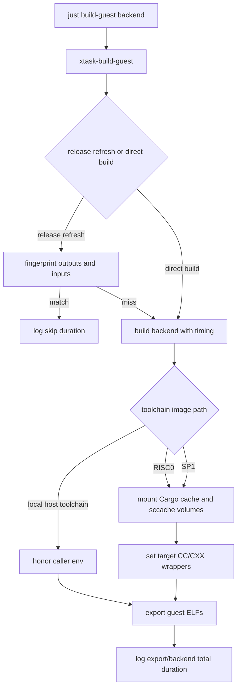

# Guest Build Speed - Plan

## Goal Capsule

| Field | Value |
|---|---|
| Objective | Reduce guest build wall time for repeated RISC0 and SP1 builds while preserving checked-in guest ELF semantics. |
| Authority | Current `xtask/build-guest` behavior, `README.md`, `docs/development.md`, `docs/operations.md`, and repository verification policy. |
| Execution profile | Code change to build orchestration, toolchain images, documentation, and focused tests. |
| Stop conditions | Stop if sccache integration changes guest artifact selection, breaks local toolchain-image builds, or cannot be disabled cleanly. |
| Tail ownership | LFG continues through implementation, review, commit, PR, and CI watch unless blocked by push or CI access. |

---

## Product Contract

### Summary

Guest builds already skip unchanged release ELFs through a backend fingerprint and reuse Docker Cargo cache volumes, but repeated builds still pay host-side `xtask-build-guest` release optimization cost, lack visible phase timings, and do not cache C/C++ compilation through `sccache` inside the repo-managed zkVM toolchain containers.
This plan adds measurable guest build timings and default, opt-out `sccache` support for the Docker toolchain image paths without changing which guest binaries are built or where ELFs are exported.

### Problem Frame

`just build-guest risc0`, `just build-guest sp1`, and release guest refreshes are expensive because zkVM guest crates pull large Rust and native dependency graphs.
The current build path has important coarse caching, but logs do not quantify fingerprint hit cost, rebuild duration, toolchain-image check duration, export duration, or cache backend selection.
Local measurement also showed the direct `just build-guest` entrypoint can spend unnecessary time compiling and linking the host-side launcher before entering guest compilation.
The optimization must be conservative because guest ELF and SP1 VK artifacts are part of verifier registration and image release provenance.

### Requirements

**Measurement and observability**

- R1. Guest build logs must report backend-level elapsed time for skip and rebuild paths.
- R2. Guest build logs must expose the effective Cargo cache and sccache choices so cache-hit runs are diagnosable from release logs.
- R3. The implementation must leave enough local commands documented to compare cold, warm, and fingerprint-hit guest build runs.

**Build cache behavior**

- R4. Repo-managed RISC0 and SP1 Docker toolchain builds should route native guest C/C++ compilation through `sccache` where the target compiler environment accepts a compiler wrapper.
- R5. Guest Rust compilation should stay on Cargo's normal path unless a separate benchmark proves `RUSTC_WRAPPER=sccache` improves wall-clock time for this guest graph.
- R6. sccache state must persist across Docker toolchain container runs using a deterministic per-repo/per-backend cache volume by default.
- R7. Users must be able to disable the sccache layer without disabling the existing Docker Cargo cache layer.

**Artifact safety**

- R8. Cache configuration must not force guest ELF rebuilds when sources and artifact bytes are unchanged.
- R9. RISC0 and SP1 output export locations must remain `crates/guests/elf`.
- R10. The implementation must not hand-edit generated ELF or VK artifacts.
- R11. The `just build-guest` entrypoint should lower optimization for the host-side launcher because launcher runtime is negligible compared with guest compilation and fingerprinting.

### Scope Boundaries

#### Deferred to Follow-Up Work

- Parallelizing `Backend::All` is deferred because RISC0 and SP1 builds are both CPU, memory, Docker, and disk intensive; concurrency should be opt-in only after single-backend cache behavior is measured.
- Per-binary guest fingerprints are deferred because the current backend-level fingerprint is simple and safe; splitting SP1 artifact invalidation should follow real evidence that most guest edits affect only one binary.
- Remote or distributed sccache is deferred because credentials, eviction, and CI cache ownership need a separate policy.
- Stale historical target directory cleanup is deferred to a maintenance task; this plan may document the footprint but should not delete developer caches.

### Assumptions

- Pipeline scoping confirmation is unavailable in LFG, so the plan assumes the first optimization pass should favor safe default caching and measurement over higher-risk concurrency.
- `sccache` is available as a pinned official release binary for the architectures supported by the repo-managed RISC0 and SP1 toolchain images; if either image cannot install it, implementation should keep the cache integration opt-in for that image or stop with evidence.
- `sccache` compiler wrapping is output-transparent for guest builds; therefore sccache selection should not be included in the guest artifact fingerprint.

---

## Planning Contract

### Key Technical Decisions

- KTD1. Add timings at the `xtask-build-guest` orchestration layer rather than relying only on shell `time`.
  This makes release logs and local runs comparable even when the caller is `release-image`, `bench-guest`, or direct `xtask-build-guest`.
- KTD2. Use separate deterministic Docker volumes for Cargo cache and sccache.
  Cargo cache volume behavior already exists and should remain independently controllable; sccache needs its own opt-out and volume name so users can clear or isolate it without losing registry and git caches.
- KTD3. Keep sccache out of the artifact fingerprint.
  A compiler cache wrapper should not affect produced ELF bytes; hashing cache toggles would turn a speed setting into a rebuild trigger and hide the value of fingerprint hits.
- KTD4. Default the new cache layer only on repo-managed Docker toolchain image paths.
  The local `cargo risczero` and `cargo prove` paths depend on host-installed tools and should honor the user's existing `RUSTC_WRAPPER` environment instead of requiring repo-managed host setup.
- KTD5. Keep C/C++ wrapper injection narrow and reversible.
  RISC0 and SP1 target compiler env vars already centralize cross compiler selection, so the wrapper can be composed there and disabled through the new sccache mode if a native dependency rejects it.
- KTD6. Keep the host-side launcher in release mode for dependency compatibility, but override release profile settings at the `just build-guest` entrypoint.
  This avoids changing workspace-wide release settings for real server binaries while removing unnecessary launcher LTO from guest build timings.
- KTD7. Print `sccache --show-stats` inside the same Docker container lifecycle as the guest build.
  sccache daemon statistics do not survive container exit, so stats must be emitted before the container exits; set `SCCACHE_BASEDIRS=/work` to keep source paths stable inside repo-managed containers.

### High-Level Technical Design

### Sources and Research

- `xtask/build-guest/src/lib.rs` already computes backend fingerprints, skips up-to-date release ELFs, builds RISC0 before SP1 for `Backend::All`, exports RISC0 ELFs, and exports SP1 ELFs plus VK files.
- `xtask/build-guest/src/util.rs` already provides `DOCKER_CARGO_CACHE` and `DOCKER_CARGO_CACHE_VOLUME` with deterministic default volume names.
- `docker/risc0-toolchain/Dockerfile` and `docker/sp1-toolchain/Dockerfile` are the repo-owned images used by default through `RISC0_TOOLCHAIN_IMAGE=raiko2-risc0-toolchain:local` and `SP1_TOOLCHAIN_IMAGE=raiko2-sp1-toolchain:local`.
- `docs/development.md` documents guest build entrypoints and local toolchain image defaults; `docs/operations.md` documents release-image guest refresh semantics and dirty generated artifact handling.
- No relevant `docs/solutions/` corpus exists in this checkout.

### System-Wide Impact

- Developers get repeatable timing signals in local and release logs.
- Release operators keep the existing guest ELF dirty-state safety: generated artifact drift remains visible in git rather than hidden by cache configuration.
- CI and self-hosted guest ELF sync jobs continue using the same `just build-guest` entrypoint, with cache behavior controlled by environment variables when needed.

### Risks and Dependencies

- Toolchain image package availability can block default sccache installation; implementation must verify both Dockerfiles or keep the affected path disabled.
- Wrapping target C/C++ compilers can expose assumptions in native build scripts; an explicit disable mode is required.
- Full cold guest builds can be slow and may rewrite generated ELF artifacts; verification should prefer focused unit tests plus a measured fingerprint-hit or single-backend smoke unless a full artifact refresh is required.

---

## Implementation Units

### U0. Lower Host Launcher Optimization In Guest Build Entrypoint

- **Goal:** Prevent direct `just build-guest` runs from spending extra time optimizing the host launcher before guest compilation starts.
- **Requirements:** R11.
- **Dependencies:** None.
- **Files:** `justfile`, `docs/development.md`.
- **Approach:** Apply a Cargo release opt-level override only to the `xtask-build-guest` just recipe, keeping workspace release settings at Cargo defaults for production binaries.
- **Patterns to follow:** Existing runtime image smoke docs that keep build-only host binaries out of hot-path tuning.
- **Test scenarios:** Measure `cargo build -r -p xtask-build-guest --bin xtask-build-guest` or `just build-guest <backend>` after the override and confirm the launcher enters guest work quickly.
- **Verification:** The build-guest launcher enters guest fingerprinting/build work without an unnecessary high-optimization delay.

### U1. Add Guest Build Timing Primitives

- **Goal:** Make skip, rebuild, and direct build paths report backend-level elapsed time without changing build selection.
- **Requirements:** R1, R2, R3.
- **Dependencies:** None.
- **Files:** `xtask/build-guest/src/lib.rs`, `xtask/build-guest/src/util.rs`.
- **Approach:** Add a small duration formatter or timing helper and apply it around `ensure_release_backend`, `build_risc0`, `build_sp1`, and export sections where the code already has backend boundaries.
- **Patterns to follow:** Existing `[INFO]` log style in `xtask/build-guest/src/lib.rs`; runtime image build duration logging in `xtask/src/release_image.rs`.
- **Test scenarios:** Run the focused `xtask-build-guest` unit tests and add tests for duration formatting if the formatter has edge cases. Use a command-level smoke that exercises a fingerprint-hit path and confirm the log includes a backend skip duration.
- **Verification:** The output clearly shows elapsed time for unchanged release backends and rebuilt backends, and existing build behavior remains unchanged.

### U2. Add Docker sccache Volume Configuration

- **Goal:** Provide a deterministic, separately controllable Docker sccache cache volume for guest builds.
- **Requirements:** R2, R6, R7, R8.
- **Dependencies:** U1.
- **Files:** `xtask/build-guest/src/util.rs`, `xtask/build-guest/src/lib.rs`.
- **Approach:** Mirror the existing Docker Cargo cache volume helper with a new sccache helper, default it to `volume`, support `none|0|false|off`, validate explicit volume names, and log the selected volume or disabled state when a toolchain container is used.
- **Patterns to follow:** `docker_cargo_cache_volume`, `sanitize_docker_name`, `is_valid_docker_volume_name`, and existing util unit tests.
- **Test scenarios:** Add unit tests that default volume names are per-repo/per-backend, invalid explicit names fail, and disable values return `None`. Confirm sccache env changes do not affect `compute_guest_fingerprint`.
- **Verification:** sccache cache selection is deterministic, separately disableable, and does not invalidate unchanged guest fingerprints.

### U3. Install and Wire sccache in Repo Toolchain Images

- **Goal:** Route supported native target compilation through sccache for RISC0 and SP1 Docker toolchain image builds.
- **Requirements:** R4, R5, R6, R7, R8.
- **Dependencies:** U2.
- **Files:** `docker/risc0-toolchain/Dockerfile`, `docker/sp1-toolchain/Dockerfile`, `xtask/build-guest/src/lib.rs`.
- **Approach:** Install `sccache` in both repo-managed toolchain images, mount the configured sccache volume into container runs, set `SCCACHE_DIR` and `SCCACHE_BASEDIRS=/work`, compose target `CC`/`CXX` values through `sccache` only when sccache mode is enabled, and print sccache stats before the container exits. Do not set `RUSTC_WRAPPER=sccache` by default for guest Rust compilation unless a benchmark shows it helps.
- **Patterns to follow:** Existing image package-install blocks and existing target compiler env construction in RISC0 and SP1 builder paths.
- **Test scenarios:** Build or inspect both toolchain image Dockerfiles enough to prove `sccache` is present. Run a single-backend guest build smoke or, if too expensive, a toolchain-container command that checks `sccache --version` and validates env wiring. Run focused Rust tests for the command construction and fingerprint invariants.
- **Verification:** Toolchain image builds can find `sccache`, the guest build command uses target C/C++ wrappers by default, and setting the new disable env removes the wrappers and volume mount.

### U4. Document Measurement and Cache Controls

- **Goal:** Give developers and release operators copyable commands for quantifying guest build cache behavior.
- **Requirements:** R2, R3, R7, R10.
- **Dependencies:** U1, U2, U3.
- **Files:** `docs/development.md`, `docs/operations.md`.
- **Approach:** Update guest build docs with cold, warm, and fingerprint-hit measurement guidance, document Cargo cache and sccache env controls separately, and call out that guest ELF/VK diffs are generated artifacts that must be reviewed rather than hand-edited.
- **Patterns to follow:** Existing guest build and runtime image build smoke sections in `docs/development.md`; existing release-image guest refresh section in `docs/operations.md`.
- **Test scenarios:** Test expectation: none -- documentation-only unit, verified by checking commands and env names against the implemented code.
- **Verification:** Documentation names the exact cache controls and explains how to collect comparable before/after timings.

---

## Verification Contract

| Gate | Applies to | Done signal |
|---|---|---|
| `cargo fmt --all -- --check` | Rust changes | Formatting passes. |
| `just build-guest <backend>` or equivalent `CARGO_PROFILE_RELEASE_OPT_LEVEL=1 cargo run -r -p xtask-build-guest` | U0, U1, U3 | The launcher uses reduced optimization, then reports guest fingerprint/build timing. |
| `cargo test -p xtask-build-guest` | U1, U2, U3 | Unit tests cover cache volume parsing, fingerprint invariants, and any timing helpers. |
| `cargo clippy -p xtask-build-guest -- -D warnings` | U1, U2, U3 | Guest build orchestration has no new clippy warnings. |
| `docker build -f docker/risc0-toolchain/Dockerfile -t raiko2-risc0-toolchain:guest-cache-test docker/risc0-toolchain` | U3 | RISC0 toolchain image builds with `sccache` installed. |
| `docker build -f docker/sp1-toolchain/Dockerfile -t raiko2-sp1-toolchain:guest-cache-test docker/sp1-toolchain` | U3 | SP1 toolchain image builds with `sccache` installed. |
| `cargo run -r -p xtask-build-guest --bin xtask-build-guest -- risc0` or `sp1` | U1, U3 | At least one backend smoke shows timing output and cache configuration; generated artifact diffs are inspected. |
| `git diff --check` | All units | No whitespace errors. |

Full `just build-guest all` is desirable when time and disk allow, but a single-backend smoke plus focused unit tests is acceptable if a full rebuild would be disproportionate for the code-path change.

---

## Definition of Done

- Guest build logs include measurable elapsed time for skip and rebuild paths.
- Docker toolchain image paths use sccache by default for supported native C/C++ compilation.
- Cargo cache and sccache cache controls are separately documented and independently disableable.
- Guest artifact fingerprints do not change solely because cache configuration changes.
- No generated ELF or VK artifact is hand-edited; any generated drift is either committed intentionally or removed before shipping.
- Focused Rust tests, Dockerfile build checks, at least one guest build smoke, and diff checks have been run or explicitly reported if environment constraints prevent them.
