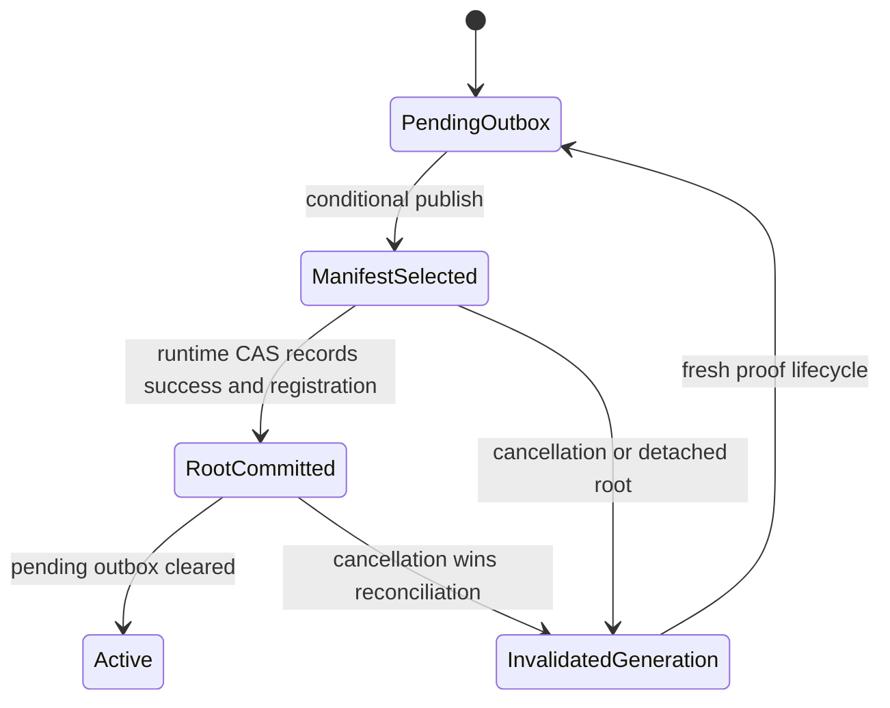
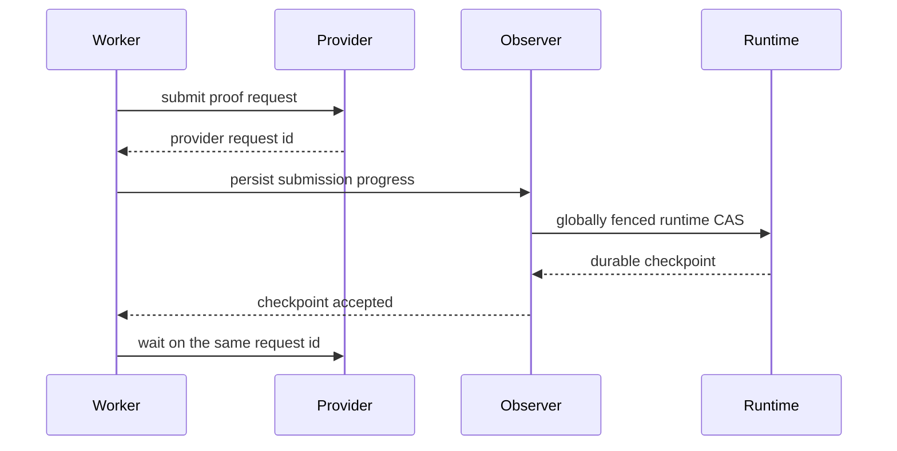

# Proof Publication Correctness - Plan

## Goal Capsule

- **Objective:** Make proof publication, invalidation, recovery, lifecycle fencing, and readiness converge on one durable state without allowing dangling GCS objects or observer failures to produce reusable invalid proofs or duplicate paid submissions.
- **Authority:** The global runtime lifecycle and authoritative runtime-state generation gate every store mutation; engine state is execution state, not the durable source of truth for API recovery.
- **Deployment invariant:** Exactly one live process owns a namespace. Old and replacement processes never overlap, and namespaces never share data.
- **Execution profile:** Deep, cross-cutting Rust change across runtime storage, server orchestration, queue health, and SP1 recovery.
- **Stop conditions:** Do not weaken create-only proof selection, do not report publication retries as terminal failures, and do not claim the SP1 provider crash window is eliminated without a provider idempotency primitive.
- **Tail ownership:** The implementation owns focused tests, workspace lint/format gates, and synchronized API/operations documentation. Deployment and live GKE validation are outside this plan.

---

## Product Contract

### Summary

Proof publication must remain recoverable when GCS contains partial state, cancellation races publication, shutdown begins, or runtime synchronization temporarily fails. Readiness must stop traffic when the instance cannot safely mutate either its runtime namespace or its queue. Remote prover recovery must resume known requests without silently expanding operator-defined cost limits.

### Problem Frame

The current branch adds durable proof artifacts, but several boundaries are not yet atomic. A manifest can outlive content and poison a proof reference, content-hash tombstones can reject every deterministic reproof, and a proof can become externally visible before its runtime root reaches success. Observer persistence failures are logged but hidden from the execution path, while readiness reports the queue as healthy without observing it. SP1 submission checkpoints and legacy deadlines also permit duplicate paid requests or premature timeout behavior.

### Requirements

**Artifact lifecycle and global fencing**

- R1. A dangling GCS manifest must remain inspectable and conditionally removable, and publishing the same content must repair its missing content object.
- R2. Invalidation must cross the global lifecycle and state-coherence fence before every store mutation and invalidate only the selected publication generation.
- R3. A fresh proof lifecycle may republish identical deterministic bytes after the prior publication generation was invalidated, while the invalidated generation remains unusable.
- R4. Publication, root success synchronization, artifact registration, and pending-outbox cleanup must converge after cancellation or transient runtime failures without exposing a live artifact for a cancelled root.

**Runtime convergence and readiness**

- R5. Terminal engine events that fail to persist must remain recoverable and must not permanently block re-enqueue from a non-terminal runtime root.
- R6. Publication retries remain non-terminal until the publication path reaches a durable terminal outcome.
- R7. Runtime startup loads authoritative state before recovery and fails without leaving background workers running.
- R8. `/ready` fails when the global runtime lifecycle is draining, the authoritative runtime store is inaccessible, or queue maintenance is not demonstrably live.

**Remote prover safety**

- R9. SP1 submission progress persistence is fallible and must complete before the worker treats a newly returned request ID as safely resumable.
- R10. Legacy SP1 checkpoints with a zero or absent deadline use the configured full timeout while retaining the stored provider request ID and attempt count.
- R11. Request-scoped `network_request_max_attempts` may reduce but never increase the operator-configured cap.

**Documentation and verification**

- R12. API and operations documentation describe one consistent GCS lifecycle and distinguish active manifests, immutable content, generation-scoped invalidation markers, and retention policy.
- R13. Regression coverage exercises production GCS semantics through a deterministic storage seam or emulator-equivalent fake, not only the memory backend.

### Acceptance Examples

- AE1. Given a manifest whose content object was removed, publishing the same proof bytes restores content and returns an idempotent result; publishing different bytes still returns a conflict.
- AE2. Given generation A was invalidated, reads of A fail, then an identical reproof creates generation B and is reusable while A remains rejected.
- AE3. Given publication completes and cancellation wins before root synchronization, reconciliation invalidates generation A and no active runtime artifact is returned.
- AE4. Given root synchronization fails transiently after engine completion, the task remains recoverable and later reconciliation reaches one terminal runtime result without republishing a conflicting proof.
- AE5. Given draining begins or authoritative-store coherence is lost, all mutations stop and `/ready` reports an error before more work is accepted.
- AE6. Given an SP1 request ID is returned but checkpoint persistence fails transiently, the same worker retries the checkpoint without submitting another request; a zero-deadline legacy checkpoint resumes with the configured timeout.
- AE7. Given an operator cap of three attempts and a request override of ten, the effective cap remains three; an override of two resolves to two.

### Scope Boundaries

In scope are the review findings plus startup task cleanup, the cancel-after-commit race, real queue readiness, and the GCS/recovery tests needed to prove those fixes.

Active/active replicas and overlapping rolling replacement are outside the supported architecture.
There is intentionally no owner lease, owner epoch, or ownership heartbeat. The non-overlap invariant
is enforced by deployment configuration and is not duplicated as application-level coordination.

### Deferred to Follow-Up Work

- Docker environment cleanup and unrelated config hygiene.
- CI lane redesign; this plan uses existing CI entry points but does not restructure workflows.
- Cleanup of unrelated checkpoint fields, exhausted-checkpoint retention, and memory-backend production warnings.
- A complete elimination of the provider-accepted/process-crashed SP1 interval, unless the pinned SP1 client exposes a documented idempotency key or request lookup primitive during implementation.

---

## Planning Contract

### Key Technical Decisions

- KTD1. **Invalidate publication generations, not content globally.** A marker identifies the logical proof reference, manifest generation, and content hash. Invalidation conditionally removes the selected manifest, leaving immutable content available for a later manifest generation with the same hash.
- KTD2. **Keep manifests create-only within one generation.** Fresh publication after invalidation is a new generation selected through conditional manifest creation; no mutable overwrite path is introduced.
- KTD3. **Separate manifest metadata reads from content materialization.** Conditional delete and repair decisions use manifest hash and generation even when content is missing; normal proof reads still surface an integrity error instead of silently treating corruption as absence.
- KTD4. **Make terminal convergence a durable runtime reconciliation concern.** Observer callbacks record enough publication outcome to retry root synchronization, and API recovery may re-enqueue a failed engine child when the authoritative root is still non-terminal. Publication-retry failures do not become terminal root failures.
- KTD5. **Use a queue maintenance heartbeat for readiness.** Queue readiness means the maintenance loop has completed successfully within a bounded multiple of `queue.maintenance_interval_ms`; it does not mean the queue is empty.
- KTD6. **Persist remote submission progress synchronously.** `ProverProgressObserver` returns an error, and a newly submitted request remains attached to the current stage lease while checkpoint persistence retries. If the global lifecycle becomes inactive, the worker stops; it never converts a failed checkpoint into permission to submit again in the same process.
- KTD7. **Treat the server SP1 attempt limit as policy.** Effective request configuration uses the minimum of the operator cap and a non-zero request override.
- KTD8. **Do not start workers before authoritative initialization.** Runtime-state load and artifact restoration complete before recoverable tasks or maintenance loops are started.
- KTD9. **Preserve non-terminal publication retry semantics.** This carries forward the proven runtime-observer behavior: transient publication failures remain active until retry or invalidation reaches a real terminal state.
- KTD10. **Use one global namespace fence, never task-local ownership.** (session-settled: user-directed — chosen over per-task owner epochs: the deployment model has exactly one live process per namespace.) An inactive or draining runtime fences all task, checkpoint, publication, invalidation, reconciliation, and cleanup writes together. GCS generations remain independent object-version CAS tokens.
- KTD11. **Do not support overlapping same-namespace instances.** (session-settled: user-directed — chosen over active/active coordination: namespaces are isolated and deployments perform a hard drain-and-stop replacement.) Do not retain owner leases, epochs, heartbeats, or distributed locks that only serve an unsupported deployment mode.

### High-Level Technical Design





```mermaid
flowchart TB
  Probe[/ready] --> Runtime{Runtime active, coherent, and store reachable?}
  Runtime -->|no| NotReady[Not ready]
  Runtime -->|yes| Queue{Recent successful queue maintenance?}
  Queue -->|no| NotReady
  Queue -->|yes| Dependencies{RPC and prover config healthy?}
  Dependencies -->|no| NotReady
  Dependencies -->|yes| Ready[Ready]
```

### Sequencing

Define generation-aware storage semantics first, then build runtime publication convergence on them. After the runtime contract is stable, wire observer reconciliation and readiness. SP1 checkpoint/config changes are independent of artifact storage but should land before the final cross-layer regression pass. Documentation follows the final lifecycle terms.

### System-Wide Impact

- **Persistence:** Runtime state, GCS manifests, invalidation markers, and the pending publication outbox must agree across process restart and non-overlapping replacement.
- **API behavior:** `/ready` becomes a meaningful traffic gate; proof reads distinguish invalidation from storage corruption.
- **Cost control:** SP1 retries cannot exceed operator policy, and checkpoint failures no longer silently permit same-process resubmission.
- **Operations:** Lifecycle rules must prevent bucket retention policies from deleting active manifest dependencies.

### Risks and Mitigations

- **Old invalidation marker compatibility:** Existing content-hash-only markers may remain in buckets. Treat them as invalidating the currently referenced legacy generation, migrate lazily when observed, and document removal only after the retention window.
- **Cancellation ordering:** A cancellation can occur at every publication boundary. Preserve the committed publication descriptor until root synchronization or invalidation succeeds, and test each boundary with deterministic failpoints.
- **Readiness flapping:** Derive the stale threshold from a bounded multiple of the configured maintenance interval and publish the last error without probing by destructively popping work.
- **SP1 residual crash window:** The provider returns the request ID before local persistence can be atomic. Keep the interval minimal, emit explicit telemetry, and adopt provider idempotency only if the pinned SDK proves it supports the needed contract.

---

## Implementation Units

### U1. Generation-aware GCS artifact lifecycle

- **Goal:** Make GCS artifact repair, reads, conditional deletion, and invalidation operate correctly when manifest and content lifecycles diverge.
- **Requirements:** R1, R2, R3, R13; KTD1, KTD2, KTD3.
- **Dependencies:** None.
- **Files:** `crates/runtime/src/artifact_store.rs`, `crates/runtime/src/artifact_store/gcs.rs`, `crates/runtime/src/lib.rs`, and GCS artifact-store tests colocated under `crates/runtime/src/artifact_store/`.
- **Approach:** Introduce an internal manifest descriptor carrying hash and generation independently of bytes. Scope invalidation markers to that descriptor, conditionally delete only the matching manifest, repair missing same-hash content during `put_if_absent`, and retain an explicit corruption result for ordinary reads. Keep the trait backend-neutral and mirror semantics in the memory backend.
- **Execution note:** Start with storage-contract tests that reproduce a dangling manifest and generation reuse before changing the implementation.
- **Patterns to follow:** Existing generation-match CAS in `GcsProofArtifactStore` and authoritative mutation fencing in `RuntimeManager`.
- **Test scenarios:**
  1. Covers AE1. Same-hash publication repairs missing content behind an existing manifest and returns idempotent success.
  2. A dangling manifest remains conditionally deletable using its generation and expected hash.
  3. Different bytes behind an existing live manifest remain a conflict.
  4. Covers AE2. Invalidate generation A, recreate the manifest for identical content as generation B, and verify only A is invalidated.
  5. Once global runtime authority becomes inactive, no task can create an invalidation marker or delete a manifest; a stale generation cannot delete a newer manifest.
- **Verification:** The storage contract behaves identically under the memory fake and the GCS transport seam for create, repair, conflict, invalidate, and stale-generation cases.

### U2. Atomic publication-to-root convergence

- **Goal:** Ensure a published proof becomes active only when its runtime root and artifact registration durably converge, including cancellation and retry races.
- **Requirements:** R4, R6; KTD1, KTD4, KTD9.
- **Dependencies:** U1.
- **Files:** `crates/runtime/src/publication.rs`, `crates/runtime/src/lib.rs`, `bin/raiko2/src/server/state/runtime_observer.rs`, and their colocated test modules.
- **Approach:** Carry a generation-qualified publication descriptor through observer completion. Register the exact canonical descriptor before root synchronization, clear the pending outbox only after registration, and retain the descriptor when root synchronization fails. A retry verifies that the same descriptor is still current before accepting an already-completed root. Cancellation or a detached root invalidates the exact committed generation even when the pending outbox was already drained.
- **Execution note:** Use deterministic failpoints around publish, runtime CAS, outbox cleanup, and cancellation to characterize every boundary.
- **Patterns to follow:** `commit_proof_artifact_publication`, pending publication outbox recovery, and the existing invalidated-completion behavior in `RuntimeObserver`.
- **Test scenarios:**
  1. Covers AE3. Cancellation after manifest creation but before root CAS invalidates that generation and returns no active artifact.
  2. Cancellation after root CAS but before outbox cleanup converges to invalidated without losing the descriptor.
  3. Covers AE4. A transient root CAS failure retains retry state and later commits exactly once.
  4. A publication retry remains `Allocated` or otherwise non-terminal until success or explicit invalidation.
  5. Global authority loss at each external mutation boundary prevents every task in the instance from changing GCS or runtime state.
- **Verification:** Runtime and observer tests prove there is no terminal state with a live cancelled artifact and no retry path that loses its publication descriptor.

### U3. Engine-to-runtime reconciliation

- **Goal:** Prevent warn-only observer failures from leaving engine and runtime state permanently divergent.
- **Requirements:** R5, R6; KTD4, KTD9.
- **Dependencies:** U2.
- **Files:** `bin/raiko2/src/server/state/runtime_observer.rs`, `bin/raiko2/src/server/handlers/proof_api.rs`, `crates/engine/src/lib.rs`, and affected colocated tests.
- **Approach:** Propagate failures through the engine callbacks that already support fallible completion, then reconcile remaining terminal engine state by scanning the existing scheduler store during maintenance/startup rather than adding a second journal. Allow submission recovery to replace or re-enqueue a failed engine child only when the authoritative root is non-terminal and no active stage lease exists. Keep publication retry dispositions distinct from terminal prover failure.
- **Patterns to follow:** Existing runtime task recovery and queue lease ownership checks.
- **Test scenarios:**
  1. Terminal engine success plus transient runtime failure is reconciled to one completed root after store recovery.
  2. Terminal engine failure plus non-terminal root permits one safe re-enqueue and does not duplicate an active lease.
  3. A terminal runtime root is never reopened by stale engine state.
  4. Publication retry errors remain non-terminal throughout reconciliation.
- **Verification:** Restart and maintenance tests show engine entries cannot permanently suppress recovery when runtime remains authoritative and non-terminal.

### U4. Lifecycle-safe startup and real readiness

- **Goal:** Load authoritative state before recovery and reject traffic whenever runtime or queue mutation capability is not healthy.
- **Requirements:** R7, R8; KTD5, KTD8.
- **Dependencies:** U3.
- **Files:** `bin/raiko2/src/server/state/mod.rs`, `bin/raiko2/src/server/ready.rs`, `crates/engine/src/worker.rs`, `crates/engine/src/lib.rs`, and corresponding colocated tests.
- **Approach:** Complete runtime-state load and artifact restoration before starting recovery and maintenance tasks. Track queue maintenance last-success time and last error in shared application state without mutating queue contents from the probe. Readiness combines the global lifecycle/store-coherence check with a freshness threshold derived from the configured maintenance interval.
- **Test scenarios:**
  1. Covers AE5. Draining fences all runtime and external-store mutations.
  2. Initialization failure does not leave recovery or maintenance tasks running.
  3. Draining or authoritative store failure makes runtime readiness fail.
  4. A stopped or repeatedly failing maintenance loop makes queue readiness fail after the freshness threshold.
  5. An empty but healthy queue remains ready, while a backlogged but maintained queue also remains ready.
- **Verification:** Readiness tests observe real shared health state, and startup tests prove background-task cleanup on both success and failure.

### U5. Durable SP1 submission checkpoints and legacy resume

- **Goal:** Make returned SP1 request IDs durably resumable before normal waiting continues and restore safe timeout behavior for legacy records.
- **Requirements:** R9, R10; KTD6.
- **Dependencies:** None.
- **Files:** `crates/prover/src/lib.rs`, `crates/prover/src/sp1/mod.rs`, `crates/prover/src/boundless/mod.rs`, `bin/raiko2/src/server/state/runtime_observer.rs`, `bin/raiko2/src/server/task_metadata.rs`, and affected test modules.
- **Approach:** Change progress observation to return a persistence result across all prover backends. After SP1 submission, retry the same checkpoint while holding the stage lease and request ID; propagate permanent global lifecycle failure without issuing another request. Normalize zero deadlines to absent and use the configured full timeout for legacy resume while preserving request ID and attempt.
- **Execution note:** Characterize both SP1 and Boundless observer call sites before changing the shared trait.
- **Test scenarios:**
  1. Covers AE6. Two transient checkpoint failures cause repeated persistence attempts for one provider request ID and zero additional submissions.
  2. Permanent global lifecycle failure stops the stage and records an explicit checkpoint failure without same-process resubmission.
  3. A legacy zero-deadline checkpoint resumes the stored request with the full configured timeout.
  4. A future deadline uses only the remaining duration; an expired non-zero deadline uses the existing minimum wait behavior.
  5. Boundless progress propagation preserves its existing retry and recovery semantics after the trait becomes fallible.
- **Verification:** Provider fakes count submissions separately from checkpoint attempts and prove one returned request ID is never resubmitted because of a local persistence retry.

### U6. Enforce operator-owned SP1 retry limits

- **Goal:** Prevent public request overrides from increasing the maximum number of billable SP1 submissions.
- **Requirements:** R11; KTD7.
- **Dependencies:** U5.
- **Files:** `crates/prover/src/sp1_config.rs`, `bin/raiko2/src/server/proof_types/v3.rs`, `docs/API.md`, `config.example.toml`, and `crates/prover/src/sp1_config.rs` tests.
- **Approach:** Resolve the effective attempt limit as the minimum of the validated operator cap and a validated non-zero request override. Document the override as a downward-only budget control.
- **Test scenarios:**
  1. Covers AE7. Override ten under operator cap three resolves to three.
  2. Override two under operator cap three resolves to two.
  3. Zero remains invalid, and absence uses the operator cap.
  4. Proposal and aggregation request contexts apply the same cap.
- **Verification:** Config resolution tests prove no public request shape can increase the configured submission budget.

### U7. Align lifecycle documentation and run cross-layer regressions

- **Goal:** Publish one operational lifecycle contract and prove the integrated recovery behavior.
- **Requirements:** R12, R13.
- **Dependencies:** U1, U2, U3, U4, U5, U6.
- **Files:** `docs/API.md`, `docs/operations.md`, `config.example.toml`, and the focused runtime/server/prover test modules introduced by U1-U6.
- **Approach:** State that active manifests have no independent age-based deletion, immutable content must outlive every referencing manifest generation, and invalidation markers must outlive the maximum retry/recovery window for their generation. Add an operator-visible note for legacy markers and dangling-object repair. Run the integrated restart, lifecycle-fence, cancellation, deterministic-reproof, and remote-checkpoint scenarios.
- **Test scenarios:**
  1. Restart after every publication boundary converges to active or generation-invalidated state with no orphaned live registration.
  2. Global authority loss during invalidation prevents all remaining tasks from mutating the selected or replacement generation.
  3. Deterministic reproof after invalidation is reusable through the API.
  4. Readiness transitions to error on runtime/queue failure and returns to ready after successful recovery.
  5. Documentation examples and config names match the implemented lifecycle and request-limit semantics.
- **Verification:** Cross-crate tests pass and the API, operations guide, and example config describe the same lifecycle and limits.

---

## Verification Contract

| Gate | Applies to | Required outcome |
|---|---|---|
| `cargo fmt --all --check` | All units | No formatting drift. |
| `cargo test -p raiko2-runtime -p raiko2-queue -p raiko2-engine` | U1-U4, U7 | Storage, reconciliation, lifecycle fencing, and queue health scenarios pass. |
| `cargo test -p raiko2-prover` | U5-U6 | Submission checkpoint, legacy resume, Boundless compatibility, and retry-cap scenarios pass. |
| `cargo test -p raiko2` | U2-U7 | Server observer, API recovery, startup, and readiness integration scenarios pass. |
| `cargo clippy --workspace --all-targets -- -D warnings` | Final integration | No new warnings across touched shared interfaces. |
| `git diff --check` | Final integration | No whitespace or patch integrity errors. |

No guest ELF rebuild is required because the plan does not change guest sources, prover proof formats, or host/guest contracts.

---

## Definition of Done

- Every R-ID is implemented by its cited units and every acceptance example has deterministic regression coverage.
- An inactive or draining runtime cannot write runtime state, manifests, checkpoints, deletions, or invalidation markers from any task.
- Dangling GCS manifests can be repaired or removed without poisoning the logical proof reference.
- Invalidation blocks only the selected generation, and an identical fresh proof can become active under a newer generation.
- Cancellation and transient root-sync failures converge without a live cancelled artifact or a permanently blocked runtime root.
- `/ready` reflects runtime authority and queue maintenance liveness.
- SP1 checkpoint failures do not trigger same-process duplicate submissions, legacy zero deadlines receive the full configured timeout, and client overrides cannot exceed the operator attempt cap.
- `docs/API.md`, `docs/operations.md`, and `config.example.toml` agree on lifecycle and retry policy.
- All Verification Contract gates pass, and abandoned experimental code or duplicate paths are removed from the final diff.
