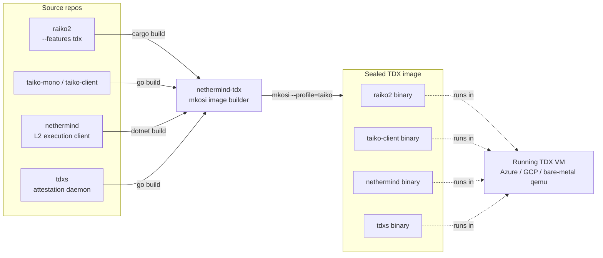
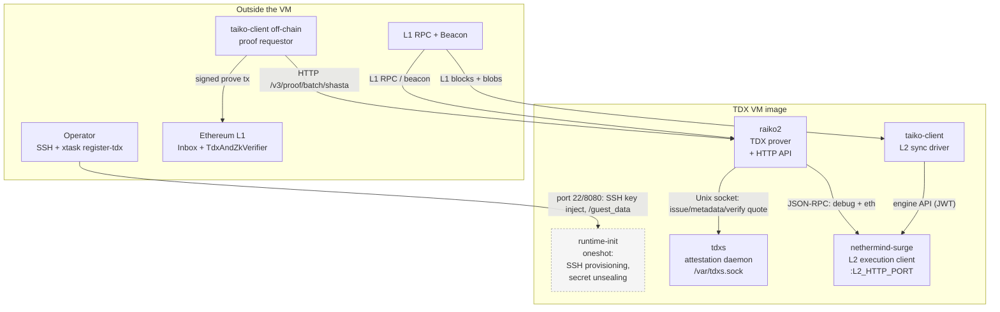
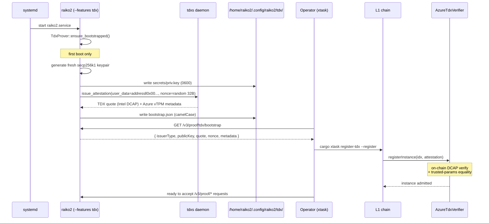
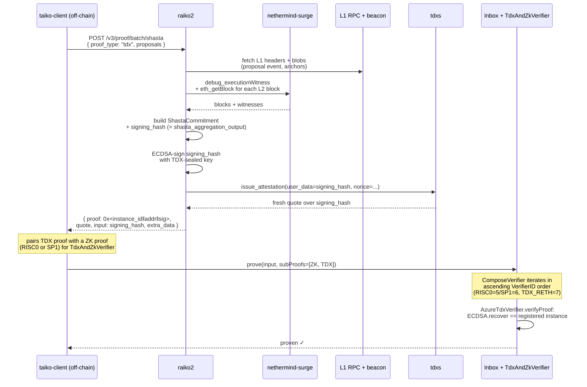

# raiko2 ↔ nethermind-tdx architecture

This doc explains how the raiko2 TDX prover is packaged into a sealed Linux image by the
[`nethermind-tdx`](https://github.com/NethermindEth/nethermind-tdx) repo, what runs inside
that image at runtime, and how the parts talk to each other to produce a TDX-attested
proof that lands on-chain.

For the on-chain registration flow (`AzureTdxVerifier`, `setTrustedParams`, `registerInstance`)
see [`tdx_register.md`](./tdx_register.md). For the full deployment pipeline (image build →
smart-contract deploy → registration) see
[taiko-mono — TDX deployment](https://github.com/taikoxyz/taiko-mono/blob/main/packages/protocol/docs/tdx_deployment.md).

## Repo relationships (build time vs. runtime)

`nethermind-tdx` is **not** an executable — it's a build system (mkosi + nix) that pins
versions of each upstream repo in [`taiko-tdx-prover/mkosi.build`](https://github.com/NethermindEth/nethermind-tdx/blob/master/taiko-tdx-prover/mkosi.build)
and produces a single, measured, reproducible EFI image. The TDX measurements (`mrTd`,
PCRs) cover the entire image, so swapping any binary inside requires re-attesting on-chain.

## Inside the image (runtime topology)

| Service             | Source repo            | Role inside the image                                                                                  |
| ------------------- | ---------------------- | ------------------------------------------------------------------------------------------------------ |
| `runtime-init`      | `nethermind-tdx/init`  | oneshot: configures network, accepts an SSH pubkey via port 8080, unseals persistent storage           |
| `tdxs`              | `NethermindEth/tdxs`   | Long-running daemon that owns quote generation. Listens on `/var/tdxs.sock` (group `tdx`). Issues Intel TDX DCAP quotes bound to caller-supplied 32-byte user-data. |
| `nethermind-surge`  | `NethermindEth/nethermind` | L2 execution client. Provides the engine API to `taiko-client` and JSON-RPC (incl. `debug_*`) to `raiko2` for witness fetching. |
| `taiko-client`      | `taikoxyz/taiko-mono`  | L2 sync driver — watches L1 Inbox events and feeds blocks to nethermind via the engine API.            |
| `raiko2`            | `taikoxyz/raiko2`      | TDX prover. Built with `--features tdx`, exposes the proof HTTP API, and signs proofs with a key derived inside the TEE. |

## Bootstrap: how raiko2 gets a TDX-bound key

The bootstrap happens **once** per image instance, on first start of `raiko2.service`. It's
what makes a fresh VM into something an operator can register on-chain.

A few invariants worth remembering:

- The private key is generated **inside the TEE** and never leaves it. Its public Ethereum
  address is embedded in the quote's user-data, so the on-chain registry can trust that
  signatures from that address came from this exact image build.
- The bootstrap file is sticky across `raiko2` restarts (key + quote survive on the
  encrypted persistent disk), so registering once is enough until image measurements
  change.
- Rebuilding the image changes `mrTd` / PCRs → the existing trusted-params slot no longer
  matches → operators must run `--trust` against a fresh slot before re-registering.
  See [`tdx_register.md`](./tdx_register.md#when-do-i-need---trust).

## Proof generation flow

A proposal proof request from `taiko-client` flows through every component in the image:

Key wire-format facts:

- The 89-byte TDX proof body (`instance_id(4) ‖ address(20) ‖ signature(65)`) is
  byte-identical to the existing SGX wire format, so the on-chain verifier reuses the same
  recover-and-compare logic.
- `proof.input` returned to `taiko-client` is `signing_hash =
  shasta_aggregation_output(commitment, chain_id, verifier, tdx_instance)` — what the
  ECDSA signature is taken over, not the carry-data hash. This matters because the same
  `proof.input` is what the on-chain `Inbox` will reconstruct when calling `verifyProof`.
- The Intel TDX quote returned alongside the proof is **not** included in the on-chain
  submission for steady-state proving — it is only consumed by `registerInstance` at
  enrollment time. Per-proof attestation is implicit: the on-chain instance registry
  proves the signing key was produced by an attested image.

## Where each piece is configured

| What                                  | Where it lives                                                                                            |
| ------------------------------------- | --------------------------------------------------------------------------------------------------------- |
| Image build pin (raiko2 git ref)      | `nethermind-tdx/taiko-tdx-prover/mkosi.build` — `RAIKO2_VERSION` / `RAIKO2_GIT_URL`                       |
| Per-deployment env (chain ids, RPCs)  | `nethermind-tdx/env.json` (templated into `/etc/nethermind-surge/.env` at build time)                     |
| raiko2 runtime config                 | `/etc/nethermind-surge/raiko2_config.toml` inside the VM (rendered from `env.json` + `raiko2_config.toml.in`) |
| tdxs socket path used by raiko2       | `prover.tdx.socket_path` in raiko2 config — defaults to `/var/tdxs.sock` and matches `tdxs.socket`        |
| On-chain verifier address (per L2)    | raiko2 chain spec `verifier_address_forks.TDX`                                                            |
| Bootstrap data (TDX-sealed key+quote) | `/home/raiko2/.config/raiko2/tdx/{secrets/priv.key, bootstrap.json}` (encrypted persistent disk)          |

If you change anything in the first column you must rebuild the image; the resulting
`mrTd` will differ and the on-chain trusted-params slot will need to be re-issued before
new instances can register.
