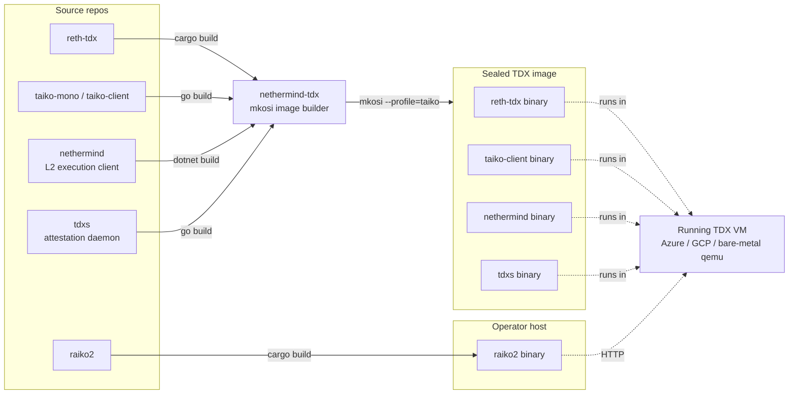
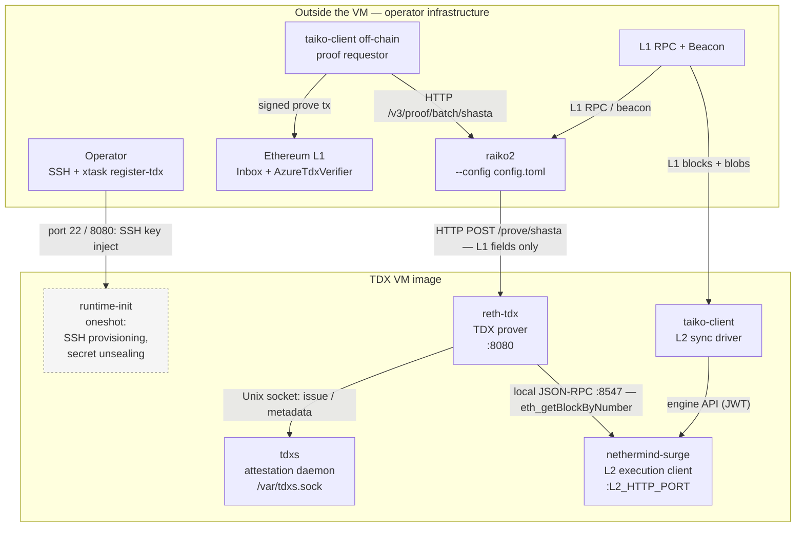
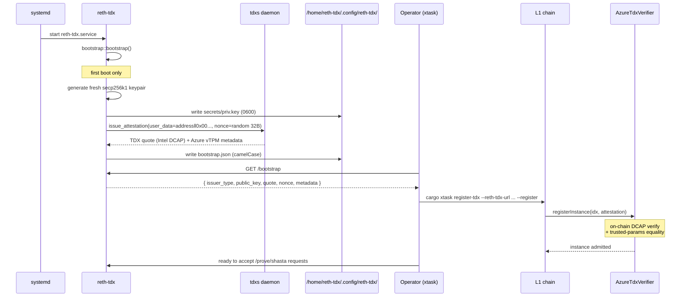
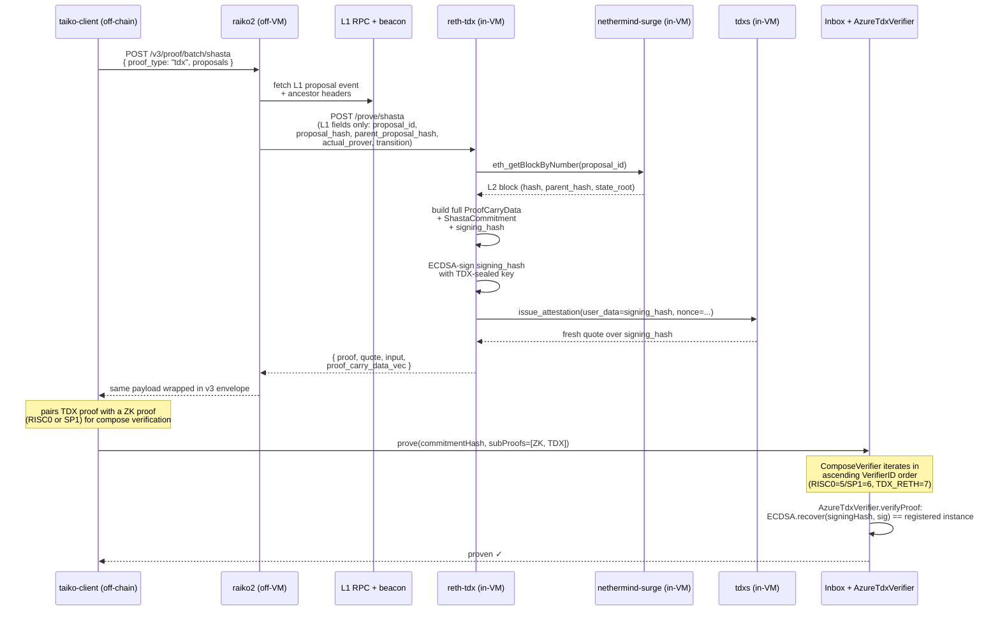

# raiko2 ↔ nethermind-tdx architecture

This doc explains how the TDX proving stack is split across repos, what runs
inside vs outside the TDX VM, and how the components talk to each other to
produce a TDX-attested proof that lands on-chain.

For the on-chain registration flow (`AzureTdxVerifier`, `setTrustedParams`,
`registerInstance`) see [`tdx_register.md`](./tdx_register.md). For the full
deployment pipeline (image build → smart-contract deploy → registration) see
[taiko-mono — TDX deployment](https://github.com/taikoxyz/taiko-mono/blob/main/packages/protocol/docs/tdx_deployment.md).

## TL;DR

- `raiko2` runs **outside** the TDX VM, on operator-controlled infrastructure.
- `reth-tdx` (a separate binary from
  [NethermindEth/reth-tdx](https://github.com/NethermindEth/reth-tdx)) runs
  **inside** a measured Nethermind TDX VM produced by
  [`nethermind-tdx`](https://github.com/NethermindEth/nethermind-tdx).
- On a `proof_type=tdx` request, raiko2 forwards only L1-derived proposal data
  over HTTP to `reth-tdx`. `reth-tdx` fetches the corresponding L2 block from
  its co-resident Nethermind, builds the Shasta commitment, signs it with a
  TDX-bound bootstrap key, and returns the 89-byte proof + attestation quote.
- Only `reth-tdx` ever touches the `tdxs` daemon or the bootstrap key. raiko2
  never speaks the tdxs protocol.

## Repo relationships (build time vs. runtime)

`nethermind-tdx` is a build system (mkosi + nix) that pins each upstream repo
by git revision in
[`taiko-tdx-prover/mkosi.build`](https://github.com/NethermindEth/nethermind-tdx/blob/main/taiko-tdx-prover/mkosi.build)
(`RETH_TDX_VERSION`, `NETHERMIND_VERSION`, `TAIKO_CLIENT_VERSION`,
`TDXS_VERSION`) and produces a single measured EFI image. The TDX measurements
(`mr_td`, `mr_seam`, PCRs) cover the entire image, so swapping any binary
inside requires re-attesting on-chain.

## Inside the image (runtime topology)

| Service             | Source repo                     | Role                                                                                                                          |
| ------------------- | ------------------------------- | ----------------------------------------------------------------------------------------------------------------------------- |
| `raiko2`            | `taikoxyz/raiko2`               | Off-VM proof orchestrator. Accepts public `/v3/proof/batch/shasta` requests, runs preflight against L1, forwards TDX requests to `reth-tdx`. |
| `runtime-init`      | `nethermind-tdx/init`           | Oneshot: configures network, accepts an SSH pubkey via port 8080, unseals persistent storage.                                |
| `tdxs`              | `NethermindEth/tdxs`            | Long-running daemon that owns quote generation. Listens on `/var/tdxs.sock` (group `tdx`). Issues Intel TDX DCAP quotes bound to caller-supplied 32-byte user-data. |
| `nethermind-surge`  | `NethermindEth/nethermind`      | L2 execution client. Provides the engine API to `taiko-client` and JSON-RPC to `reth-tdx` for block lookups.                  |
| `taiko-client`      | `taikoxyz/taiko-mono`           | L2 sync driver — watches L1 Inbox events and feeds blocks to nethermind via the engine API.                                   |
| `reth-tdx`          | `NethermindEth/reth-tdx`        | In-VM TDX prover. Receives L1-only proof requests from raiko2, fetches L2 state locally, signs with a TDX-bound key.          |

## Bootstrap: how `reth-tdx` gets a TDX-bound key

The bootstrap happens **once** per image instance, on first start of
`reth-tdx.service`. It's what makes a fresh VM into something an operator can
register on-chain.

A few invariants worth remembering:

- The private key is generated **inside the TEE** and never leaves it. Its
  public Ethereum address is embedded in the quote's user-data, so the
  on-chain registry can trust that signatures from that address came from
  this exact image build.
- The bootstrap file is sticky across `reth-tdx` restarts (key + quote survive
  on the encrypted persistent disk), so registering once is enough until image
  measurements change.
- Rebuilding the image changes `mr_td` / PCRs → the existing trusted-params
  slot no longer matches → operators must run `--trust` against a fresh slot
  before re-registering. See
  [`tdx_register.md`](./tdx_register.md#when-do-i-need---trust).

## Proof generation flow

A proposal proof request from `taiko-client` flows through both halves of the
stack:

Key wire-format facts:

- The 89-byte TDX proof body
  (`instance_id(4) ‖ address(20) ‖ signature(65)`) is byte-identical to the
  existing SGX wire format, so the on-chain verifier reuses the same
  recover-and-compare logic.
- The HTTP boundary between raiko2 and `reth-tdx` uses the
  `reth-tdx-shasta-request-v1` schema; only L1-derived fields cross the
  boundary, never L2 block data. `reth-tdx` sources L2 state from its
  co-resident Nethermind.
- `proof.input` returned to `taiko-client` is `signing_hash =
  shasta_aggregation_output(commitment, chain_id, verifier, tdx_instance)` —
  what the ECDSA signature is taken over.
- `proof.extra_data.shasta.proof_carry_data` echoes the **exact** carry data
  `reth-tdx` signed over, including the L2 checkpoint fields. Use it to
  compute `_commitmentHash = hashCommitment(commitment)` for on-chain
  `verifyProof(uint256, bytes32 _commitmentHash, bytes _proof)`.
- The Intel TDX quote returned alongside the proof is **not** included in the
  on-chain submission for steady-state proving — it is only consumed by
  `registerInstance` at enrollment time. Per-proof attestation is implicit:
  the on-chain instance registry proves the signing key was produced by an
  attested image.

## Trust boundary

The motivation for splitting `reth-tdx` out from raiko2 is to make the
attestation quote a useful constraint on where the proven blocks came from.

- The signing key is generated inside the TDX VM and never leaves it.
- The L2 JSON-RPC URL `reth-tdx` reads is **hardcoded** to the co-resident
  Nethermind (`http://127.0.0.1:8547`) — there is no operator-controllable
  override.
- The caller (raiko2, outside the VM) sends only L1-derived fields. The L2
  fields that go into the signed commitment come from `reth-tdx`'s own block
  fetch.

Consequence: an attested TDX proof says "an enclave whose measurements match
the registered trusted-params slot signed off on this transition, sourcing
L2 state from a Nethermind that booted inside the same enclave." The on-chain
Shasta verifier additionally cross-checks the L1-derived fields against L1
state at submission time, so a malicious operator cannot trick `reth-tdx`
into signing a transition for a proposal that doesn't exist on L1.

## Where each piece is configured

| What                                  | Where it lives                                                                                                        |
| ------------------------------------- | --------------------------------------------------------------------------------------------------------------------- |
| Image build pin (`reth-tdx` git ref)  | `nethermind-tdx/taiko-tdx-prover/mkosi.build` — `RETH_TDX_VERSION` / `RETH_TDX_GIT_URL`                               |
| Per-deployment env (chain ids, RPCs, verifier addr) | `nethermind-tdx/env.json` (templated into `/etc/nethermind-surge/.env` at build time)                         |
| `reth-tdx` runtime config             | CLI flags + env vars set by `/etc/systemd/system/reth-tdx.service` (`--l2-chain-id`, `--verifier`, `--home`, etc.)    |
| Local L2 JSON-RPC URL `reth-tdx` reads| Hardcoded to `http://127.0.0.1:8547` — see [reth-tdx/src/config.rs `LOCAL_L2_RPC_URL`](https://github.com/NethermindEth/reth-tdx/blob/main/src/config.rs) |
| tdxs socket path                      | `--tdxs-socket` (defaults to `/var/tdxs.sock`, matches `tdxs.socket`)                                                 |
| On-chain verifier address (per L2)    | raiko2 chain spec `verifier_address_forks.<FORK>.TDX`                                                                 |
| Bootstrap data (TDX-sealed key+quote) | `/home/reth-tdx/.config/reth-tdx/{secrets/priv.key, bootstrap.json}` (encrypted persistent disk)                      |
| raiko2 ↔ `reth-tdx` URL               | `[prover.tdx].base_url` in raiko2's `config.toml`                                                                     |

If you change anything that affects the in-image binaries you must rebuild
the mkosi image; the resulting `mr_td` will differ and the on-chain
trusted-params slot will need to be re-issued (`xtask register-tdx --trust`)
before new instances can register.
